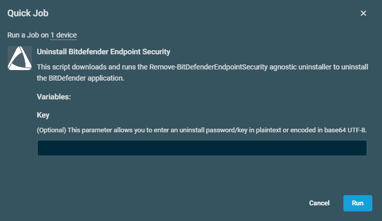
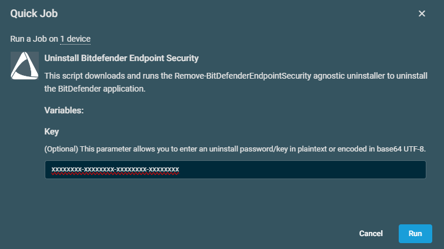

## Overview
BitDefender Endpoint Security script downloads and runs the [Agnostic-Remove-BitDefenderEndpointSecurity](/docs/3037688b-782b-468e-956a-292b3ef33534) uninstaller.

## Dependencies
[Agnostic-Remove-BitDefenderEndpointSecurity](/docs/3037688b-782b-468e-956a-292b3ef33534)

## Implementation  

1. Download the component [Uninstall Bitdefender Endpoint Security](../../../static/attachments/Bitdefender%20Endpoint%20Security%20Uninstall.cpt) from the attachments.

2. After downloading the attached file, click on the `Import` button
3. Select the component just downloaded and add it to the Datto RMM interface.  
  

## Sample Run

To execute the `component` over a specific machine, follow these steps:  

1. Select the machine you want to run the `component` on from the Datto RMM.  

2. Click on the `Quick Job` button.  
  

3. Search the component `Uninstall Bitdefender Endpoint Security` and click on `Select`
 

4. This parameter allows you to enter an uninstall password/key in plaintext or encoded in base64 UTF-8. If the key is not required then run the script as shown below: 

5. If the key is not required then run the script as shown below: 

## Datto Variables

| Variable Name | Type | Default | Required | Description |
| ------------- | ---- | ------- | -------- | ----------- |
| Key           | String |       | Partial  | This parameter allows you to enter an uninstall password/key in plaintext or encoded in base64 UTF-8 |

## Output

- stdOut  
- stdError 

## Attachments

- [Uninstall Bitdefender Endpoint Security](../../../static/attachments/Bitdefender%20Endpoint%20Security%20Uninstall.cpt)
