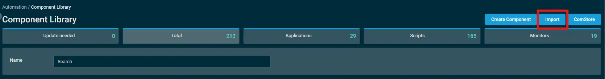
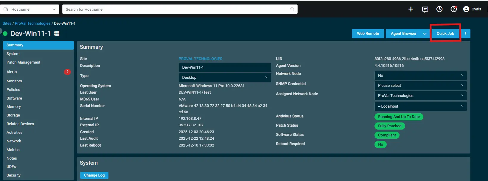
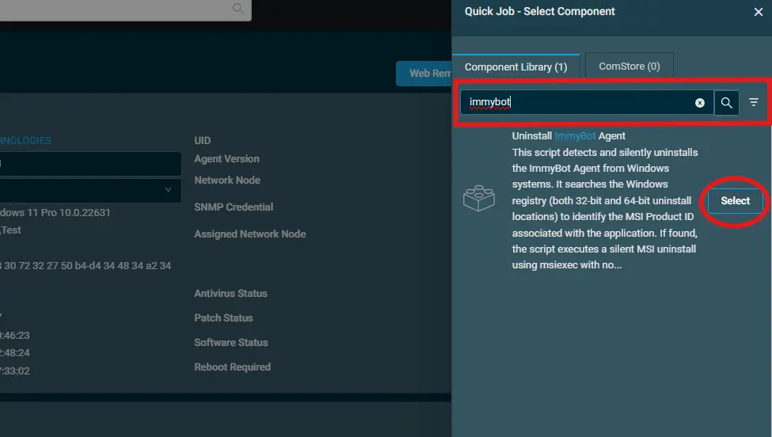
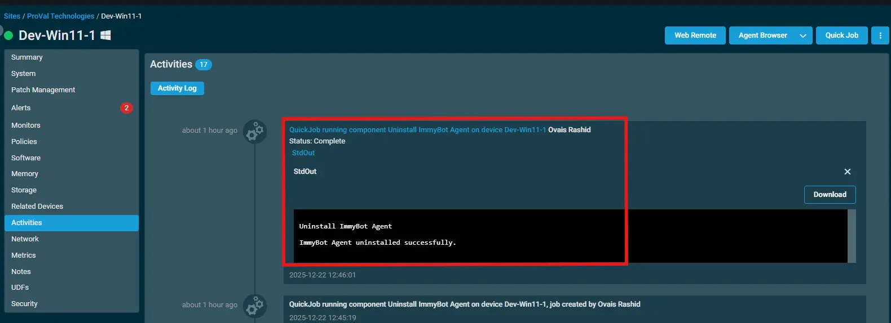

## Overview

This script detects and silently uninstalls the ImmyBot Agent from Windows systems. It searches the Windows registry (both 32-bit and 64-bit uninstall locations) to identify the MSI Product ID associated with the application. If found, the script executes a silent MSI uninstall using msiexec with no user interaction or forced reboot. After execution, the script verifies whether the application was successfully removed and reports the result. If the ImmyBot Agent is not installed, the script exits gracefully without error.

## Implementation  

1. Download the component `[Uninstall ImmyBot Agent](../../../static/attachments/Uninstall%20ImmyBot%20Agent.cpt)` from the attachments.

2. After downloading the attached file, click on the `Import` button

3. Select the component just downloaded and add it to the Datto RMM interface.  
  

## Sample Run

To execute the `component` over a specific machine, follow these steps:  

1. Select the machine you want to run the `component` on from the Datto RMM.  

2. Click on the `Quick Job` button.  
  

3. Search the component `Uninstall ImmyBot Agent` and click on `Select`.

## Output

- stdOut  
- stdError
- 

## Attachments

[Uninstall ImmyBot Agent](../../../static/attachments/Uninstall%20ImmyBot%20Agent.cpt)
