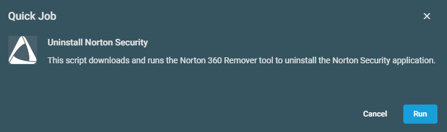

## Overview
This script downloads and runs the [Norton 360 Remover tool](https://www.norton.com/nortonremover) to uninstall the Norton Security application.

## Implementation  

1. Download the [Uninstall Norton Security](../../../static/attachments/uninstall-nortonsecurity.cpt) component from the attachments.

2. After downloading the attached file, click on the `Import` button
3. Select the component just downloaded and add it to the Datto RMM interface.  
  

## Sample Run

To execute the `component` over a specific machine, follow these steps:  

1. Select the machine you want to run the `component` on from the Datto RMM.  

2. Click on the `Quick Job` button.  
  

3. Search the [Uninstall Norton Security](../../../static/attachments/uninstall-nortonsecurity.cpt) component and click on `Select`.  

    

4. Click on `Run`  

## Output

- stdOut  
- stdError  

## Attachments

[Uninstall Norton Security](../../../static/attachments/uninstall-nortonsecurity.cpt)