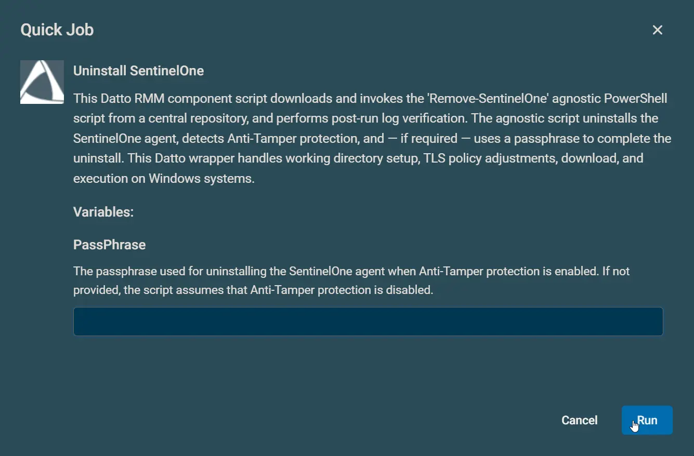
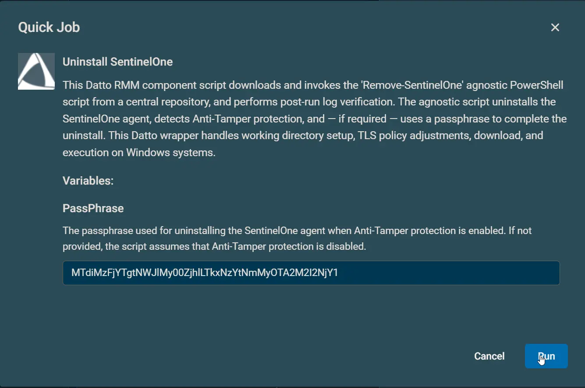

## Overview

This Datto RMM component script downloads and invokes the [Remove-SentinelOne](/docs/c64c47e7-8da3-46c6-9765-29da85addc2f) agnostic PowerShell script from a central repository, and performs post-run log verification. The agnostic script uninstalls the SentinelOne agent, detects Anti-Tamper protection, and — if required — uses a passphrase to complete the uninstall. This Datto wrapper handles working directory setup, TLS policy adjustments, download, and execution on Windows systems.

## Dependencies

- [Remove-SentinelOne](/docs/c64c47e7-8da3-46c6-9765-29da85addc2f)

## Implementation  

1. Download the component [Uninstall SentinelOne](../../../static/attachments/uninstall-sentinelone.cpt) from the attachments.

2. After downloading the attached file, click on the `Import` button
3. Select the component just downloaded and add it to the Datto RMM interface.  
  

## Sample Run

To execute the `component` over a specific machine, follow these steps:  

1. Select the machine you want to run the `component` on from the Datto RMM.  

2. Click on the `Quick Job` button.  
  

3. Search the component `Uninstall SentinelOne` and click on `Select`
 

4.
    - Example 1: With PassPhrase (Tamper protection is not disabled)
        

    - Example 2: Without PassPhrase (Tamper protection is disabled)
        

## Datto Variables

| Variable Name | Type | Default | Required | Description |
| ------------- | ---- | ------- | -------- | ----------- |
| PassPhrase    | String | | Partially | The passphrase used for uninstalling the SentinelOne agent when Anti-Tamper protection is enabled. If not provided, the script assumes that Anti-Tamper protection is disabled. |

## Output

- StdOut
- StdErr
- C:\ProgramData\_Automation\Script\Remove-SentinelOne\Remove-SentinelOne-log.txt
- C:\ProgramData\_Automation\Script\Remove-SentinelOne\Remove-SentinelOne-error.txt

## Attachments

[Uninstall SentinelOne](../../../static/attachments/uninstall-sentinelone.cpt)
