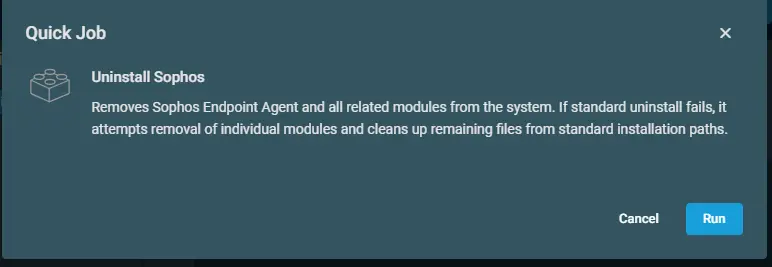

## Overview
Removes Sophos Endpoint Agent and all related modules from the system. If standard uninstall fails, it attempts removal of individual modules and cleans up remaining files from standard installation paths.

<I><U><b>Note:</b></U> Ensure to disable Tamper protection for smooth uninstallation.</I>

## Implementation  

1. Download the component [Uninstall Sophos](../../../static/attachments/uninstall-sophos.cpt) from the attachments.

2. After downloading the attached file, click on the `Import` button

3. Select the component just downloaded and add it to the Datto RMM interface.  
  

## Sample Run

To execute the `component` over a specific machine, follow these steps:  

1. Select the machine you want to run the `component` on from the Datto RMM.  

2. Click on the `Quick Job` button.  
  

3. Search the component `Uninstall Sophos` and click on `Select`
 

4. Click on `Run`  

## Output

- stdOut  
- stdError  

## Attachments

[Uninstall Sophos](../../../static/attachments/uninstall-sophos.cpt)