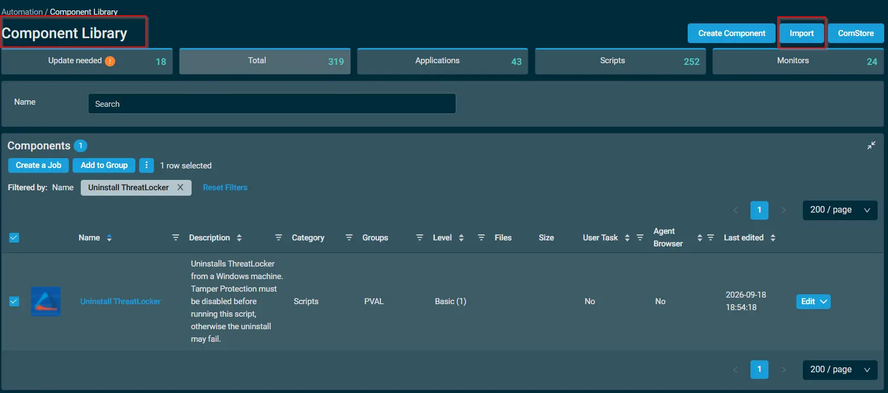
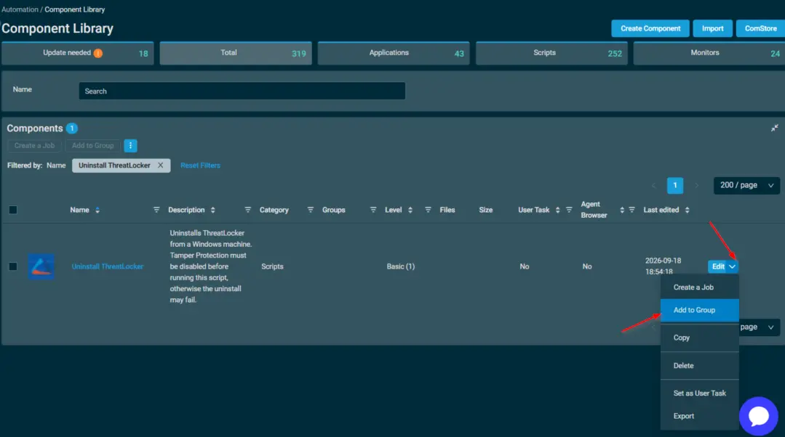
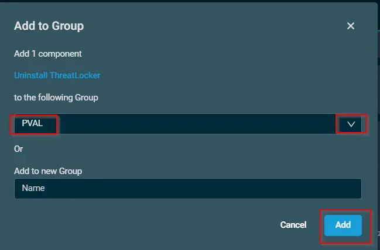
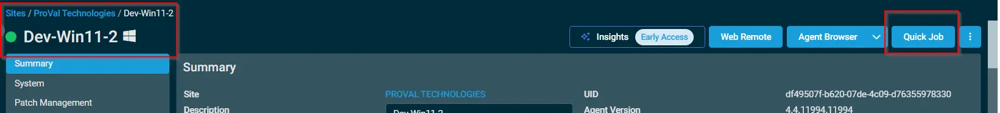
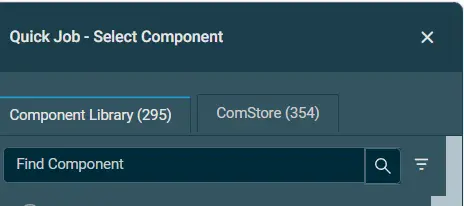

## Overview

Uninstalls ThreatLocker from a Windows machine. Tamper Protection must be disabled before running this script, otherwise the uninstall may fail.

## Dependencies

> 📝 **Document Author Workflow (Read Before Proceeding)**
> 
> **Do not upload `.cpt` files directly to this public documentation repository.** 
> To keep our public documentation clean and our components secure, all `.cpt` files must be hosted in our central private repository.
> 
> 1. **Author & Export:** Build and export your component from the Datto RMM interface as a `.cpt` file.
> 2. **Commit to Repository:** Push the finalized `.cpt` file to the **[`datto-rmm` repository](https://github.com/ProVal-Tech/datto-rmm)**.
> 3. **Directory Structure & Naming:** Save the file inside the `components/` directory. The filename **must** be in strict `kebab-case` and exactly match the slug/filename of this markdown document (without the `.md` extension). 
>    * *Example Path:* `components/<this-document-slug>.cpt`
> 4. **Link in Document:** Replace the placeholder links in the "Implementation" and "Attachments" sections below with the permanent GitHub URL pointing to your committed `.cpt` file.

## Implementation  

1. Download the component from the [`datto-rmm` repository](https://github.com/ProVal-Tech/datto-rmm):
   [Uninstall ThreatLocker](https://github.com/ProVal-Tech/datto-rmm/blob/main/components/uninstall-threatlocker.cpt)

2. After downloading the file, click on the `Import` button in the Datto RMM interface.

3. Select the component just downloaded and add it to the Datto RMM interface.  
  

4. After Importing the component to the Datto RMM, make sure to add the component to the `PVAL` Group always.  
    - Steps to Add the component under `PVAL` Group.  
    i. Click on `Drop Down Icon`.  
    ii. Click on `Add to Group`.  
    
    iii. Select the group as `PVAL`  
    

## Sample Run

To execute the `Uninstall ThreatLocker` over a specific machine, follow these steps:  

1. Select the machine you want to run the `Uninstall ThreatLocker` on from the Datto RMM.  

2. Click on the `Quick Job` button.  
  

3. Search the component `Uninstall ThreatLocker` and click on `Select`
 

## Output

- Activity Logs

## Attachments  

- [Uninstall ThreatLocker](https://github.com/ProVal-Tech/datto-rmm/blob/main/components/uninstall-threatlocker.cpt)

## Changelog
 
### 2026-09-18
 
- Initial version of the document
