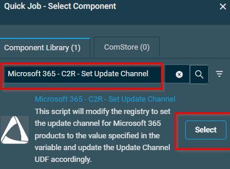
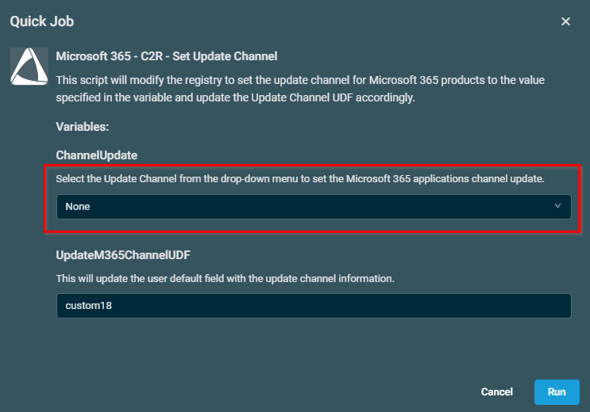

## Overview

This script will modify the registry to set the update channel for Microsoft 365 products to the value specified in the variable and update the Update Channel UDF accordingly.

## Implementation  

1. Download the component [Microsoft 365 - C2R - Set Update Channel](../../../static/attachments/Microsoft365-C2R-Set-Update-Channel.cpt) from the attachments.

2. After downloading the attached file, click on the `Import` button
3. Select the component just downloaded and add it to the Datto RMM interface.  
  

## Sample Run

To execute the `component` over a specific machine, follow these steps:  

1. Select the machine you want to run the `component` on from the Datto RMM.  

2. Click on the `Quick Job` button.  
  

1. Search the component `Microsoft 365 - C2R - Set Update Channel` and click on `Select`
 

- Click dropdown and select the required channel settings and then click run

## Datto Variables

| Variable Name | Type | Default | Description |
| ------------- | ---- | ------- | ----------- |
| ChannelUpdate | Selection (Values: Current Channel~Monthly Enterprise Channel~Semi-Annual Enterprise Channel~Beta Channel~None)  | None | Select the Update Channel from the drop-down menu to set the Microsoft 365 applications channel update. |
| UpdateM365ChannelUDF | String | custom18 | This will update the user default field with the update channel information. |

## Output

- stdout
- stderr
  
## Attachments

[Microsoft 365 - C2R - Set Update Channel](../../../static/attachments/Microsoft365-C2R-Set-Update-Channel.cpt)