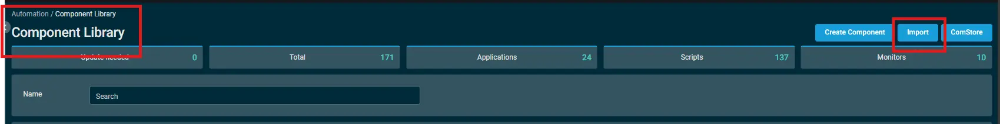
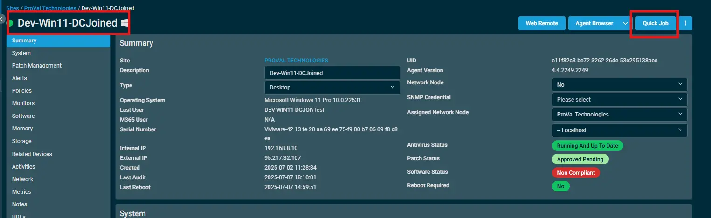
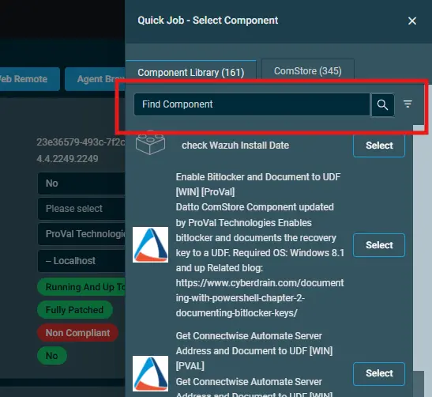
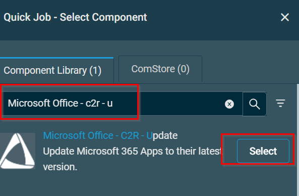
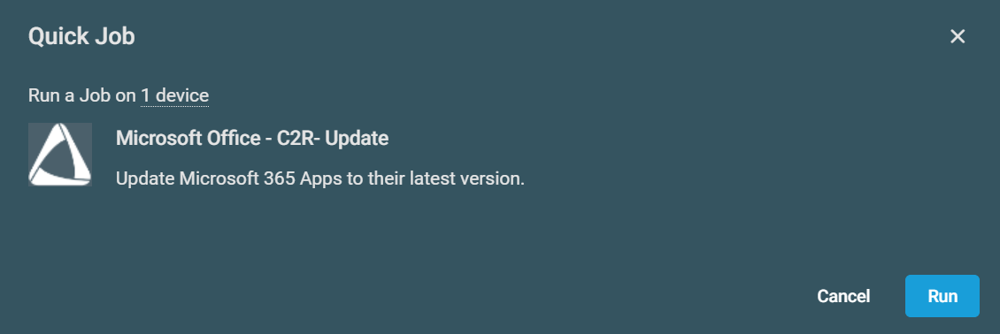

## Overview

Update Microsoft 365 Apps to their latest version.

## Implementation  

1. Download the component [Microsoft Office - C2R - Update](../../../static/attachments/Microsoft-Office-C2R-Update.cpt) from the attachments.

2. After downloading the attached file, click on the `Import` button
3. Select the component just downloaded and add it to the Datto RMM interface.  
  

## Sample Run

To execute the `component` over a specific machine, follow these steps:  

1. Select the machine you want to run the `component` on from the Datto RMM.  

2. Click on the `Quick Job` button.  
  

3. Search the component `Microsoft 365 - C2R - Get Channel` and click on `Select`
    

    

    

## Output

- stdout
- stderr
  
## Attachments

[Microsoft Office - C2R - Update](../../../static/attachments/Microsoft-Office-C2R-Update.cpt)