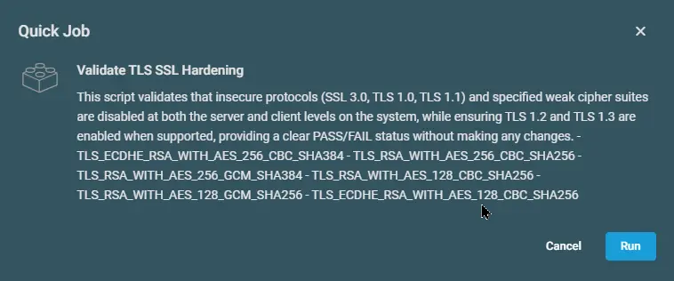

## Overview

This script validates that insecure protocols (SSL 3.0, TLS 1.0, TLS 1.1) and specified weak cipher suites are disabled at both the server and client levels on the system, while ensuring TLS 1.2 and TLS 1.3 are enabled when supported, providing a clear PASS/FAIL status without making any changes.

- TLS_ECDHE_RSA_WITH_AES_256_CBC_SHA384
- TLS_RSA_WITH_AES_256_CBC_SHA256
- TLS_RSA_WITH_AES_256_GCM_SHA384
- TLS_RSA_WITH_AES_128_CBC_SHA256
- TLS_RSA_WITH_AES_128_GCM_SHA256
- TLS_ECDHE_RSA_WITH_AES_128_CBC_SHA256

## Implementation  

1. Download the component from the [`datto-rmm` repository](https://github.com/ProVal-Tech/datto-rmm):
   [Validate TLS SSL Hardening](https://github.com/ProVal-Tech/datto-rmm/blob/main/components/validate-tls-ssl-hardening.cpt)

2. After downloading the file, click on the `Import` button in the Datto RMM interface.

3. Select the component just downloaded and add it to the Datto RMM interface.  
  

4. After Importing the component to the Datto RMM, make sure to add the component to the `PVAL` Group always.  
    - Steps to Add the component under `PVAL` Group.  
    i. Click on `Drop Down Icon`.  
    ii. Click on `Add to Group`.  
      
    iii. Select the group as `PVAL`  
    

## Sample Run

To execute the `component` over a specific machine, follow these steps:  

1. Select the machine you want to run the `component` on from the Datto RMM.  

2. Click on the `Quick Job` button.  
  

3. Search the component `Validate TLS SSL Hardening` and click on `Select`
 

4. Click on `Run` to execute the script:  

## Datto Variables

| Variable Name | Type | Default | Description |
| ------------- | ---- | ------- | ----------- |
| usrUDF | String | - | Enter the UDF ID to store the Secure Boot Check Status |

## Output

- stdOut  
- stdError

## Attachments  

- [Validate TLS SSL Hardening](https://github.com/ProVal-Tech/datto-rmm/blob/main/components/validate-tls-ssl-hardening.cpt)

## Changelog

### 2026-09-24
 
- Updated the script to store the SSL/TLS status to a UDF.

 
### 2026-09-16
 
- Initial version of the document
