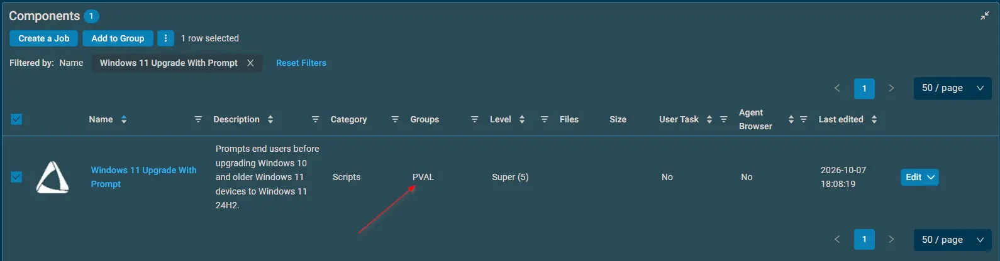
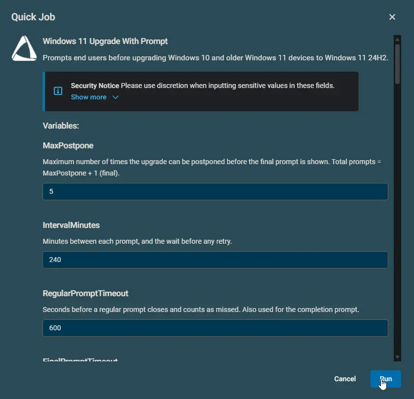

## Overview

This is a Datto implementation of the agnostic [Invoke-Windows11InstallerWithPrompt](/docs/b2f20f90-99f9-4bb1-ac7a-a3939f73ccec)

The component upgrades Windows 10 and older Windows 11 devices to Windows 11 24H2 (build 26100). Users can postpone the upgrade a set number of times, then pick a time for it. After the restart, the upgrade is confirmed and the user sees a completion message.

Run the component once per device. Scheduled tasks on the device handle everything after that. Devices that cannot run Windows 11 are never prompted.

## Dependencies

- [Invoke-Windows11InstallerWithPrompt](/docs/b2f20f90-99f9-4bb1-ac7a-a3939f73ccec)

## Implementation

1. Download the component [Windows 11 Upgrade With Prompt](https://github.com/ProVal-Tech/datto-rmm/blob/main/components/windows-11-upgrade-with-prompt.cpt) from the attachments.  
2. After downloading the attached file, click on the `Import` button.  
3. Select the component just downloaded and add it to the Datto RMM interface.  
  
4. After Importing the component to the Datto RMM, make sure to add the component to the `PVAL` Group always.  
    - Steps to Add the component under `PVAL` Group.  
    i. Click on `Drop Down Icon`.  
    ii. Click on `Add to Group`.  
      
    iii. Select the group as `PVAL`  
    

For detailed instructions on importing a Datto component, see [Workflow for Implementing Engineers](https://github.com/ProVal-Tech/datto-rmm#-workflow-for-implementing-engineers).

## Sample Run



## Examples

### Scenario 1: Standard Deployment

Run with all variables left at their defaults.

Expected output:

- The user gets five prompts, four hours apart, then picks a time on the final prompt.
- The device is upgraded at that time, restarts, and shows a completion message.

### Scenario 2: WithoutPrompt

Run with user parameter `WithoutPrompt = True`.

Expected output:

- Any cycle already running is cancelled, and the compatibility and safety checks run.
- The upgrade starts from a scheduled task one minute later, and the Datto job ends straight away.
- No prompt of any kind is shown.

### Scenario 3: IfNotLoggedIn

Run with user parameter `IfNotLoggedIn = True`.

Expected output:

- If nobody is logged in, the upgrade starts without prompting.
- If a user is logged in, the normal prompt cycle continues.

### Scenario 4: Force

Run with user parameter `Force = True`.

Expected output:

- Existing scheduled tasks and stored prompt state are removed.
- The prompt cycle starts again from the beginning.
- Refused while an upgrade is running.

### Scenario 5: SkipWeekends and SuppressPopupTimeWindows

Run with user parameters `SkipWeekends = True` and `SuppressPopupTimeWindows = 1800-0900`.

Expected output:

- No prompt appears on weekends or between 6 PM and 9 AM.
- A time the user already picked is still honoured, even inside those hours.

### Scenario 6: MaxMissedScheduledUpgrades

Run with user parameter `MaxMissedScheduledUpgrades = 1`.

Expected output:

- If the device is off at the chosen time, no upgrade starts later by surprise.
- The user is asked once to pick a new time.
- A second missed or unanswered time ends the cycle as a failure. Nothing changes on the device.

### Scenario 7: ShowProgressPrompt (Interval Mode)

Run with user parameters `ShowProgressPrompt = True`, `ProgressPromptInterval = 10`, `ProgressPromptTimeout = 300`.

Expected output:

- While the upgrade runs, a notice appears for 5 minutes every 10 minutes.
- The notice only appears while a user is logged in and unlocked.

### Scenario 8: KeepProgressPromptVisible (Stay Mode)

Run with user parameter `KeepProgressPromptVisible = True`.

Expected output:

- The notice appears when the upgrade starts and stays on screen until the restart.
- Clicking OK only hides it until the next check brings it back.
- `ShowProgressPrompt` is not needed.

### Scenario 9: Uri

Run with user parameter `Uri = https://files.example.com/win11/Win11_24H2_English_x64.iso`.

Expected output:

- Your own Windows 11 ISO is installed instead of the ProVal image.
- An invalid link (not `https://`, or containing spaces) stops the component with an error.
- **ProVal is not responsible for any issue caused by a custom ISO or ZIP file.**

### Scenario 10: Icon and HeaderImage

Run with user parameters `Icon = https://example.com/icon.png` and `HeaderImage = \\fileserver\share\header.png`.

Expected output:

- Verified local copies of both images are used on every prompt.
- The logged-in user never needs access to the original files.

## If the Device Was Off at the Chosen Time

An upgrade never starts more than 30 minutes after its planned time. This protects users from a surprise upgrade the next morning.

1. When the device comes back, no upgrade starts.
2. About a minute later, the user is asked to pick a new time.
3. An unanswered prompt returns after `IntervalMinutes`. No upgrade starts.
4. After `MaxMissedScheduledUpgrades` (default 3) missed or unanswered times, the cycle ends as a failure.

## While the Upgrade Runs

The upgrade runs in the background for an hour or more. Two optional modes keep the user informed; both are off by default:

- **Interval mode (`ShowProgressPrompt = True`):** every `ProgressPromptInterval` minutes a notice appears for `ProgressPromptTimeout` seconds. Set `ProgressPromptInterval` to `0` to turn the interval notices off.
- **Stay mode (`KeepProgressPromptVisible = True`):** the notice appears when the upgrade starts and stays on screen until the restart.

Stay mode wins when both are set. The notice only appears while a user is logged in and unlocked.

## Prompt Display Retry

A prompt that fails to display is retried up to `PromptDisplayRetryCount` extra times, `PromptDisplayRetryDelay` seconds apart. A failed attempt never uses up one of the user's postponements. If every attempt fails, the component tries again at the next interval.

## Customize the Prompt Text

Leave the message variables empty and users see the built-in wording in their own language (English or Dutch). Enter your own text and it is used instead, exactly as written.

Titles and messages both have Datto variables, so no change to the component is needed to reword a prompt.

### Default messages

These are the messages users see when the text parameters are left empty. Wording follows the display language of the logged-in user.

Names such as `PromptsLeft`, `ScheduledUpgradeTime`, and `UpgradeElapsedMinutes` are replaced with live values before the prompt appears. `\n` produces a line break.

#### Titles

| Parameter | English | Dutch |
| --- | --- | --- |
| `Title` | Windows 11 Upgrade | Windows 11-upgrade |
| `ReminderPromptTitle` | Windows 11 Upgrade - Starting Soon | Windows 11-upgrade - Start binnenkort |
| `CompletionPromptTitle` | Windows 11 Upgrade - Complete | Windows 11-upgrade - Voltooid |
| `ProgressPromptTitle` | Windows 11 Upgrade - In Progress | Windows 11-upgrade - Bezig |

#### Messages

**Regular prompt** — `RegularPromptMessage`

*English*

```text
An upgrade to Windows 11 24H2 is available for your computer. The upgrade can take an hour or more and restarts your computer, so please save your work first. You will receive PromptsLeft more prompt(s) with an interval of PromptIntervalMinutes minutes. After the last prompt the upgrade will proceed automatically.\n\nPlease save your work and click Upgrade Now to proceed.
```

*Dutch*

```text
Er is een upgrade naar Windows 11 24H2 beschikbaar voor uw computer. De upgrade kan een uur of langer duren en start uw computer opnieuw op, dus sla eerst uw werk op. U ontvangt nog PromptsLeft herinnering(en) met een interval van PromptIntervalMinutes minuten. Na de laatste herinnering wordt de upgrade automatisch uitgevoerd.\n\nSla uw werk op en klik op Nu upgraden om door te gaan.
```

**Final prompt** — `FinalPromptMessage`

*English*

```text
An upgrade to Windows 11 24H2 is required on your computer. This is the final prompt. Please select a time within the next 48 hours for the upgrade to begin. If no action is taken within FinalTimeoutMinutes minutes the upgrade will proceed automatically in DelayAfterFinalMinutes minutes.\n\nChoose a time and click Schedule Upgrade.
```

*Dutch*

```text
Er is een upgrade naar Windows 11 24H2 vereist op uw computer. Dit is de laatste herinnering. Selecteer een tijdstip binnen de komende 48 uur voor de upgrade. Als er geen actie wordt ondernomen binnen FinalTimeoutMinutes minuten, wordt de upgrade automatisch uitgevoerd na DelayAfterFinalMinutes minuten.\n\nKies een tijdstip en klik op Upgrade plannen.
```

**Missed upgrade prompt** — `MissedUpgradePromptMessage`

*English*

```text
Your Windows 11 upgrade was planned for MissedUpgradeTime, but it could not start because your computer was turned off or not connected at that time. Please select a new time within the next 48 hours for the upgrade to begin. If no time is selected, you will be asked again in PromptIntervalMinutes minutes.\n\nChoose a time and click Schedule Upgrade.
```

*Dutch*

```text
Uw Windows 11-upgrade stond gepland voor MissedUpgradeTime, maar kon niet starten omdat uw computer op dat moment uit stond of niet verbonden was. Selecteer een nieuw tijdstip binnen de komende 48 uur voor de upgrade. Als er geen tijdstip wordt gekozen, wordt het u over PromptIntervalMinutes minuten opnieuw gevraagd.\n\nKies een tijdstip en klik op Upgrade plannen.
```

**Reminder prompt** — `ReminderPromptMessage`

*English*

```text
Your Windows 11 upgrade is scheduled to begin at ScheduledUpgradeTime.\n\nPlease save all your work now. The upgrade will start in MinutesUntilUpgrade minute(s).\n\nClick OK to acknowledge.
```

*Dutch*

```text
Uw Windows 11-upgrade staat gepland om te beginnen om ScheduledUpgradeTime.\n\nSla al uw werk nu op. De upgrade begint over MinutesUntilUpgrade minuten.\n\nKlik op OK om te bevestigen.
```

**Completion prompt** — `CompletionPromptMessage`

*English*

```text
Your computer has been upgraded to Windows 11 24H2 successfully.\n\nYour computer is ready to use.\n\nClick OK to acknowledge.
```

*Dutch*

```text
Uw computer is succesvol bijgewerkt naar Windows 11 24H2.\n\nUw computer is klaar voor gebruik.\n\nKlik op OK om te bevestigen.
```

**In-progress notice** — `ProgressPromptMessage`

*English*

```text
Windows 11 24H2 is being downloaded and installed on your computer. The upgrade is running in the background.\n\nYour computer will restart automatically, possibly more than once, so please save your work and leave the computer switched on.\n\nNo action is needed from you.
```

*Dutch*

```text
De upgrade naar Windows 11 24H2 wordt op uw computer gedownload en uitgevoerd. De upgrade loopt op de achtergrond.\n\nUw computer wordt automatisch opnieuw opgestart, mogelijk meerdere keren. Sla uw werk op en laat de computer ingeschakeld.\n\nU hoeft verder niets te doen.
```

#### Extra line on laptops

On laptops, notebooks, and tablets the following line is added before the closing sentence of these five prompts. Desktops do not see it.

| Prompt | English | Dutch |
| --- | --- | --- |
| Regular prompt | Please connect your laptop to power before the upgrade begins. The upgrade does not start while the laptop runs on battery. | Sluit uw laptop aan op de netstroom voordat de upgrade begint. De upgrade start niet zolang de laptop op de accu werkt. |
| Final prompt | Please make sure your laptop is connected to power at the time you select. | Zorg ervoor dat uw laptop op het gekozen tijdstip op de netstroom is aangesloten. |
| Missed upgrade prompt | Please make sure your laptop is connected to power at the time you select. | Zorg ervoor dat uw laptop op het gekozen tijdstip op de netstroom is aangesloten. |
| Reminder prompt | Please make sure your laptop is connected to power now. | Zorg ervoor dat uw laptop nu op de netstroom is aangesloten. |
| In-progress notice | Please keep your laptop connected to power until the upgrade has finished. | Laat uw laptop aangesloten op de netstroom totdat de upgrade is voltooid. |

### Insert live values

Type any of these names into your message as a plain word. The real value is filled in before the prompt appears.

| Name | Shows |
| --- | --- |
| `PromptsToSend` | Total prompts the user will receive |
| `PromptsSent` | Prompts shown so far, including this one |
| `PromptsLeft` | Prompts still to come after this one |
| `PromptIntervalMinutes` / `PromptIntervalHours` | Time between prompts |
| `RegularTimeoutSeconds` / `RegularTimeoutMinutes` | Regular prompt timeout |
| `FinalTimeoutSeconds` / `FinalTimeoutMinutes` | Final prompt timeout |
| `DelayAfterFinalSeconds` / `DelayAfterFinalMinutes` | Grace period after the final prompt |
| `ScheduledUpgradeTime` | Time the upgrade starts (reminder prompt only) |
| `MinutesUntilUpgrade` | Minutes until the upgrade starts (reminder prompt only) |
| `MissedUpgradeTime` | Time the missed upgrade was planned for (missed upgrade prompt only) |
| `ProgressIntervalMinutes` | Minutes between in-progress notices |
| `ProgressTimeoutSeconds` / `ProgressTimeoutMinutes` | How long each in-progress notice stays on screen |
| `UpgradeElapsedMinutes` | Minutes the upgrade has been running (in-progress notice only) |
| `ComputerName` | Machine name |
| `UserName` | Logged-in username |

Use `\n` for a line break.

**Example:**

```text
IT will upgrade ComputerName to Windows 11 24H2. You have PromptsLeft reminder(s) left, one every PromptIntervalHours hour(s).\n\nSave your work and click Upgrade Now.
```

**Example with the in-progress notice:**

```text
IT is upgrading ComputerName to Windows 11. This has been running for UpgradeElapsedMinutes minute(s).\n\nPlease leave the machine switched on.
```

### Things to know

* These names are reserved words. If a message needs the literal word `ComputerName`, reword it.
* Button labels always follow the user's language and cannot be changed.
* The in-progress notice always carries an OK button. In stay mode, clicking it only hides the notice until the next check.
* Custom text is not translated and does not receive the automatic connect-to-power line shown on laptops. Include that wording yourself if your fleet has laptops.

### Sample Prompts - English

**Desktops:**

  
  
  

**Laptops:**

  
  


### Missed Upgrade Prompt - English

  

### Upgrade In Progress Notification - English

  

### Completion Prompt - English

  

### Sample Prompts - Dutch

  
  
  

#### Missed Upgrade Prompt - Dutch

  

#### Upgrade In Progress Notification - Dutch

  

#### Completion Prompt - Dutch

  

## Datto Variables

| Variable Name | Default | Type | Description |
| --- | --- | --- | --- |
| `MaxPostpone` | `5` | String | Maximum number of times the upgrade can be postponed before the final prompt is shown. Total prompts = MaxPostpone + 1 (final). |
| `IntervalMinutes` | `240` | String | Minutes between each prompt, and the wait before any retry. |
| `RegularPromptTimeout` | `600` | String | Seconds before a regular prompt closes and counts as missed. Also used for the completion prompt. |
| `FinalPromptTimeout` | `900` | String | Seconds before the final prompt and the missed upgrade prompt close. |
| `DelayAfterFinalPrompt` | `600` | String | Seconds to wait before the upgrade starts after the final prompt is ignored. |
| `MaxMissedScheduledUpgrades` | `3` | String | Missed or unanswered upgrade times allowed before the cycle ends as a failure. `0` ends it at the first missed time. |
| `PromptDisplayRetryCount` | `1` | String | Extra attempts to display a prompt when it fails to appear or returns unreadable output. `0` gives each prompt a single attempt. |
| `PromptDisplayRetryDelay` | `30` | String | Seconds to wait between prompt display attempts. |
| `SkipWeekends` | `False` | Boolean | Prevents prompts on Saturdays and Sundays. |
| `IfNotLoggedIn` | `False` | Boolean | Upgrades without prompting if no user is logged in. |
| `Force` | `False` | Boolean | Clears all scheduled tasks and stored state, restarting the prompt cycle from 0. Refused while an upgrade is running. |
| `WithoutPrompt` | `False` | Boolean | Skips every prompt and starts the upgrade right away, cancelling any cycle in progress. |
| `SuppressPopupTimeWindows` |  | String | Time window (24-hour format, e.g., `1800-0900`) during which prompts are suppressed. |
| `MaxMissedPromptsBeforeForce` | `0` | String | Consecutive missed prompts (locked screen, or nobody logged in) before the upgrade starts without prompting. `0` disables this. |
| `UpgradeDuringSuppress` | `False` | Boolean | Lets an unattended or forced upgrade run inside a suppress window or on a weekend. Prompts are still never shown during those times. `UpdateDuringSuppress` is also accepted. |
| `Uri` |  | String | Direct `https://` link to your own Windows 11 ISO or ZIP file. Blank installs the ProVal image. **ProVal is not responsible for any issue caused by a custom ISO or ZIP file.** |
| `MinimumFreeSpaceGB` | `24` | String | Free space required on the system drive, in GB. |
| `MinimumReservedPartitionFreeMB` | `15` | String | Free space required on the system reserved partition, in MB. |
| `SkipBitLockerSafetyCheck` | `False` | Boolean | Continues when BitLocker lacks the recommended protectors or cannot be suspended. |
| `MaxACPowerRetries` | `3` | String | Times the upgrade waits for a laptop to be connected to power before the cycle ends as a failure. |
| `Icon` |  | String | URL, local path, or UNC share path for the icon displayed in the prompt dialog (e.g., `https://example.com/icon.png` or `\\server\share\icon.png`). A verified local copy is used. |
| `HeaderImage` |  | String | URL, local path, or UNC share path for the header image displayed at the top of the prompt dialog. A verified local copy is used. |
| `ShowProgressPrompt` | `False` | Boolean | Shows a notice on the user's desktop while the upgrade runs, repeating every `ProgressPromptInterval` minutes for `ProgressPromptTimeout` seconds. |
| `ProgressPromptInterval` | `10` | String | Minutes between in-progress notices. `0` turns the interval notices off. Ignored when `KeepProgressPromptVisible` is enabled. |
| `ProgressPromptTimeout` | `300` | String | Seconds each in-progress notice stays on screen. Ignored when `KeepProgressPromptVisible` is enabled. |
| `KeepProgressPromptVisible` | `False` | Boolean | Keeps the in-progress notice on the desktop for the whole upgrade and brings it back if dismissed. Implies `ShowProgressPrompt`. |
| `Theme` | `Dark` | Selection | Prompt window theme. `Dark` or `Light`. |
| `Title` |  | String | Title for the regular, final, and missed upgrade prompts. Blank uses the built-in title. |
| `RegularPromptMessage` |  | String | Body of the postponable prompts. Blank uses the built-in wording. |
| `FinalPromptMessage` |  | String | Body of the final scheduling prompt. Blank uses the built-in wording. |
| `MissedUpgradePromptMessage` |  | String | Body of the prompt that asks for a new time after a missed upgrade. Blank uses the built-in wording. |
| `ReminderPromptTitle` |  | String | Title of the 10-minute warning. Blank uses the built-in title. |
| `ReminderPromptMessage` |  | String | Body of the 10-minute warning. Blank uses the built-in wording. |
| `CompletionPromptTitle` |  | String | Title of the completion confirmation. Blank uses the built-in title. |
| `CompletionPromptMessage` |  | String | Body of the completion confirmation. Blank uses the built-in wording. |
| `ProgressPromptTitle` |  | String | Title of the in-progress notice shown while the upgrade runs. Blank uses the built-in title. |
| `ProgressPromptMessage` |  | String | Body of the in-progress notice. Blank uses the built-in wording. |

## Output

Activity Log

The last line of the log starts with `Success:` or `Failure:`. The component fails when the result is `Failure:`.

## Attachments  

- [Windows 11 Upgrade With Prompt](https://github.com/ProVal-Tech/datto-rmm/blob/main/components/windows-11-upgrade-with-prompt.cpt)

## Changelog

### 2026-10-07

- Initial version of the document
