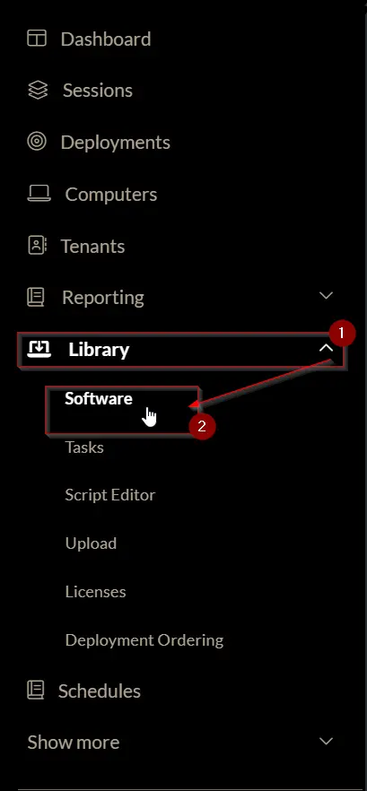
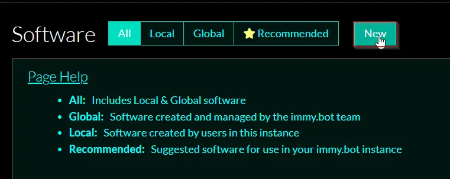
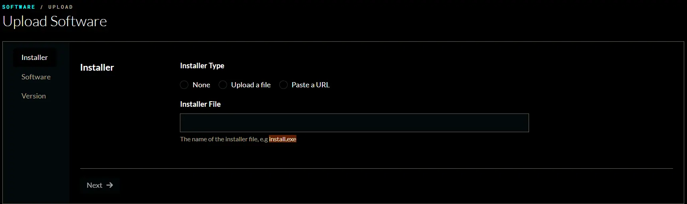
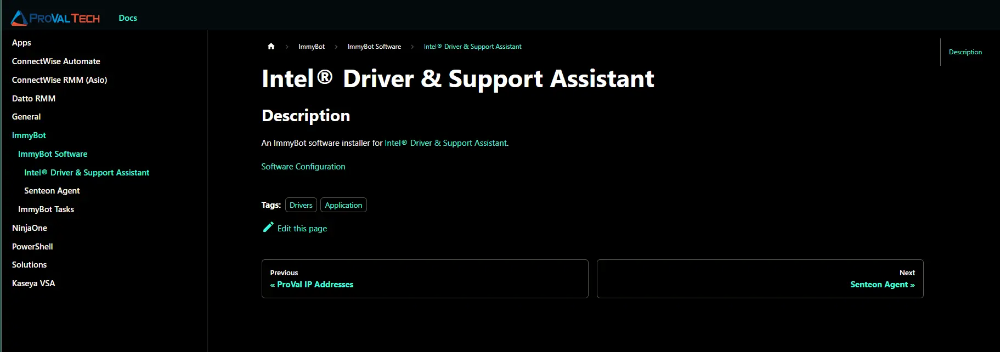
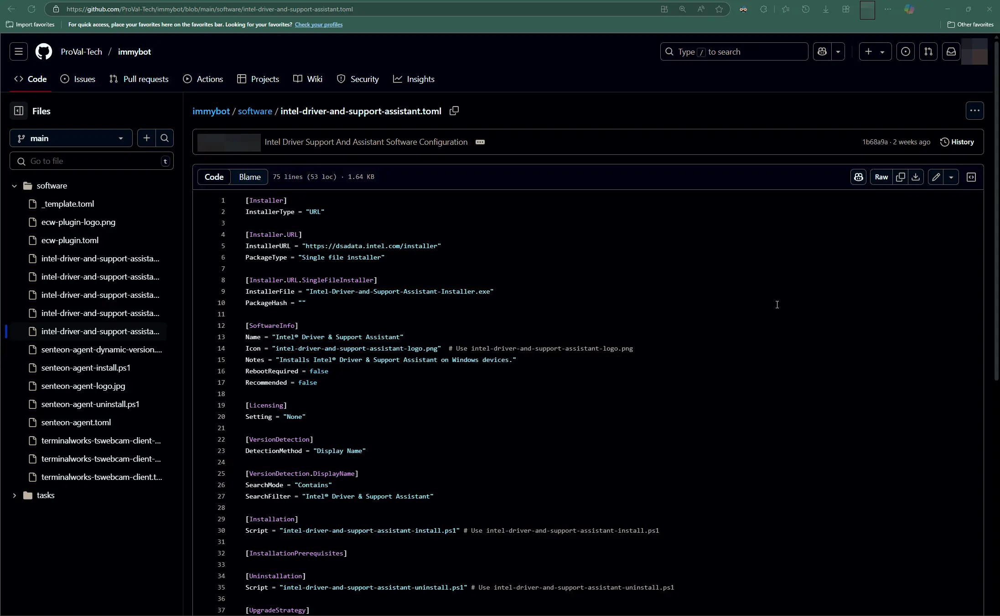
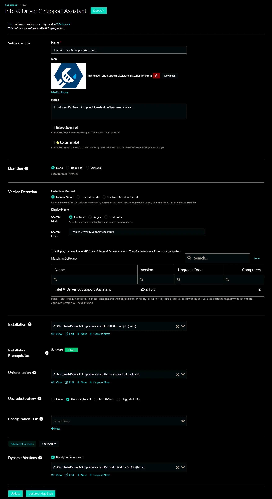

## Summary

The document provides step-by-step instructions for creating an ImmyBot software based on a ProVal document.

## Process

### Step 1

Sign in to your ImmyBot portal.

### Step 2

Go to `Library` and select `Software`.

### Step 3

Click the `New` button to begin creating an ImmyBot software.

After clicking `New`, the upload software page will appear.

### Step 4

Open the provided document URL for the task in a new browser tab.  
For example, see the [Intel® Driver & Support Assistant](/docs/54b9a177-bf2c-4ddb-9c66-8b27b4700628) ImmyBot software.

### Step 5

Navigate to the [Software Configuration](https://github.com/ProVal-Tech/immybot/blob/main/software/intel-driver-and-support-assistant.toml) url.

### Step 6

This will take you to the [.toml configuration](https://github.com/ProVal-Tech/immybot/blob/main/software/intel-driver-and-support-assistant.toml) file in [ProVal's ImmyBot GitHub repository](https://github.com/ProVal-Tech/immybot/blob/main/software).

### Step 7

Return to the ImmyBot software creation tab and configure it using the details from the .toml file.

Any files referenced in the .toml file can be found in the [same repository](https://github.com/ProVal-Tech/immybot/blob/main/software) with matching names.

Download or copy the required files or content as needed to complete the software in ImmyBot.

If the .toml file mentions any `script` or `logo`, these can also be found in the same repository using the specified names.

## Completed Software Example

