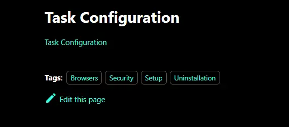

## Summary

The document provides step-by-step instructions for creating an ImmyBot task based on a ProVal document.

-----

## Process

### Step 1

Sign in to your ImmyBot portal.

-----

### Step 2

Go to `Library` and select `Tasks`.

-----

### Step 3

Click the `New` button to begin creating a new task.

After clicking `New`, the task creation page will appear.

-----

### Step 4

Open the provided document URL for the task in a new browser tab.  
For example, see the [Lockdown Browsers Autofill and Password Manager](/docs/4a0c81a2-6ba3-4663-8afb-7f90c021d47e) task.

-----

### Step 5

Scroll down to the [Task Configuration](https://content.provaltech.com/docs/4a0c81a2-6ba3-4663-8afb-7f90c021d47e/#task-configuration) section at the bottom of the document.

-----

### Step 6

Click the link in the Task Configuration section to access the relevant [.toml configuration](https://github.com/ProVal-Tech/immybot/blob/main/tasks/lockdown-browsers-autofill-and-password-manager.toml) file in [ProVal's ImmyBot GitHub repository](https://github.com/ProVal-Tech/immybot/blob/main/tasks).

-----

### Step 7

Return to the ImmyBot task creation tab and configure the task using the details from the .toml file.

Any files referenced in the .toml file can be found in the [same repository](https://github.com/ProVal-Tech/immybot/blob/main/tasks) with matching names.

Download or copy the required files or content as needed to complete the task or script in ImmyBot.

If the .toml file mentions any `script` or `logo`, these can also be found in the same repository using the specified names.

-----

## Completed Task Example

-----
