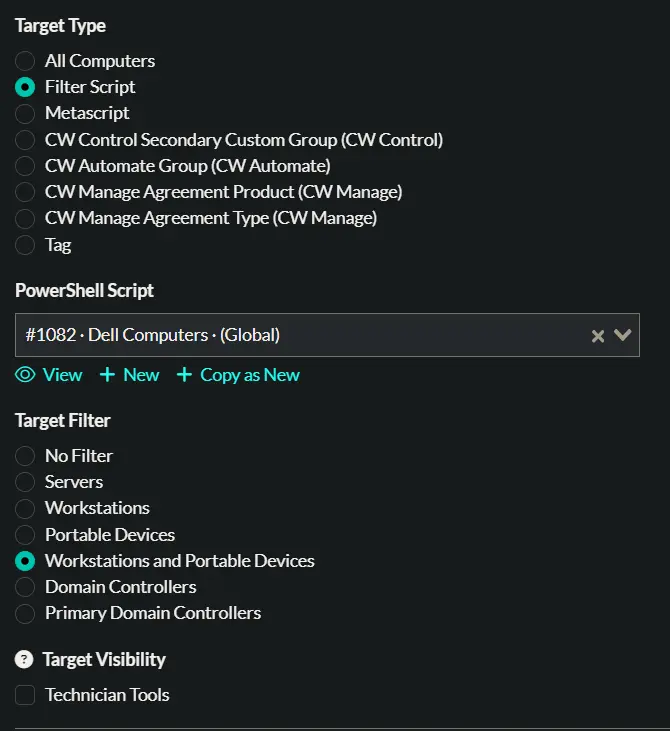
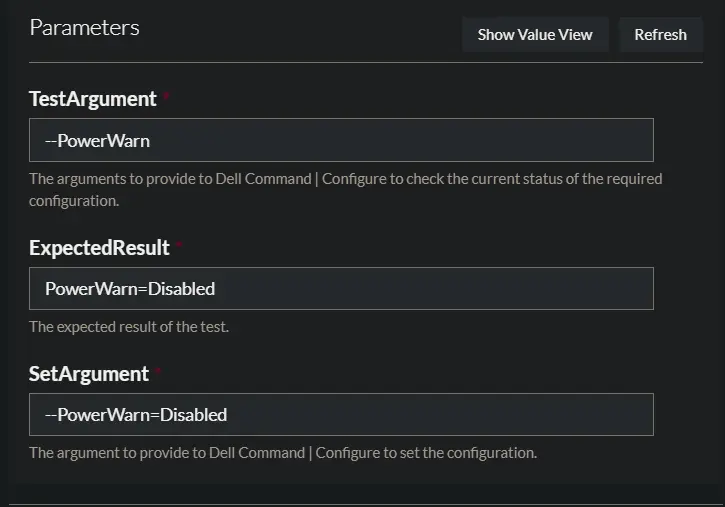
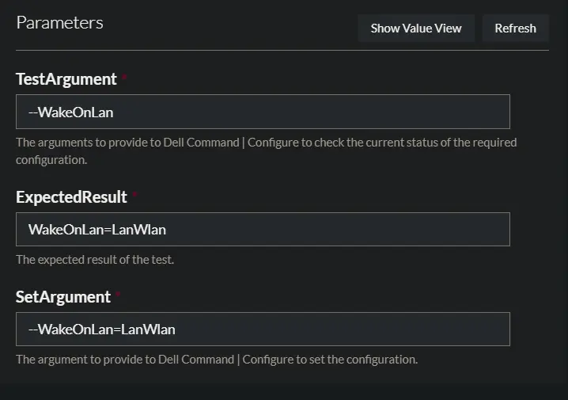
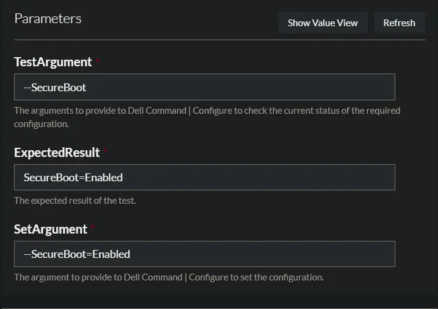

## Description

Automates installation, update, and execution of Dell Command | Configure (DCC) on Dell workstations, ensuring the latest version is present and providing command-line automation for DCC operations for Dell workstations BIOS configurations.

**Notes:**

- For best results, use the built-in 'Dell Computers' filter script and restrict deployment to 'Workstations and Portable Devices'.  
  

## Documentation Links

- [Dell Command | Configure CLI Reference - General Options](https://www.dell.com/support/manuals/en-us/command-configure-v4.2/dcc_cli_4.2/general-options?guid=guid-70b4993d-58d3-48ef-a8db-ae7feb6e01ae&lang=en-us)
- [Dell Command | Configure CLI Reference - BIOS Options](https://www.dell.com/support/manuals/en-us/command-configure-v4.2/dcc_cli_4.2/bios-options?guid=guid-44c059be-b76d-4b2f-b8ef-655f736c40ce&lang=en-us)
- [Dell Command | Configure Command Line Syntax](https://www.dell.com/support/manuals/en-us/command-configure-v4.2/dcc_cli_4.2/command-line-option-delimiter?guid=guid-a46d5033-22cc-4369-8951-d1b30e51008f)
- [Dell Command | Configure Exit Codes](https://www.dell.com/support/kbdoc/en-us/000147084/dell-command-configure-error-codes)

## Dependencies

- [Initialize-DellCommandConfigure](/docs/a0f958c9-7364-4bde-af18-01e6232620cc)

## Parameters

| Parameter | Example | Type | Required | Description |
| --------- | ------- | ---- | -------- | ----------- |
| TestArgument | `--PowerWarn` | String | True |  The command-line argument(s) to pass to `Dell Command \| Configure` for checking the current status of a required configuration. |
| ExpectedResult | `PowerWarn=Disabled` | String | True | The expected output/result from `Dell Command \| Configure` when the configuration is correct. |
| SetArgument | `--PowerWarn=Disabled` | String | True | The command-line argument(s) to pass to `Dell Command \| Configure` to set the required configuration. |

**Summary:** Set `TestArgument` to specify the command for checking the current configuration status. Use `ExpectedResult` to define the desired output when the configuration is correct. Provide `SetArgument` to set the required configuration if it is not already applied. If the result from running `Dell Command \| Configure` with `TestArgument` does not match `ExpectedResult`, the task will execute `Dell Command \| Configure` with `SetArgument` to update the configuration.

## Deployment Examples

### Example 1

This example checks if PowerWarning is disabled and sets it if necessary.

**TestArgument:** `--PowerWarn`  
**ExpectedResult:** `PowerWarn=Disabled`  
**SetArgument:** `--PowerWarn=Disabled`

### Example 2

This example checks if Wake On LAN is enabled and sets it if necessary.

**TestArgument:** `--WakeOnLan`  
**ExpectedResult:** `WakeOnLan=LanWlan`  
**SetArgument:** `--WakeOnLan=LanWlan`

### Example 3

This example checks if Secure Boot is enabled and sets it if necessary.

**TestArgument:** `--SecureBoot`  
**ExpectedResult:** `SecureBoot=Enabled`  
**SetArgument:** `--SecureBoot=Enabled`

## Task Configuration

[Task Configuration](https://github.com/ProVal-Tech/immybot/blob/main/tasks/initialize-dell-command-configure.toml)