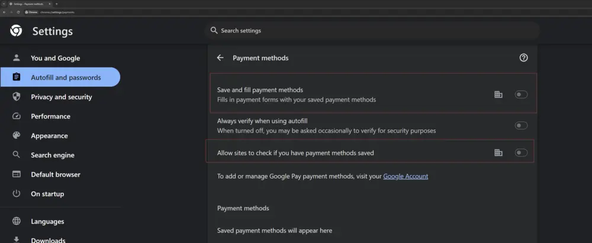
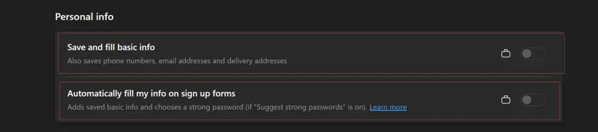
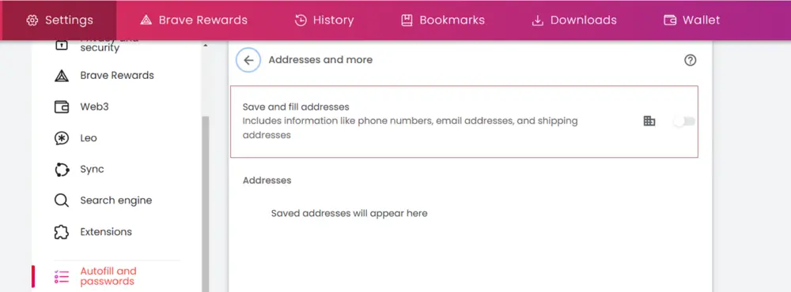

## Summary

The task can disable the password manager and autofill address and credit card information for the Edge, Chrome, Brave, and Firefox browsers. Moreover, it can delete the saved passwords, but it will forcefully close the browsers. Microsoft Edge will also be closed if the task is used to disable the Edge Wallet.

## Lockdown Browsers Password Manager

It's important to know that for browsers based on Chromium (like Google Chrome, Microsoft Edge, and Brave), turning off the Password Manager won't stop the Autofill (or Sign in Automatically) feature. If Autofill (or Sign in Automatically) is enabled and there are saved passwords, it will still automatically fill in credentials for websites. However, if the Password Manager is disabled, new passwords won't be saved, and the browser won't ask to store passwords. The saved passwords will still work.

For Firefox, turning off the Password Manager will also disable Autofill.

**Affected Setting for Google Chrome:**  

**Affected Setting for Brave:**  

**Affected Settings for Microsoft Edge:**  

**Affected Settings for Mozilla Firefox:**  

**Note:**

- The changes will only take effect once the browser is restarted if it's currently open. In certain situations, especially for Microsoft Edge, the user might need to restart the entire computer for the changes to take effect.

## Lockdown Chromium Browsers Credit Card Autofill

**Affected Setting for Google Chrome:**  

**Affected Settings for Microsoft Edge:**  

**Affected Setting for Brave:**  

**Note:**

- The changes will only take effect once the browser is restarted if it's currently open.

## Lockdown Chromium Browsers Address Autofill

**Affected Setting for Google Chrome:**  

**Affected Settings for Microsoft Edge:**  

**Affected Setting for Brave:**  

**Note:**

- The changes will only take effect once the browser is restarted if it's currently open.

## Clear Browsers Saved Passwords

The task is designed to remove saved passwords from the following browsers:

- Google Chrome
- Microsoft Edge
- Brave
- Mozilla Firefox

**Note:**  

- If any of these browsers are running, they will be forcefully closed.

## Disable Edge Wallet

The task can disable the sync between Edge Wallet and the cloud. It should be disabled to remove the saved passwords from Microsoft Edge.  

**Note:**  

- If Microsoft Edge is running, it will be forcefully closed.

## Parameters

| Name                     | Example                     | Accepted Values                                   | Default | Type  | Required | Description                                                          |
|--------------------------|-----------------------------|---------------------------------------------------|---------|-------|----------|----------------------------------------------------------------------|
| Browser                  | Chrome, Edge, Firefox       | Chrome, Edge, Firefox, Brave, All                 | All     | Text  | False    | Name of the Browser(s) to apply the changes for.                   |
| DisablePasswordManager    | True                        | True or False                                     | True    | Text  | False    | Set this value to false to NOT disable the password manager for the browser(s). |
| DisableAutofillAddress   | True                        | True or False                                     | True    | Text  | False    | Set this value to false to NOT disable the autofilling of addresses for the browser(s). |
| DisableAutofillCreditCard | True                        | True or False                                     | True    | Text  | False    | Set this value to false to NOT disable the autofilling of credit card details for the browser(s). |
| RemoveSavedPassword       | False                       | True or False                                     | False   | Text  | False    | Setting this to true will remove the saved passwords from the browser(s). Browser(s) will be forcefully closed if they are running. |
| DisableEdgeWallet         | False                       | True or False                                     | False   | Text  | False    | Setting this to true will disable the Microsoft Edge Wallet's sync. Microsoft Edge will be forcefully closed if it is running. It is mandatory to set this parameter to True to remove the saved password from Microsoft Edge. |

## Task Configuration

[Task Configuration](https://github.com/ProVal-Tech/immybot/blob/main/tasks/lockdown-browsers-autofill-and-password-manager.toml)