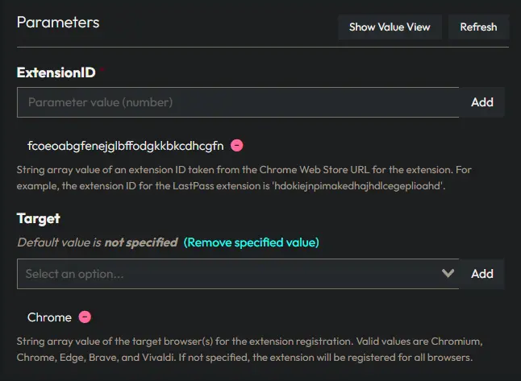
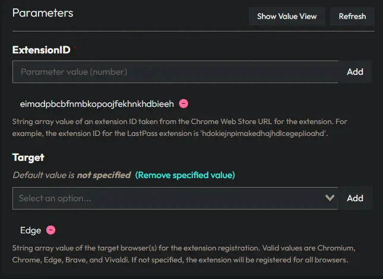
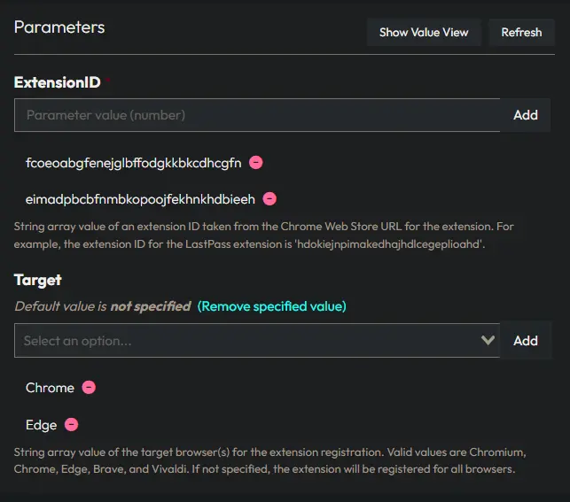
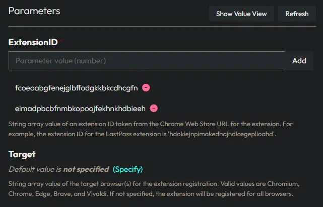

## Description

Adds one or more extensions to popular Chromium-based browsers.

## Requirements

The Extension URL ID must be obtained from [Chrome Web Store](https://chromewebstore.google.com).

## Sample Deployment Parameters

### Example 1: Installing `Claude` Extension for `Chrome`

**ExtensionID:**

```PlainText
fcoeoabgfenejglbffodgkkbkcdhcgfn
```

**Target:**

```PlainText
Chrome
```



### Example 2: Installing `Dark Reader` Extension for `Edge`

**ExtensionID:**

```PlainText
eimadpbcbfnmbkopoojfekhnkhdbieeh
```

**Target:**

```PlainText
Edge
```



### Example 3: Installing both `Claude` and `Dark Reader` Extensions for both `Chrome` and `Edge`

**ExtensionID:**

```PlainText
fcoeoabgfenejglbffodgkkbkcdhcgfn
eimadpbcbfnmbkopoojfekhnkhdbieeh
```

**Target:**

```PlainText
Chrome
Edge
```



### Example 4: Installing both `Claude` and `Dark Reader` Extensions for all supported browsers (`Chromium`, `Chrome`, `Edge`, `Brave`, and `Vivaldi`)

**ExtensionID:**

```PlainText
fcoeoabgfenejglbffodgkkbkcdhcgfn
eimadpbcbfnmbkopoojfekhnkhdbieeh
```

**Target:** (leave blank or omit to apply to all supported browsers)



## Parameters

| Parameter         | ValidateSet | Required  | Default   | Type      | Description                               |
| ----------------- | ----------- | --------- | --------- | --------- | ----------------------------------------- |
| `ExtensionID`     |             | True      |           | String[]  | Holds the URL id values for the desired extensions to install. |
| `Target`          | `Chromium`, `Chrome`, `Edge`, `Brave`, `Vivaldi` | False | Defaults to applying settings to all available targets | String[] | Designates the target browser to add the extension to. |

[Task Configuration](https://github.com/ProVal-Tech/immybot/blob/main/tasks/register-chromium-extension.toml)

## Changelog

### 2026-04-02

- Deprecated `Install Google Chrome Extension` and `Install Microsoft Edge Extension`
- Initial version of the document
