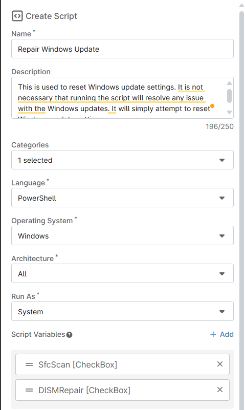
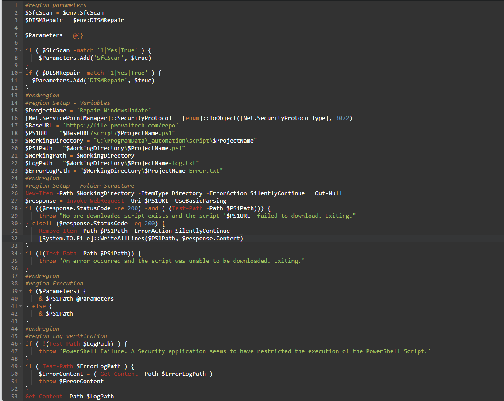
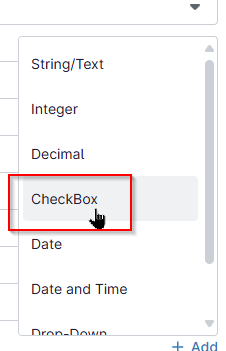
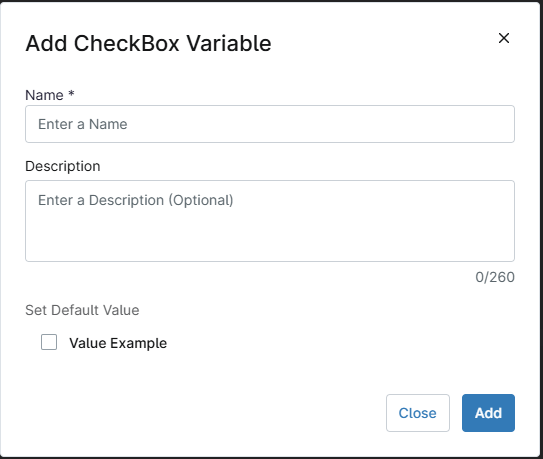
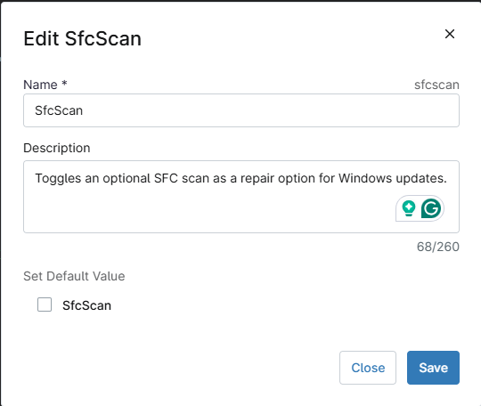
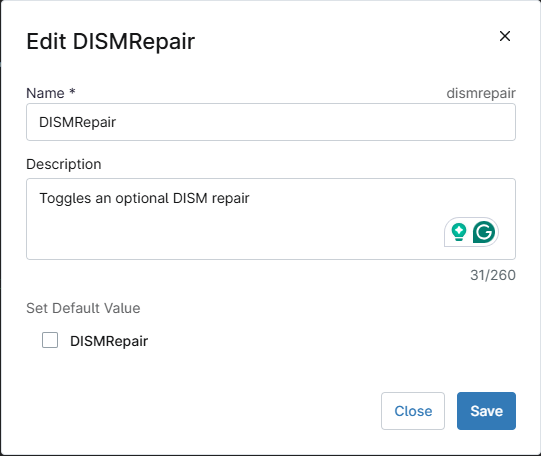
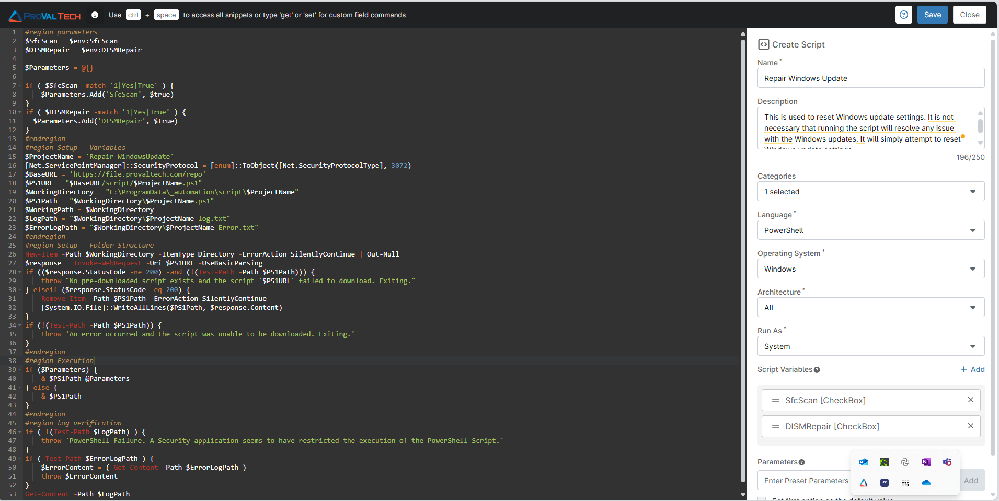

## Overview
This is used to reset Windows update settings. It is not necessary that running the script will resolve any issue with the Windows updates. It will simply attempt to reset Windows update settings.

## Sample Run

`Play Button` > `Run Automation` > `Script`  


## Dependencies

## Parameters

| Name       | Example | Accepted Values | Required | Default | Type     | Description                                                   |
|------------|---------|-----------------|----------|---------|----------|---------------------------------------------------------------|
| SfcScan    | -       | -               | False    | False   | Checkbox | Toggles an optional SFC scan as a repair option for Windows updates |
| DISMRepair | -       | -               | False    | False   | Checkbox | Toggles an optional DISM repair                               |

## Automation Setup/Import

### Step 1

Navigate to `Administration` > `Library` > `Automation`  


### Step 2

Locate the `Add` button on the right-hand side of the screen, click on it and click the `New Script` button.  


The scripting window will open.  


**Name:** `Repair Windows Update`  
**Description:** `This is used to reset Windows update settings. It is not necessary that running the script will resolve any issue with the Windows updates. It will simply attempt to reset Windows update settings.`  
**Categories:** `ProVal`  
**Language:** `PowerShell`  
**Operating System:** `Windows`  
**Architecture:** `All`  
**Run As:** `System`  


```powershell
#region parameters
$SfcScan = $env:SfcScan
$DISMRepair = $env:DISMRepair
 
$Parameters = @{}
 
if ( $SfcScan -match '1|Yes|True' ) {
    $Parameters.Add('SfcScan', $true)
}
if ( $DISMRepair -match '1|Yes|True' ) {
	$Parameters.Add('DISMRepair', $true)
}
#endregion
#region Setup - Variables
$ProjectName = 'Repair-WindowsUpdate'
[Net.ServicePointManager]::SecurityProtocol = [enum]::ToObject([Net.SecurityProtocolType], 3072)
$BaseURL = 'https://file.provaltech.com/repo'
$PS1URL = "$BaseURL/script/$ProjectName.ps1"
$WorkingDirectory = "C:\ProgramData\_automation\script\$ProjectName"
$PS1Path = "$WorkingDirectory\$ProjectName.ps1"
$WorkingPath = $WorkingDirectory
$LogPath = "$WorkingDirectory\$ProjectName-log.txt"
$ErrorLogPath = "$WorkingDirectory\$ProjectName-Error.txt"
#endregion
#region Setup - Folder Structure
New-Item -Path $WorkingDirectory -ItemType Directory -ErrorAction SilentlyContinue | Out-Null
$response = Invoke-WebRequest -Uri $PS1URL -UseBasicParsing
if (($response.StatusCode -ne 200) -and (!(Test-Path -Path $PS1Path))) {
    throw "No pre-downloaded script exists and the script '$PS1URL' failed to download. Exiting."
} elseif ($response.StatusCode -eq 200) {
    Remove-Item -Path $PS1Path -ErrorAction SilentlyContinue
    [System.IO.File]::WriteAllLines($PS1Path, $response.Content)
}
if (!(Test-Path -Path $PS1Path)) {
    throw 'An error occurred and the script was unable to be downloaded. Exiting.'
}
#endregion
#region Execution
if ($Parameters) {
    & $PS1Path @Parameters
} else {
    & $PS1Path
}
#endregion
#region log verification
if ( !(Test-Path $LogPath) ) {
    throw 'PowerShell Failure. A Security application seems to have restricted the execution of the PowerShell Script.'
}
if ( Test-Path $ErrorLogPath ) {
    $ErrorContent = ( Get-Content -Path $ErrorLogPath )
    throw $ErrorContent
}
Get-Content -Path $LogPath
#endregion
```

## Script Variables

Click the `Add` button next to `Script Variables`.  


Select the `Checkbox` option.  


The `Add Checkbox Variable` window will open.  


In the box, fill in the following details and select `Add` to create the script variable.

**Name:** `SfcScan`  
**Description:** `Toggles an optional SFC scan as a repair option for Windows updates.`  
**Mandatory:** `<Leave it Unchecked>`  


Add another Script variable and Select the `Checkbox` option. `Add Checkbox Variable` window will open. In the box, fill in the following details and select `Add` to create the script variable.

**Name:** `DISMRepair`  
**Description:** `Toggles an optional DISM repair`  
**Mandatory:** `<Leave it Unchecked>`  



## Saving the Automation

Click the Save button in the top-right corner of the screen to save your automation.  


You will be prompted to enter your MFA code. Provide the code and press the Continue button to finalize the process.  


## Completed Automation


## Output

- Activity Details  
