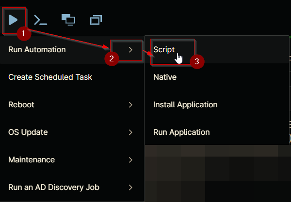
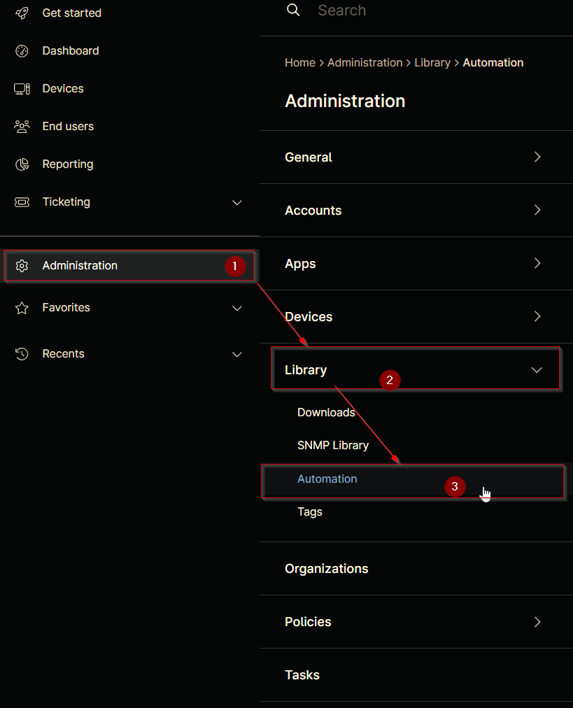
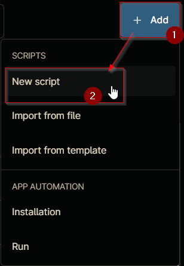
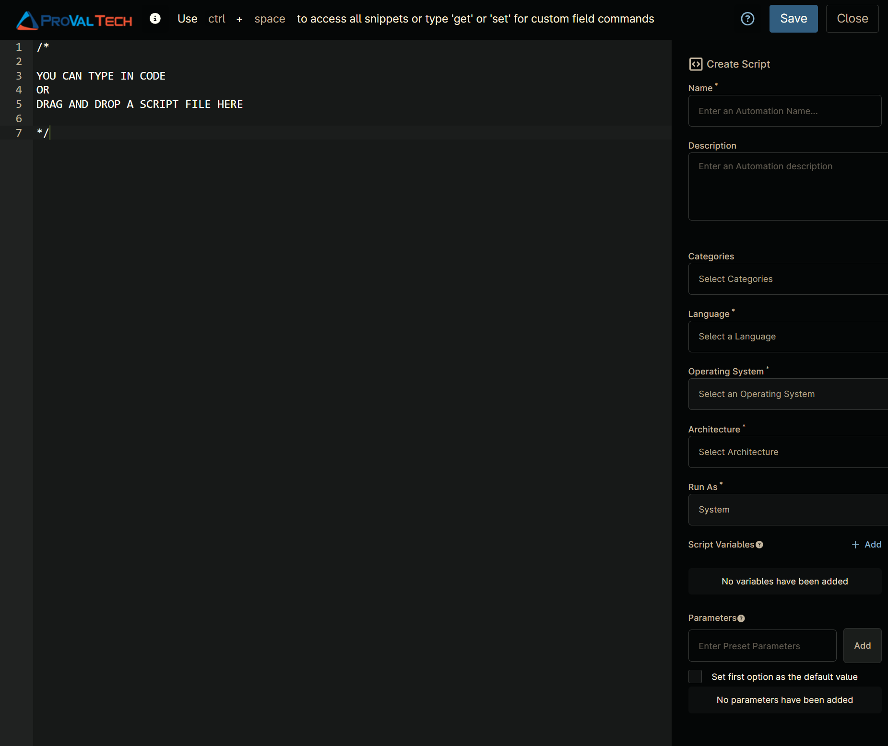
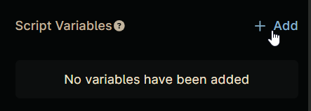
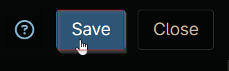
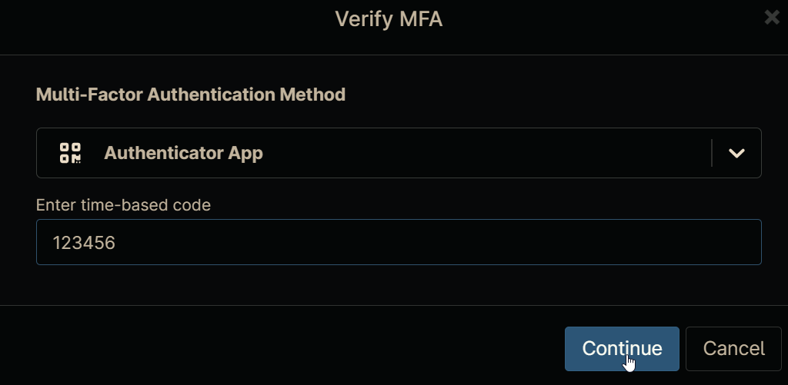

## Overview

## Sample Run

`Play Button` > `Run Automation` > `Script`  

## Dependencies

## Parameters

| Name | Example | Accepted Values | Required | Default | Type | Description |
| ---- | ------- | --------------- | -------- | ------- | ---- | ----------- |

## Automation Setup/Import

### Step 1

Navigate to `Administration` > `Library` > `Automation`  

### Step 2

Locate the `Add` button on the right-hand side of the screen, click on it and click the `New Script` button.  

The scripting window will open.  

## Script Variables

Click the `Add` button next to `Script Variables`.  

## Saving the Automation

Click the Save button in the top-right corner of the screen to save your automation.  

You will be prompted to enter your MFA code. Provide the code and press the Continue button to finalize the process.  

## Completed Automation

## Output

- Activity Details  
- Custom Field