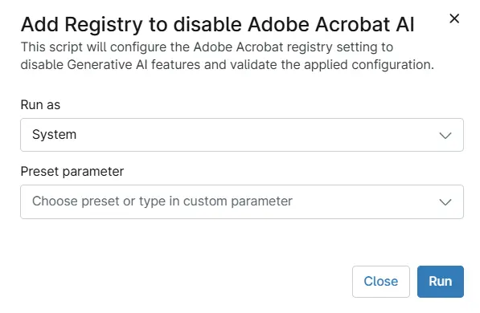

## Overview

This script will configure the Adobe Acrobat registry setting to disable Generative AI features and validate the applied configuration and sets the bEnableGentech DWORD value to 0 to disable Generative AI functionality.

## Sample Run

`Play Button` > `Run Automation` > `Script` 

## Automation Setup/Import

[Automation Configuration](https://github.com/ProVal-Tech/ninjarmm/blob/main/scripts/add-registry-to-disable-adobe-acrobat-ai.ps1)

## Output

- Activity Details

## Changelog

### 2026-07-09

This is the initial version.