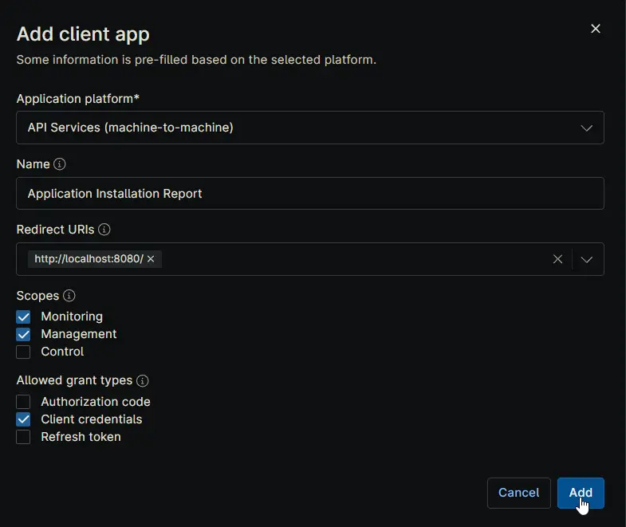
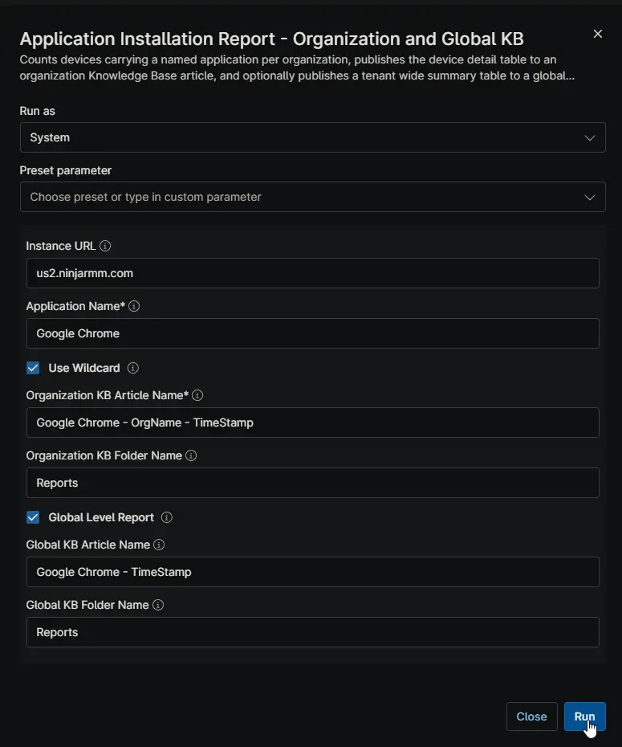
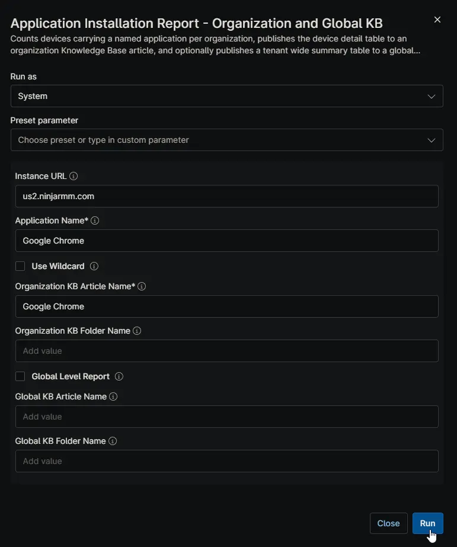
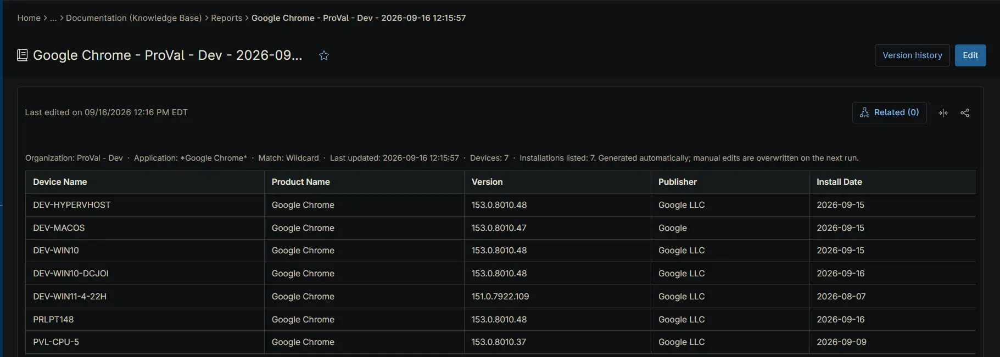
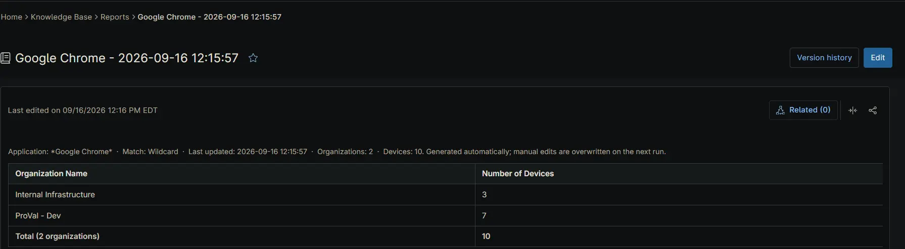

## Overview

This automation reports on where a given application is installed across the tenant. For each organization it counts the devices carrying the named application and publishes a device detail table to an organization Knowledge Base article. Optionally, it also publishes a tenant-wide summary table to a global Knowledge Base article.

Inventory is not collected from the endpoint the script runs on. The script calls the NinjaOne Public API and works from the software inventory NinjaOne has already gathered, authenticating with the OAuth 2.0 client credentials grant. The credential comes from two secure custom fields — [cPVAL Ninja API Client ID](/docs/32142af2-d352-4d0d-9ec3-9dae0a5fef88) and [cPVAL Ninja API Client Secret](/docs/58b01634-4e1a-4793-aafd-18526ea8c80e) — populated once during setup and read at runtime, so no credential is passed in as a script parameter.

Because the report is assembled centrally, run this on a single scheduled device rather than deploying it across the fleet.

> **⚠️ Prerequisite:** Both credential custom fields must be populated before the first run, from an API application configured as described in [API Application Configuration](#api-application-configuration). The script exits without producing a report if it cannot obtain an access token.

## API Application Configuration

The credential this automation uses comes from an API application registered in NinjaOne. Create it once, before the first run, under **Administration → Apps → API → Client App IDs → Add**.

| Setting | Value | Notes |
| ------- | ----- | ----- |
| Application platform | `API Services (machine-to-machine)` | Required. Pre-fills the dialog for unattended access with no user sign-in. |
| Name | `Application Installation Report` | Any name works. Naming it after the automation makes the credential easy to identify and revoke later. |
| Redirect URIs | `http://localhost:8080/` | Not used by the client credentials flow, but the field must contain a value. |
| Scopes | `Monitoring`, `Management` | **Monitoring** reads organizations, devices, and software inventory. **Management** writes the Knowledge Base articles. Leave **Control** unchecked — the automation never takes remote action on a device. |
| Allowed grant types | `Client credentials` | Leave **Authorization code** and **Refresh token** unchecked. Client credentials is the only flow the automation uses. |

On **Add**, NinjaOne issues a Client ID and a Client Secret. Copy both into their custom fields straight away:

- Client ID → [cPVAL Ninja API Client ID](/docs/32142af2-d352-4d0d-9ec3-9dae0a5fef88)
- Client Secret → [cPVAL Ninja API Client Secret](/docs/58b01634-4e1a-4793-aafd-18526ea8c80e)

> **⚠️ The Client Secret is shown only once.** If the dialog is closed before it is copied, the secret cannot be retrieved — a new one must be generated, which immediately invalidates the old one. Update the custom field at the same time, or the automation will fail to obtain an access token on its next run.
>
> **💡 Note:** Granting only Monitoring and Management keeps the credential to the minimum this automation needs. If the same API application is later reused by other automations, review whether their requirements change the scopes above.

## Sample Run

### Example 1

Runs with `Use Wildcard` and `Global Level Report` both enabled.

`Google Chrome` is matched as a partial name, so entries such as *Google Chrome* and *Google Chrome Beta* are all counted. Every organization receives a KB article named `Google Chrome - OrgName - TimeStamp` in its **Reports** folder, listing the devices that carry a match. A single global article, `Google Chrome - TimeStamp`, is also written to the global **Reports** folder with the per-organization counts side by side.

### Example 2

Runs with `Use Wildcard` and `Global Level Report` both disabled.

`Google Chrome` is matched exactly, so variants like *Google Chrome Beta* are excluded. Organization articles are still written as above, but no global article is produced — useful when the report is for individual client review rather than an internal tenant-wide rollup.

## Dependencies

- [Custom Field: cPVAL Ninja API Client ID](/docs/32142af2-d352-4d0d-9ec3-9dae0a5fef88)
- [Custom Field: cPVAL Ninja API Client Secret](/docs/58b01634-4e1a-4793-aafd-18526ea8c80e)
- [Solution: Application Installation Reporting](/docs/4de25a7e-823c-4b69-8048-8c00f65e1c17)

## Parameters

| Name | Calculated Name | Example | Accepted Values | Required | Default | Type | Description |
| ---- | --------------- | ------- | --------------- | -------- | ------- | ---- | ----------- |
| Instance URL | instanceurl | `us2.ninjarmm.com` | Any valid NinjaOne instance host | False | `us2.ninjarmm.com` | string/text | Host name of the NinjaOne instance the API calls are directed at. Set this to match the region your tenant is hosted in. |
| Application Name | applicationname | `Google Chrome` | -- | **True** | -- | string/text | Name of the application to report on, as it appears in NinjaOne software inventory. Matched exactly unless `Use Wildcard` is enabled. |
| Use Wildcard | usewildcard | -- | `True/False` | False | False | Checkbox | Matches any application name containing the value of `Application Name` rather than requiring an exact match. Enable to capture variants such as editions, channels, and version-suffixed names. |
| Organization KB Article Name | organizationkbarticlename | `Google Chrome - OrgName - TimeStamp` | -- | **True** | -- | string/text | Name of the KB article written for each organization. Supports the `OrgName` and `TimeStamp` substitution tokens. |
| Organization KB Folder Name | organizationkbfoldername | `Reports` | -- | False | `Reports` | string/text | Knowledge Base folder the organization article is filed under. Created if it does not exist. |
| Global Level Report | globallevelreport | -- | `True/False` | False | False | Checkbox | Also publishes a tenant-wide summary table to a global KB article. Leave disabled to produce organization articles only. |
| Global KB Article Name | globalkbarticlename | `Google Chrome - TimeStamp` | -- | False | -- | string/text | Name of the global summary article. Supports the `TimeStamp` substitution token. Ignored when `Global Level Report` is disabled. |
| Global KB Folder Name | globalkbfoldername | `Reports` | -- | False | `Reports` | string/text | Knowledge Base folder the global article is filed under. Ignored when `Global Level Report` is disabled. |

### Article Name Substitution Tokens

Write these as plain words in either article name field. Each is replaced with its live value when the article is created.

| Token | Replaced With | Example |
| ----- | ------------- | ------- |
| `OrgName` | Name of the organization the article belongs to | `Contoso Ltd` |
| `TimeStamp` | Date and time the report was generated | `2026-09-16 14:30:30` |

> **💡 Note:** `OrgName` only resolves on the organization article. A global article covers every organization, so the token has no single value there.

## Custom Fields

| Field Name | Type | Mandatory | Scope | Description |
| ---------- | ---- | --------- | ----- | ----------- |
| [cPVAL Ninja API Client ID](/docs/32142af2-d352-4d0d-9ec3-9dae0a5fef88) | Secure | Yes | System | Client ID of the client-credentials API application used to authenticate against the NinjaOne Public API. Read at runtime. |
| [cPVAL Ninja API Client Secret](/docs/58b01634-4e1a-4793-aafd-18526ea8c80e) | Secure | Yes | System | Client Secret paired with the Client ID above. Read at runtime; never passed as a script parameter. |

## Automation Setup/Import

[Automation Configuration](https://github.com/ProVal-Tech/ninjarmm/blob/main/scripts/application-installation-report-organization-and-global-kb.ps1)

## Sample Output

**Organization Knowledge Base article:**

**Global Knowledge Base article:**

## Output

- **Activity Details:** Logs the authentication result, the organizations and devices processed, the match count per organization, and the Knowledge Base articles written or updated.
- **Knowledge Base:** Writes a device detail article per organization, and a tenant-wide summary article when `Global Level Report` is enabled.

## Changelog

### 2026-09-16

- Initial version of the document
