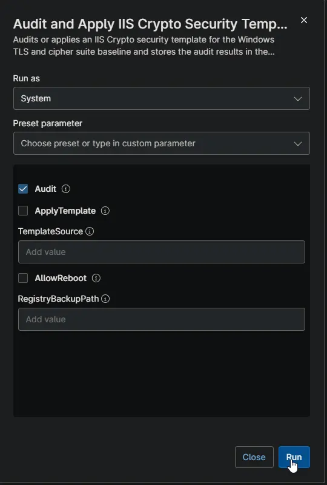
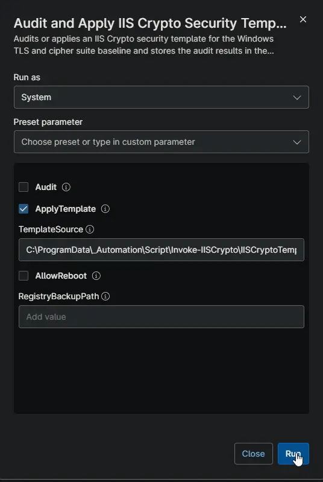
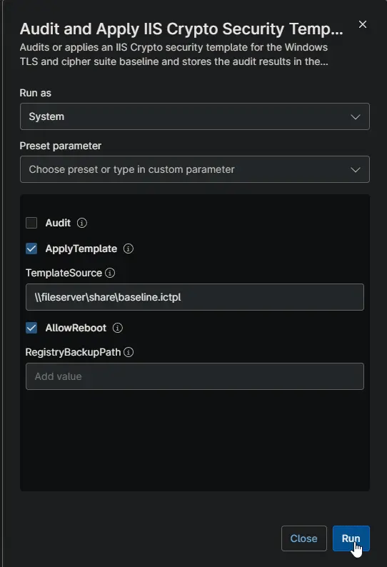
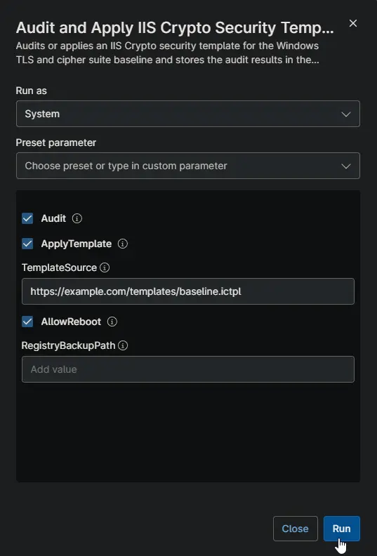

## Overview

This script audits or hardens the Windows settings that control secure connections (TLS protocols and cipher suites) using IIS Crypto security templates.

**When to use:**

- Check which TLS and cipher suite settings are enabled on a device (read-only).
- Enforce a security baseline by applying an IIS Crypto template.
- Apply a baseline and verify the new settings in a single run.
- Keep the latest audit results on the device record for reporting.

**How it works:**

- The script stages the IIS Crypto CLI and the template locally, then runs them.
- A registry backup is saved before any template is applied.
- When Audit is enabled, the results are stored as a table in the [cPVAL IIS Crypto Info](/docs/d4e8f2a6-1c9b-4a7e-8f3d-5b6c2e9a1f4d) custom field.
- Applying a template changes machine-wide security settings and may require a restart. Enable AllowReboot to restart automatically, or restart the device yourself afterwards.

**Requirements:**

- Runs elevated (System context).
- To apply a template, provide a download URL, a network share, or a local file path to a .ictpl template.
- Create the [cPVAL IIS Crypto Info](/docs/d4e8f2a6-1c9b-4a7e-8f3d-5b6c2e9a1f4d) custom field (see Dependencies) before enabling Audit. The activity fails when the field is missing.

## Sample Run

### Example 1: Running the script to audit current settings

Enable **Audit** only. The script returns every TLS and cipher suite setting with its current value. Nothing is changed on the device.

Settings that show a value of null have not been changed; Windows is still using its default for that setting.

The results are also stored as a table in the [cPVAL IIS Crypto Info](/docs/d4e8f2a6-1c9b-4a7e-8f3d-5b6c2e9a1f4d) custom field.

### Example 2: Running the script to apply a template from a local file path

Enable **ApplyTemplate** and set **TemplateSource** to the local file path. The template is downloaded and applied without restarting the device. A registry backup is saved as backup.reg in the script working directory.

### Example 3: Running the script to apply a template from a network share and restart automatically

Enable **ApplyTemplate** and **AllowReboot**. Set **TemplateSource** to the network share path, for example \\fileserver\share\baseline.ictpl. The template is copied and applied, and the device restarts automatically.

### Example 4: Running the script to apply a template and audit the results with a custom backup location

Enable **ApplyTemplate** and **Audit**. Set **TemplateSource** to a download url and **RegistryBackupPath** to the backup location. The template is applied first, then the new settings are returned and stored in the [cPVAL IIS Crypto Info](/docs/d4e8f2a6-1c9b-4a7e-8f3d-5b6c2e9a1f4d) custom field.

## Dependencies

- [Custom Field: cPVAL IIS Crypto Info](/docs/d4e8f2a6-1c9b-4a7e-8f3d-5b6c2e9a1f4d) (create before enabling Audit)
- [Script: Invoke-IISCrypto](/docs/71437aaf-ed94-4950-a746-02b6bf6eb867) (the underlying agnostic script)
- IIS Crypto templates, prebuilt or custom, from [Nartac Software](https://www.nartac.com/Products/IISCrypto)

## Parameters

| Name | Example | Accepted Values | Required | Default | Type | Description |
| ---- | ------- | --------------- | -------- | ------- | ---- | ----------- |
| Audit | true | true, false | False | false | Boolean | Shows current TLS and cipher suite settings and stores them in the [cPVAL IIS Crypto Info](/docs/d4e8f2a6-1c9b-4a7e-8f3d-5b6c2e9a1f4d) custom field. Changes nothing. |
| ApplyTemplate | true | true, false | False | false | Boolean | Applies the template given by TemplateSource. |
| TemplateSource | https://example.com/templates/baseline.ictpl | HTTP/HTTPS URL, network share, or local file path | Only with ApplyTemplate | Empty | String | Location of the .ictpl template to apply. |
| AllowReboot | true | true, false | False | false | Boolean | Restarts the computer automatically after the template is applied. |
| RegistryBackupPath | C:\Temp\backup.reg | Any file path | False | backup.reg (script working directory) | String | Where to save the registry backup created before applying a template. |

## Custom Fields

| Field Name | Type | Mandatory | Scope | Description |
| ---------- | ---- | --------- | ----- | ----------- |
| [cPVAL IIS Crypto Info](/docs/d4e8f2a6-1c9b-4a7e-8f3d-5b6c2e9a1f4d) | WYSIWYG | Yes | Device | Stores an HTML table of every audited setting: setting category, setting name, current value, and data collection time. Settings never modified show as Not changed (Windows default). Required when Audit is enabled; the activity fails when the field cannot be updated. Not used when only ApplyTemplate is enabled. |

## Automation Setup/Import

[Automation Configuration](https://github.com/ProVal-Tech/ninjarmm/blob/main/scripts/audit-and-apply-iis-crypto-security-templates-windows.ps1)

## Output

- **Activity Details:** When Audit is enabled, each setting is returned with its name and value. The run log is included, and any errors are reported in the activity output.
- **Custom Field:** [cPVAL IIS Crypto Info](/docs/d4e8f2a6-1c9b-4a7e-8f3d-5b6c2e9a1f4d) is updated with a table of every audited setting (setting category, setting name, current value, data collection time). Settings never modified show as Not changed (Windows default).
- **Registry Backup:** A copy of the previous settings, saved as backup.reg in the script working directory unless RegistryBackupPath is set.
- **Restart:** Applied settings may require a restart to take full effect. A restart only happens automatically when AllowReboot is enabled.

## Changelog

### 2026-09-30

- Initial version of the document.
