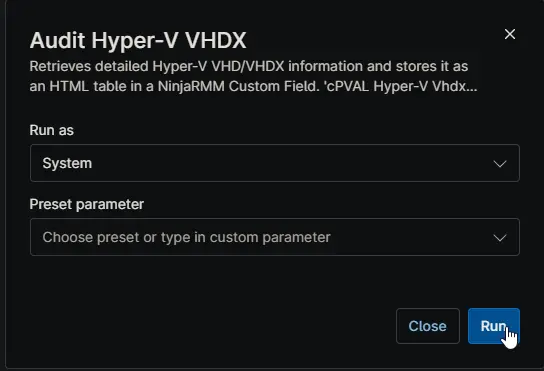

## Overview

Retrieves detailed Hyper-V VHD/VHDX information and stores it as an HTML table in a NinjaRMM Custom Field [cPVAL Hyper-V Vhdx Details](/docs/130fecda-6c10-4271-a55e-1aa19c8e8042).

## Sample Run

## Dependencies

- [Custom Field: cPVAL Hyper-V Vhdx Details](/docs/130fecda-6c10-4271-a55e-1aa19c8e8042)
- [Solution: Hyper-V VHDX Auditing](/docs/ac904ba5-b501-4137-9f09-9960c88f4aa4)

## Automation Setup/Import

[Automation Configuration](https://github.com/ProVal-Tech/ninjarmm/blob/main/scripts/audit-hyperv-vhdx.ps1)

## Output

- Activity Details  
- Custom Field
