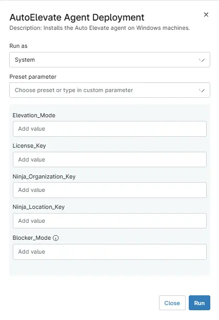

## Overview

This script automates the deployment and update of the AutoElevate on windows machines by downloading the latest installer, running the installation silently, and validating that the agent has been successfully installed.

## Sample Run

`Play Button` > `Run Automation` > `Script` 

## Parameters

**Note:** `If the value is present under the custom field then variables do not need to be put during the script execution. As the script get the data from either Custom field or variables.`

| Name | Description | Type | Mandatory | Default | Options | Source |
|------|-------------|------:|:---------:|:-------:|:-------:|--------|
| License_Key | AutoElevate license key for agent activation. | `String/text` | Yes | — | — | `cPVAL License_Key` Custom Field |
| Ninja_Organization_Key | Organization name for agent identification | `String/text` | No | —  | — | `cPVAL Ninja Organization Name` Custom Field |
| Ninja_Location_Key | Location name for agent organization | `String/text` | No | — | — | `cPVAL Ninja Location Name` Custom Field |
| Elevation_Mode | AutoElevate elevation mode setting | `String/text` | Yes | — | — | `cPVAL Elevation_Mode` Custom Field |
| Blocker_Mode | AutoElevate blocker mode setting | `String/text` | Yes | — | `Disabled`, `Enabled` | `cPVAL Blocker_Mode` Custom Field |

## Dependencies

The script is dependent on below custom fileds during the deployment.

- [cPVAL Blocker_Mode](/docs/dba79f8f-132d-41cd-ae1c-6da6964bc418)
- [cPVAL Elevation Mode](/docs/03094753-93f5-41da-8a0a-d948b1165b88)
- [cPVAL License_Key](/docs/370d64a2-0799-48ca-9661-d24bd75b7f67)
- [cPVAL Ninja Location Name](/docs/4bfe4881-3687-4a30-bf00-d85067d5c6d8)
- [cPVAL Ninja Organization Name](/docs/f6050cf6-67c8-4563-888e-8f34651cf4bb)

## Automation Setup/Import

[Automation Configuration](https://github.com/ProVal-Tech/ninjarmm/blob/main/scripts/autoelevate-install.ps1)

## Output

- Activity Details
