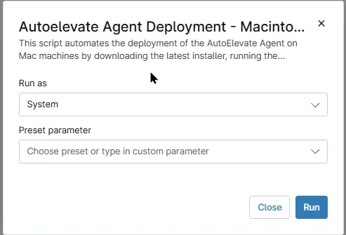

## Overview
This script automates the deployment of the AutoElevate Agent on Mac machines by downloading the latest installer, running the installation silently.

## Sample Run

`Play Button` > `Run Automation` > `Script`  

## Dependencies

## Automation Setup/Import

[Automation Configuration](https://github.com/ProVal-Tech/ninjarmm/blob/main/scripts/autoelevate-agent-deployment-macintosh.ps1)

## Output

- Activity Details 

## Changelog

### 2026-08-07

- Initial version of the document
