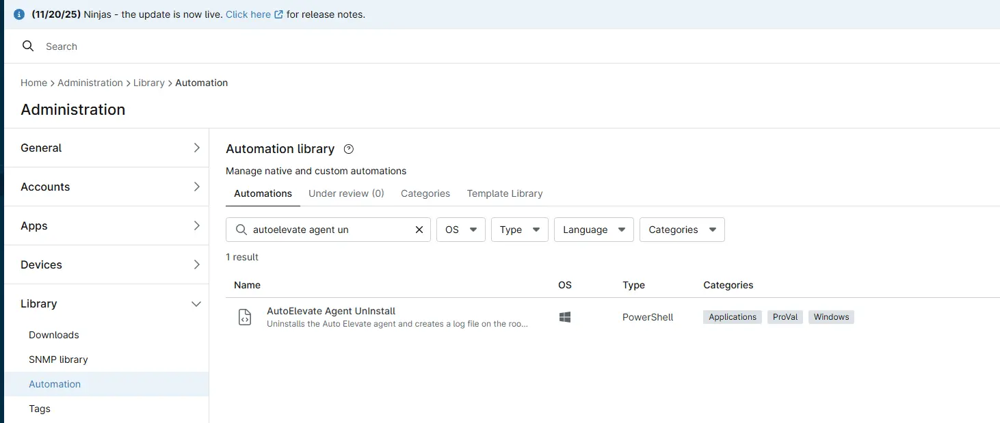

## Overview

This script automates the removal of the AutoElevate agent from Windows systems. It terminates the AutoElevateAgent service, removes associated registry keys, deletes installation directories, and uninstalls the application using WMI. All actions are logged to a file for audit purposes.

## Sample Run

`Play Button` > `Run Automation` > `Script`  

  

## Automation Setup/Import

[Automation Configuration](https://github.com/ProVal-Tech/ninjarmm/blob/main/scripts/autoelevate-uninstallation.ps1)

## Output

- Activity Details  
