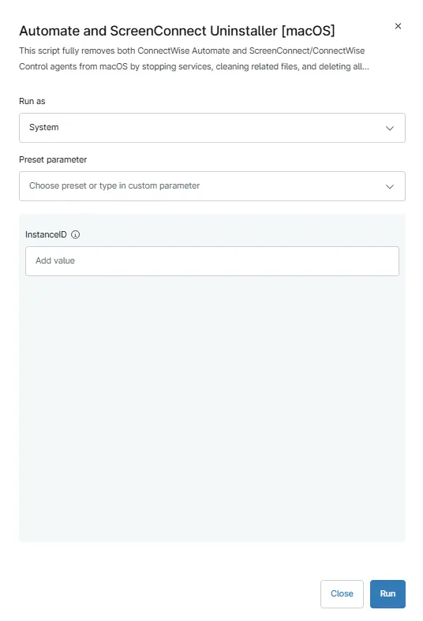

## Overview
This script fully removes both ConnectWise Automate and ScreenConnect/ConnectWise Control agents from **macOS** by stopping services, cleaning related files, and deleting all associated components, with optional targeting for specific ScreenConnect instances.

## Sample Run

`Play Button` > `Run Automation` > `Script`  

Search and select `Automate and Screenconnect Uninstaller [macOS]`

## Parameters

| Name | Example | Required | Default | Type | Description |
| ---- | ------- | -------- | ------- | ---- | ----------- |
| InstanceID| 7df67d57637499t6 | False | - | String | To uninstall a specific client/instance enter the InstanceID here. By default, all instances will be removed. |

## Automation Setup/Import

[Automation Configuration](https://github.com/ProVal-Tech/ninjarmm/blob/main/scripts/automate-and-screenconnect-uninstaller.sh)

## Output

- Activity Details  

## Changelog

### 2026-03-17

- Initial version of the document

