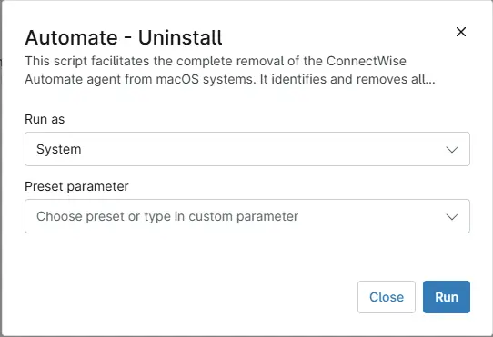

## Overview
This script facilitates the complete removal of the ConnectWise Automate agent from **macOS** systems. It identifies and removes all associated services, application components, configuration files, and residual directories to ensure a thorough and clean uninstallation of the Automate agent.

## Sample Run

`Play Button` > `Run Automation` > `Script`  

Search and select `Automate - Uninstall`

## Automation Setup/Import

[Automation Configuration](https://github.com/ProVal-Tech/ninjarmm/blob/main/scripts/automate-uninstall-macos.sh)

## Output

- Activity Details  

## Changelog

### 2026-03-17

- Initial version of the document

