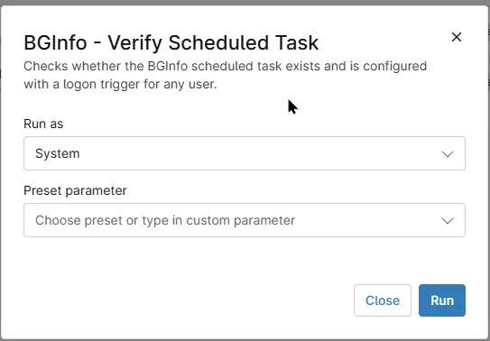

## Overview

Checks whether the "BGInfo scheduled task" exists and is configured with a "logon trigger for any user".

## Sample Run

## Dependencies

- [Automation - Configure BGInfo](/docs/408cc622-de6a-4913-9150-267dcb4685e3)
- [Solution - Configure BgInfo](/docs/e6f8548f-1459-4f72-9d77-be33dc4d89a6)

## Automation Setup/Import

[Automation Configuration](https://github.com/ProVal-Tech/ninjarmm/blob/main/scripts/bginfo-verify-scheduled-task.ps1)

## Output

- Activity Details  

## Changelog

### 2026-09-22

- Initial version of the document
