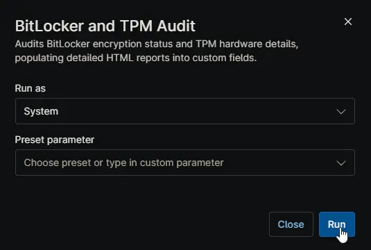
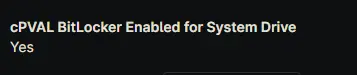
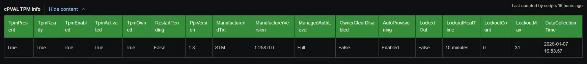

## Description

This script performs a comprehensive audit of the machine's security posture regarding disk encryption and hardware security. It executes two main functions:

1. **BitLocker Audit (`Get-BitLockerDetail`)**:
    - **Prerequisite Check**: Verifies the presence of the 'BitLocker' module and necessary OS features.
    - **Data Collection**: Scans all volumes using `Get-BitLockerVolume`. It handles complex configurations by flattening volumes with multiple key protectors into individual rows.
    - **Formatting**: Generates a stylized HTML table containing granular details such as Mount Point, Encryption Method, Protection Status, Key Protector IDs, Recovery Passwords, and timestamps.
    - **Storage**: Populates the [cPVAL BitLocker Info](/docs/fd545101-1cd5-4d9f-8df7-57c4df1616b9) custom field and sets the [cPVAL BitLocker Enabled for System Drive](/docs/5f6128a5-4fc8-44b2-adb2-40c2ac92edc5) flag if the OS drive is protected.

2. **TPM Audit (`Get-TPMDetail`)**:
    - **Prerequisite Check**: Verifies the 'TrustedPlatformModule' module.
    - **Data Collection**: Retrieves hardware security details using `Get-Tpm`.
    - **Formatting**: Generates a stylized HTML table covering Manufacturer ID, AutoProvisioning status, Lockout counters, and TpmReady/Enabled states, including a 'DataCollectionTime' timestamp.
    - **Storage**: Populates the [cPVAL TPM Info](/docs/68c098e2-54f1-40f8-9574-f70f1948e4ba) custom field.

**Note:**

- This is only compatible for Windows devices.  
- The BitLocker Drive Encryption feature must be enabled on servers to perform auditing. This script will not work without enabling this feature.
- TPM audit will still be performed even if BitLocker audit fails.

## Requirements

- PowerShell v5

## Sample Run

## Dependencies

- [Custom Field: cPVAL BitLocker Enabled for System Drive](/docs/5f6128a5-4fc8-44b2-adb2-40c2ac92edc5)
- [Custom Field: cPVAL BitLocker Info](/docs/fd545101-1cd5-4d9f-8df7-57c4df1616b9)
- [Custom Field: cPVAL TPM Info](/docs/68c098e2-54f1-40f8-9574-f70f1948e4ba)
- [Solution: BitLocker and TPM Audit](/docs/57c787ad-8d22-4ae4-b5e5-dac34fc600fc)

## Custom Fields

| Field Label                       | Scope            | Type      | Description |
|-----------------------------------|------------------------------------|--------------------|-------------|
| [cPVAL BitLocker Info](/docs/fd545101-1cd5-4d9f-8df7-57c4df1616b9)             | Device                 | WYSIWYG (HTML Table)             | Stores the HTML-formatted inventory of BitLocker volumes and protectors. |
| [cPVAL BitLocker Enabled for System Drive](/docs/5f6128a5-4fc8-44b2-adb2-40c2ac92edc5)  | Device | Checkbox             | Flag indicating if the Operating System drive is encrypted. |
| [cPVAL TPM Info](/docs/68c098e2-54f1-40f8-9574-f70f1948e4ba)                | Device                       | WYSIWYG (HTML Table)              | Stores the HTML-formatted detailed status of the Trusted Platform Module (TPM). |

## Automation Setup/Import

[Automation Configuration](https://github.com/ProVal-Tech/ninjarmm/blob/main/scripts/bitlocker-and-tpm-audit.ps1)

## Output

- Activity Logs
- Custom Fields
  - `cPVAL BitLocker SysDrive Enabled`  
    
  - `cPVAL BitLocker Info`  
    
  - `cPVAL TPM Info`  
    
