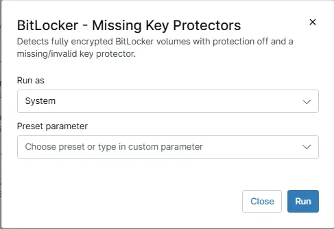

## Overview
Detects fully encrypted BitLocker volumes with protection off and a missing key protector.

## Sample Run

`Play Button` > `Run Automation` > `Script`  

## Dependencies

- [Solution: BitLocker and TPM Audit](/docs/57c787ad-8d22-4ae4-b5e5-dac34fc600fc)

## Automation Setup/Import

[Automation Configuration](https://github.com/ProVal-Tech/ninjarmm/blob/main/scripts/bitlocker-missing-key-protectors.ps1)

## Output

- Activity Details

## Changelog

### 2026-07-24

- Initial version of the document
