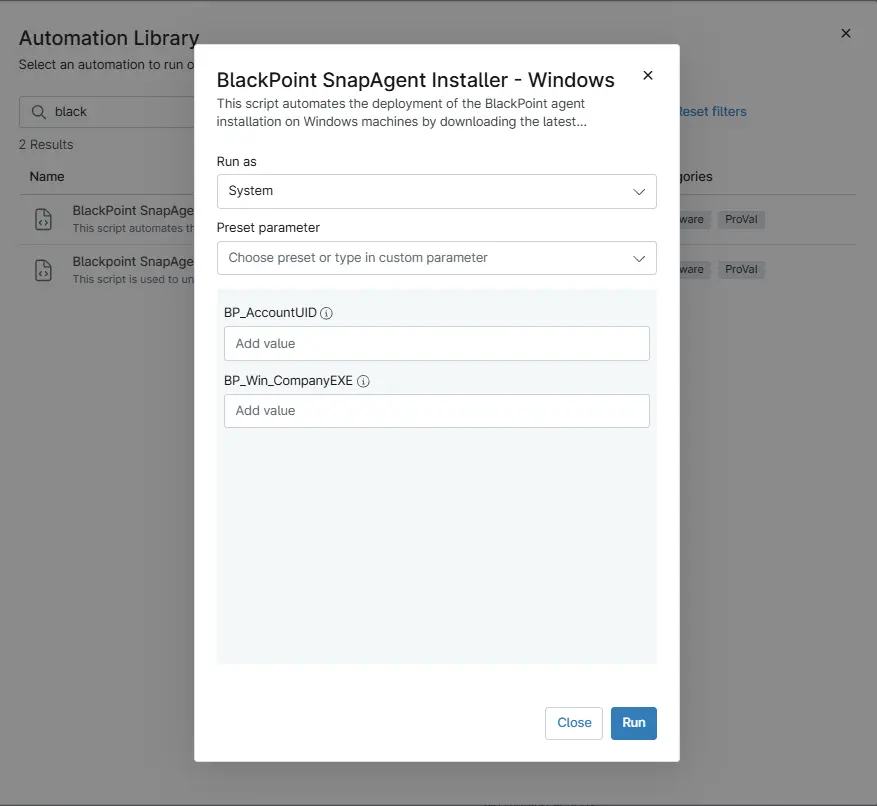

## Overview

This script automates the deployment of the BlackPoint SnapAgent installation on Windows machines by downloading the latest installer, running the installation silently, and validating that the agent has been successfully installed.

## Sample Run

`Play Button` > `Run Automation` > `Script`  

## Parameters

`Note: If the value is present under the custom field then variables do not need to be put during the script execution. As the script get the data from either Custom field or variables.`

| Name | Example | Accepted Values | Required | Default | Type | Description |
| ---- | ------- | --------------- | -------- | ------- | ---- | ----------- |
|BP_AccountUID | -- | -- | NO | "" | `String/Text` | Stores the unique Blackpoint Account UID used to identify and link endpoints to the correct Blackpoint account. |
| BP_Win_CompanyEXE |--  | -- | NO| "" | `String/Text` |It holds the company exe installer URL for BlackPoint endpoint for each client. |

## Dependencies

- [Custom Field - cPVAL BP AccountUID](/docs/83df96df-47eb-43f4-860a-af3f686641c4)
- [Custom Field - cPVAL BP Win CompanyEXE](/docs/dd410db2-6305-425c-93e7-378efbf145c3)
- [Solution - BlackPoint SnapAgent Deployment](/docs/b9f13c4b-742d-4118-be8e-0c03e43ded17)

## Automation Setup/Import

- [Automation Configuration](https://github.com/ProVal-Tech/ninjarmm/blob/main/scripts/black-point-deployment-windows.ps1)

## Output

- Activity Details
