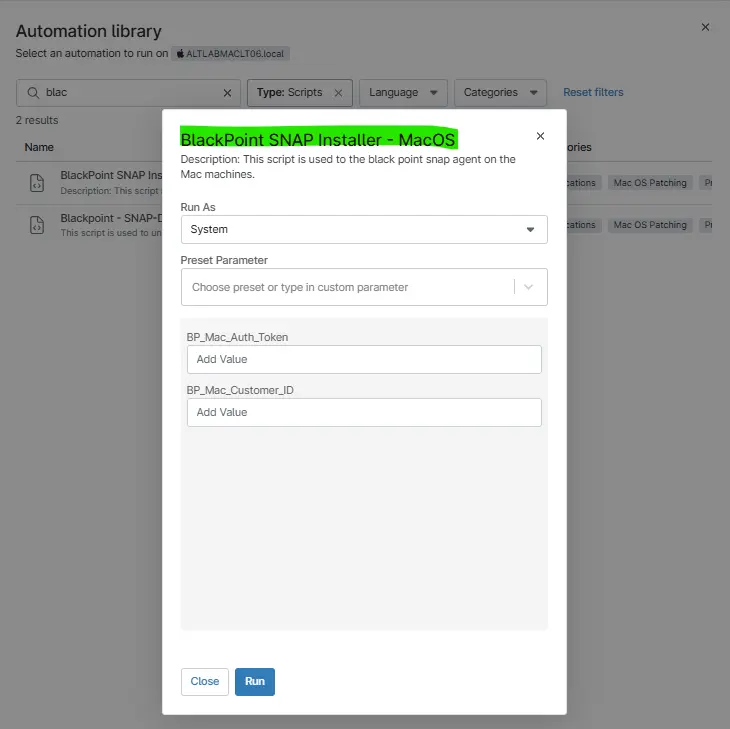

## Overview

This script automates the deployment and update of the AutoElevate on MAC machines by downloading the latest installer, running the installation silently, and validating that the agent has been successfully installed.

## Sample Run

`Play Button` > `Run Automation` > `Script`  

## Parameters

`Note: If the value is present under the custom filed then variables do not need to be put during the script execution. As the script get the data from either Custom filed or variables.`

| Name | Description | Type | Mandatory | Default | Options | Source |
|------|-------------|------:|:---------:|:-------:|:-------:|--------|
| BP_Mac_Auth_Token | Used to hold the blackpoint installation token | String | Yes | "" | — | cPVAL_BP_Mac_Auth_Token |
| BP_Mac_Customer_ID | Used to hold the blackpoint AccountID | String | No | "" | — | cPVAL_BP_AccountUID |

## Dependencies

- [BP-Accountid](/docs/83df96df-47eb-43f4-860a-af3f686641c4)
- [BP-companyEXE](/docs/7537a07a-9dda-4302-8ef4-b66ae94df2b8)

## Automation Setup/Import

[Automation Configuration](https://github.com/ProVal-Tech/ninjarmm/blob/main/scripts/black-point-deployment-mac.sh)

## Output

- Activity Details
