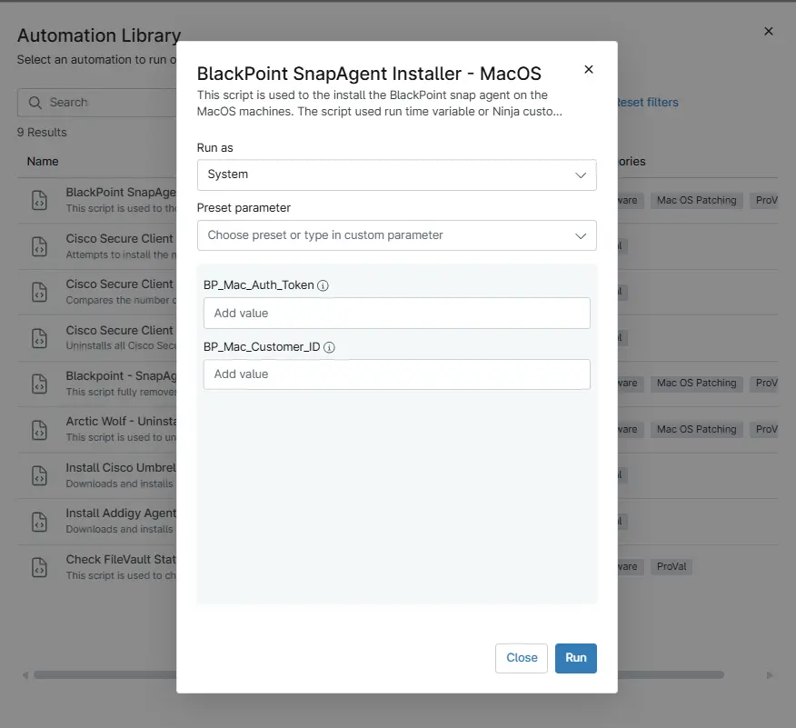

## Overview

This script is used to the install the BlackPoint SnapAgent on the MacOS machines. The script uses run time variable or Ninja custom fields to retrieve the necessary authentication information.

## Sample Run

`Play Button` > `Run Automation` > `Script`  

## Parameters

`Note: If the value is present under the custom field then variables do not need to be put during the script execution. As the script get the data from either Custom field or variables.`

| Name | Example | Accepted Values | Required | Default | Type | Description |
| ---- | ------- | --------------- | -------- | ------- | ---- | ----------- |
|BP_Mac_Auth_Token | -- | -- | NO | "" | `String/Text` | Stores the unique BlackPoint Authentication token that used during the installation of the Blackpoint SNAP agent on MacOS endpoints. |
| BP_Mac_Customer_ID |--  | -- | NO| "" | `String/Text` | Stores the unique Blackpoint Account UID used to identify and link endpoints to the correct Blackpoint account. |

## Dependencies

- [Custom Field - cPVAL BP AccountUID](/docs/83df96df-47eb-43f4-860a-af3f686641c4)
- [Custom Field - cPVAL BP Mac Auth Token](/docs/7537a07a-9dda-4302-8ef4-b66ae94df2b8)
- [Solution - BlackPoint SnapAgent Deployment](/docs/b9f13c4b-742d-4118-be8e-0c03e43ded17)

## Automation Setup/Import

- [Automation Configuration](https://github.com/ProVal-Tech/ninjarmm/blob/main/scripts/black-point-deployment-mac.sh)

## Output

- Activity Details
