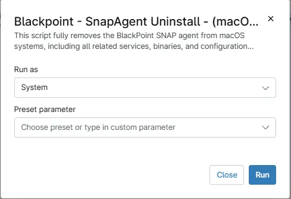

## Overview

This script fully removes the BlackPoint SnapAgent from MacOS systems, including all related services, binaries, and configuration components. It stops and unloads associated launch daemons, to prevent the service from running during removal.

## Sample Run

**Run As:** `System`  

## Automation Setup/Import

- [Automation Configuration](https://github.com/ProVal-Tech/ninjarmm/blob/main/scripts/black-point-uninstall-mac.sh)
- [Solution - BlackPoint SnapAgent Deployment](/docs/b9f13c4b-742d-4118-be8e-0c03e43ded17)

## Output

- Activity Details  
