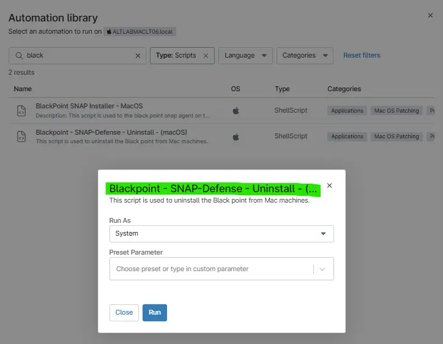

## Overview

The script using the shellscript to remove the to remove the blackpoint appication from machines. Also validates if it uninstalled successfully or not.

## Sample Run

**Run As:** `System`  

## Automation Setup/Import

- [Automation Configuration](https://github.com/ProVal-Tech/ninjarmm/blob/main/scripts/blackpoint-uninstall.ps1)

## Solution Document

- [Solution - BlackPoint Agent Deployment](/docs/b9f13c4b-742d-4118-be8e-0c03e43ded17)

## Output

- Activity Details  
