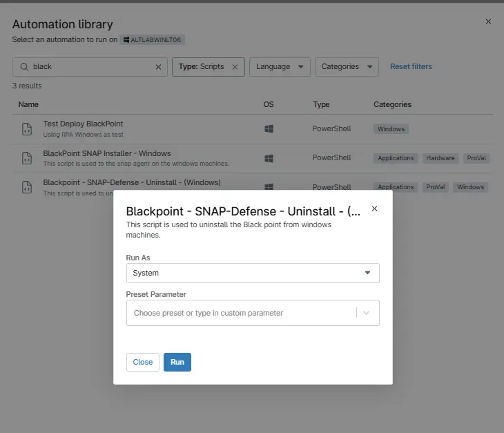

## Overview

The script using the `Remove-Application.ps1` to remove the appication from machines. Also validates if it uninstalled successfully or not.

## Sample Run

**Run As:** `System`  

## Automation Setup/Import

[Automation Configuration](https://github.com/ProVal-Tech/ninjarmm/blob/main/scripts/blackpoint-uninstall.ps1)

## Output

- Activity Details  
