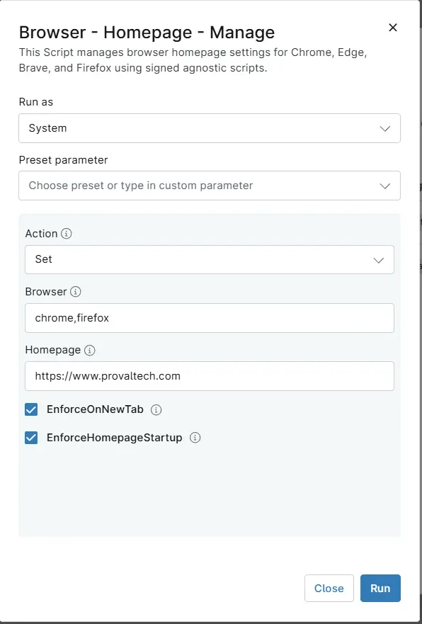

## Overview
Manages browser homepage settings for Chrome, Edge, Brave, and Firefox using signed agnostic scripts.

## Sample Run

## Dependencies

- [Custom Field - cPVAL Browser HomePage Action](/docs/9073ddaa-e5c0-478f-a893-e6b8c423fb3d)
- [Custom Field - cPVAL Browser](/docs/117579a5-d7bf-43d5-97e1-ea77163cf7a2)
- [Custom Field - cPVAL Browser Homepage](/docs/bec7d778-7266-46f4-893b-616c0cea5557)
- [Custom Field - cPVAL Browser EnforceOnNewTab](/docs/9e50a4bc-f862-48af-a964-b073cb9cce01)
- [Custom Field - cPVAL Browser EnforceHomepageStartup](/docs/734b02cf-e27d-4bc9-93b6-8054946780f5)
- [Solution - Browser - HomePage - Manage](/docs/3197b1ea-9250-4373-9d21-6124a0b72ec6)

## Parameters

| Name | Example | Accepted Values | Required | Default | Type | Description |
| ---- | ------- | --------------- | -------- | ------- | ---- | ----------- |
| Action | `Set` | `Set`, `Replace`, `Remove` | `False` | - | DropDown | Specify desired action to be performed on Browsers Homepage. |
| Browser | `chrome,edge` | `Chrome`, `Edge`, `Firefox`, `Brave` | `False` | - | Text/String | Specify the browser for setting/removing the homepage. Only 'Chrome', 'Edge', 'Brave' and 'Firefox' are acceptable values.  Each value should be separated by a comma without any additional spaces, e.g., chrome,firefox. |
| HomePage | `https://www.provaltech.com` | - | `False` | - | Text/String | The string value of the homepage to set in the browser. Only useful with the Set and Replace actions |
| EnforceOnNewTab | - | - | `False` | - | Checkbox | Select it to enforce the homepage on each new tab instead of the new tab page. Only useful with the Set and Replace actions and only works on Chromium Browsers (Brave,Chrome and Edge). |
| EnforceHomepageStartup | - | - | `False` | - | Checkbox | "Select it to enforce the homepage to be the only open tab at the startup of the browser. Only useful with the Set and Replace actions. |

## Custom Fields

| Field Name | Type | Mandatory | Scope | Description |
| ---------- | ---- | --------- | ----- | ----------- |
| [Custom Field - cPVAL Browser HomePage Action](/docs/9073ddaa-e5c0-478f-a893-e6b8c423fb3d) | DropDown | False |  `Organization`, `Location`, `Device`  | Select the desired action to be performed on Browsers Homepage. Set -> To set the Homepage; Remove -> To remove the Homepage; Replace -> To replace the current Homepage. |
| [Custom Field - cPVAL Browser](/docs/117579a5-d7bf-43d5-97e1-ea77163cf7a2) | Text | False |  `Organization`, `Location`, `Device`  | Specify the browser for setting/removing the homepage. Only 'Chrome', 'Edge', 'Brave' and 'Firefox' are acceptable values.  Each value should be separated by a comma without any additional spaces, e.g., chrome,firefox. |
| [Custom Field - cPVAL Browser Homepage](/docs/bec7d778-7266-46f4-893b-616c0cea5557) | Text | False |  `Organization`, `Location`, `Device`  | The string value of the homepage to set in the browser. Only useful with the Set and Replace actions.|
| [Custom Field - cPVAL Browser EnforceOnNewTab](/docs/9e50a4bc-f862-48af-a964-b073cb9cce01) | Checkbox | False |  `Organization`, `Location`, `Device`  | Select it to enforce the homepage on each new tab instead of the new tab page. Only useful with the Set and Replace actions and only works on Chromium Browsers (Brave,Chrome and Edge). |
| [Custom Field - cPVAL Browser EnforceHomepageStartup](/docs/734b02cf-e27d-4bc9-93b6-8054946780f5) | Checkbox | False |  `Organization`, `Location`, `Device`  | Select it to force the homepage to be the only open tab at the startup of the browser. Only useful with the Set and Replace actions. |

## Automation Setup/Import

[Automation Configuration](https://github.com/ProVal-Tech/ninjarmm/blob/main/scripts/browser-homepage-manage.ps1)

## Output

- Activity Details  

### 2026-09-28

- Initial version of the document