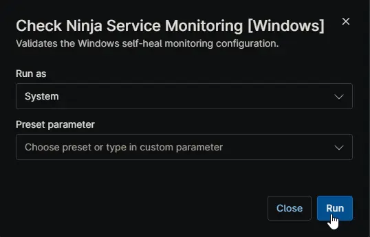

## Overview

This script serves as the health check for the NinjaRMM self-healing solution. Its primary function is to verify that the background monitoring system (the scheduled task and the watchdog script) is fully intact and operational.

**When to use:** This script is not designed to be run as a standalone automation. Instead, it is deployed as the **Condition** (evaluation script) within your NinjaRMM Agent Policies. If this script detects that the monitoring setup is missing or broken, it triggers the corresponding [remediation script](/docs/cb7a9cf6-e5ea-40db-8249-2daec21d793d) to fix it.

## How it Works

When the script runs, it performs three quick validation checks:

- **Script Presence:** It verifies that the background monitoring script exists in the expected directory on the local machine.
- **File Integrity:** It checks the file hash of the monitoring script to ensure it hasn't been corrupted, altered, or deleted.
- **Task Registration:** It verifies that the `EnsureNinjaServiceRunning` Windows Scheduled Task is properly registered and present.

If all three checks pass, the script exits successfully (Exit Code 0). If any check fails, it exits with a failure code (Exit Code 1), which tells NinjaRMM to run the "Ensure Ninja Service is Running" remediation script.

## Sample Run

> **Note:** This script is specifically engineered to operate as the detection condition within the [Ensure Ninja Service is Running [Windows Workstation]](/docs/cdcae433-5abc-4e45-97f5-96cae47ad2bf) and [Ensure Ninja Service is Running [Windows Server]](/docs/2c947f35-a856-4f70-a3f2-14c95d050943) policies. Manual execution is not recommended, as the script's output is intended to trigger automated remediation actions rather than provide direct feedback.

## Dependencies

- [Solution: NinjaRMM Agent Self-Heal](/docs/e17b4631-7778-472f-8f5f-f8de33aa3529)

## Automation Setup/Import

[Automation Configuration](https://github.com/ProVal-Tech/ninjarmm/blob/main/scripts/check-ninja-service-monitoring-windows.ps1)

## Output

- **Activity Details:** Text output indicating which specific checks passed or failed (e.g., `[PASS] Script file exists and hash validates.` or `[FAIL] Scheduled task EnsureNinjaServiceRunning is missing.`).
- **Final Result:** A clear text output indicating overall success (`Success: Monitoring configuration is fully intact.`) or failure (`Failure: Monitoring configuration is missing or invalid.`).
- **Exit Code:** Returns `0` if the monitoring setup is healthy, or `1` if remediation is required.

## Changelog

### 2026-07-07

- Initial version of the document.
