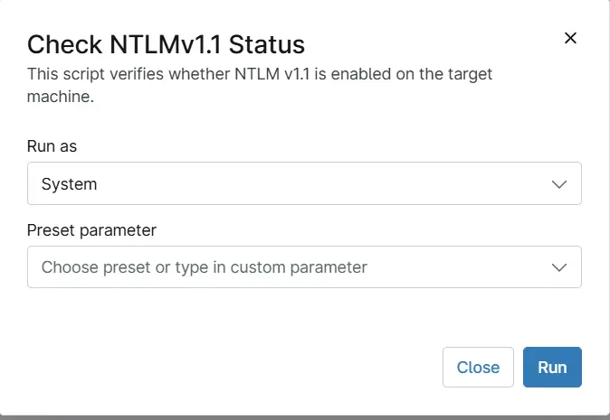

## Overview
This script verifies whether NTLM v1.1 is enabled on the target machine and updates the custom field [cPVAL NTLMv1.1 Status](/docs/61a0c2de-fefe-4726-b24e-957a2582117c).

## Sample Run

`Play Button` > `Run Automation` > `Script`  

## Dependencies

- [Solution - NTLMv1.1 ](/docs/94b6df2a-8565-4118-b2e7-35a3fe7206dc)
- [Custom Field - cPVAL NTLMv1.1 Status](/docs/61a0c2de-fefe-4726-b24e-957a2582117c) 

## Automation Setup/Import

[Automation Configuration](https://github.com/ProVal-Tech/ninjarmm/blob/main/scripts/check-ntlmv11-status.ps1)

## Output

- Activity Details  
- Custom Field
