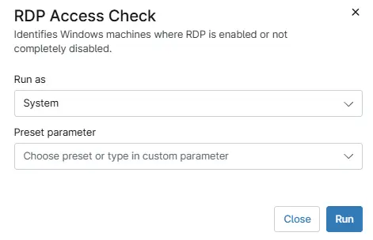

## Summary

Identifies Windows machines where RDP is enabled or not completely disabled.

## Sample Run

`Play Button` > `Run Automation` > `Script`  

## Dependencies

[ custom field - RDP Access Check]

## Automation Setup/Import

[Automation Configuration](https://github.com/ProVal-Tech/ninjarmm/blob/main/scripts/rdp-access-check.ps1)

## Output

- Activity Details  

## Changelog

### 2026-07-20

- Initial version of the document.
