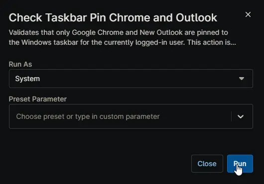

## Overview

Validates that only Google Chrome and New Outlook are pinned to the Windows taskbar for the currently logged-in user. This action is restricted to Windows Workstation systems only. This script is executed as detection script from [Configure Taskbar Outlook Chrome Only](/docs/) compound conditions.

## Sample Run

## Dependencies

- [Custom Field - cPVAL Configure Taskbar Outlook Chrome Only](/docs/48a340ed-d4aa-4949-9862-89e0737c5c95)
- [Solution - Configure Taskbar Outlook Chrome Only](/docs/)
- [Solution - Device Standards](/docs/)

## Automation Setup/Import

[Automation Configuration](https://github.com/ProVal-Tech/ninjarmm/blob/main/scripts/check-taskbar-pin-chrome-and-outlook.ps1)

## Output

- Activity Details
