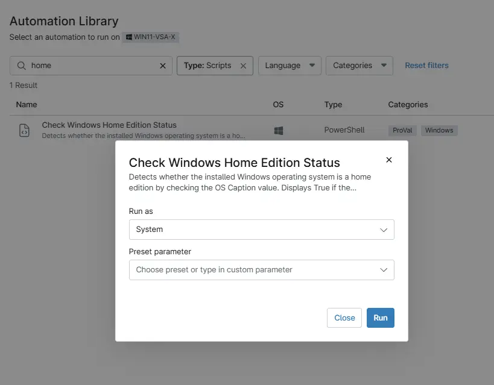

## Overview

Detects whether the installed Windows operating system is a Home edition by checking the OS Caption value. Displays True if the operating system name contains Home, otherwise displays False.

## Sample Run

`Play Button` > `Run Automation` > `Script`  

## Dependencies

- [Custom Field - cPVAL Windows Home Edition Status](/docs/4a1a47e3-19f1-4dba-be3c-be633cd52979)

## Automation Setup/Import

[Automation Configuration](https://github.com/ProVal-Tech/ninjarmm/blob/main/scripts/check-windows-home-edition.ps1)

## Output

- Activity Details  
- Custom Field
