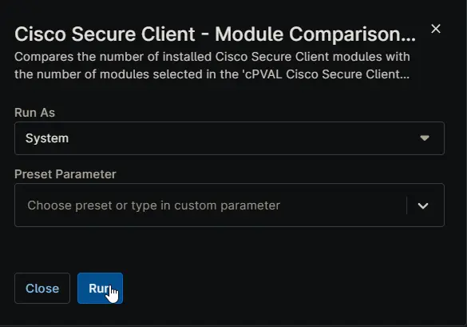

## Overview

Compares the number of installed `Cisco Secure Client` modules with the number of modules selected in the [cPVAL Cisco Secure Client Modules](/docs/e6eb3845-8c47-4791-95d6-a9138e457df9) custom field. Used as a pre-check in compound conditions to determine if installation is required.

## Custom Fields

| Field Name | Type | Mandatory | Description |
| ---------- | ---- | --------- | ----------- |
| [cPVAL Cisco Secure Client Modules](/docs/e6eb3845-8c47-4791-95d6-a9138e457df9) | Multi-select | Yes |This field specifies which modules should be installed. The script compares the count of modules selected in this field with the count of modules currently installed on the system. If "All" is selected, the script compares against all available Windows modules |

## Sample Run

## Dependencies

- [Custom Field: cPVAL Cisco Secure Client Modules](/docs/e6eb3845-8c47-4791-95d6-a9138e457df9)
- [Solution: Cisco Secure Client](/docs/b6926fc9-732f-4a5e-a42d-eae36c61c033)

## Automation Setup/Import

[Automation Configuration](https://github.com/ProVal-Tech/ninjarmm/blob/main/scripts/cisco-secure-client-module-comparison-windows.ps1)

## Output

- Activity Details  
