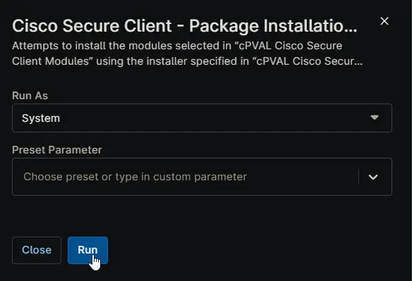

## Overview

Attempts to install the modules selected in [cPVAL Cisco Secure Client Modules](/docs/e6eb3845-8c47-4791-95d6-a9138e457df9) custom field using the installer specified in [cPVAL Cisco Secure Client Windows Source](/docs/be7067c4-47bf-4422-94d3-99ce33519996) custom field, provided as either a download URL or a local file path. Applicable for Windows systems.

> **Note:** *Mandatory custom fields must be set before running the automation.*

## Custom Fields

| Field Name | Type | Mandatory | Description | Available Options |
| ---------- | ---- | --------- | ----------- | ----------------- |
| [cPVAL Cisco Secure Client Modules](/docs/e6eb3845-8c47-4791-95d6-a9138e457df9) | Multi-select | Yes | Use this field to specify which modules should be installed. Selecting "All" installs every module and overrides individual selections. If Umbrella is selected (or "All" is used), the Umbrella UserID, Fingerprint, and OrgID must also be provided. | <ul><li>All</li><li>Core-VPN</li><li>Umbrella</li><li>Diagnostic And Reporting Tool</li><li>Network Visibility Module</li><li>ISE Posture</li><li>ThousandEyes Endpoint</li><li>Zero Trust Access</li><li>Start Before Login *(Windows Only)*</li><li>Network Access Manager *(Windows Only)*</li><li>VPN Posture *(Windows Only)*</li><li>Duo *(Mac Only)*</li><li>Fireamp *(Mac Only)*</li><li>Secure Firewall Posture *(Mac Only)*</li></ul> |
| [cPVAL Cisco Secure Client Windows Source](/docs/be7067c4-47bf-4422-94d3-99ce33519996) | Text | Yes | Provide the download URL or local file path for the **.zip** installer used on Windows (e.g., `C:\Path\To\File.zip`). Supports HTTP/HTTPS and local paths. | |
| [cPVAL Cisco Secure Client Umbrella UserID](/docs/e2073d81-d1dc-4b70-84db-6713358ddfae) | Text | Conditional (Required when “All” or “Umbrella” selected) | Umbrella UserID for your organization. | |
| [cPVAL Cisco Secure Client Umbrella Fingerprint](/docs/0bbcbadf-6663-4bd4-87d3-b6f83c5ca598) | Text | Conditional (Required when “All” or “Umbrella” selected) | Umbrella Fingerprint for your organization. | |
| [cPVAL Cisco Secure Client Umbrella OrgID](/docs/2ec6d35c-b9fe-4791-9ba8-3783b0e912bd) | Text | Conditional (Required when “All” or “Umbrella” selected) | Umbrella OrgID for your organization. | |
| [cPVAL Cisco Secure Client Windows Show VPN](/docs/6e17f64e-eccc-4f67-891c-aea3798b97d3) | Checkbox | No | Enable to show the Core‑VPN module in the Windows system tray. By default Core‑VPN does not display in the tray. | |
| [cPVAL Cisco Secure Client Windows ARP](/docs/e567d009-fc34-471c-9738-05bfed302c60) | Checkbox | No | Enable to hide Cisco Secure Client modules from Add/Remove Programs (Windows only). | |
| [cPVAL Cisco Secure Client Windows Lockdown](/docs/b8b19272-05fb-475c-8837-22eade459b3a) | Checkbox | No | Lock Cisco Secure Client services to prevent modifications for all users (including admins). Supported on Windows only. | |

> **Note:** **Umbrella** requires **Core‑VPN**. To install **Umbrella**, ensure both **Core‑VPN** and **Umbrella** are selected in [cPVAL Cisco Secure Client Modules](/docs/e6eb3845-8c47-4791-95d6-a9138e457df9).

## Sample Run

## Dependencies

- [PowerShell: Install-CiscoSecureClient](/docs/fc6bcac9-770a-46dc-902c-7176cb1d73ea)
- [Custom Field: cPVAL Cisco Secure Client Modules](/docs/e6eb3845-8c47-4791-95d6-a9138e457df9)
- [Custom Field: cPVAL Cisco Secure Client MAC Source](/docs/e1fd56d1-def8-41e6-95bf-41c4817a6323)
- [Custom Field: cPVAL Cisco Secure Client Windows Source](/docs/be7067c4-47bf-4422-94d3-99ce33519996)
- [Custom Field: cPVAL Cisco Secure Client Umbrella UserID](/docs/e2073d81-d1dc-4b70-84db-6713358ddfae)
- [Custom Field: cPVAL Cisco Secure Client Umbrella Fingerprint](/docs/0bbcbadf-6663-4bd4-87d3-b6f83c5ca598)
- [Custom Field: cPVAL Cisco Secure Client Umbrella OrgID](/docs/2ec6d35c-b9fe-4791-9ba8-3783b0e912bd)
- [Custom Field: cPVAL Cisco Secure Client Windows Show VPN](/docs/6e17f64e-eccc-4f67-891c-aea3798b97d3)
- [Custom Field: cPVAL Cisco Secure Client Windows ARP](/docs/e567d009-fc34-471c-9738-05bfed302c60)
- [Custom Field: cPVAL Cisco Secure Client Windows Lockdown](/docs/b8b19272-05fb-475c-8837-22eade459b3a)
- [Solution: Cisco Secure Client](/docs/b6926fc9-732f-4a5e-a42d-eae36c61c033)

## Automation Setup/Import

[Automation Configuration](https://github.com/ProVal-Tech/ninjarmm/blob/main/scripts/cisco-secure-client-package-installation-windows.ps1)

## Output

- Activity Details  
