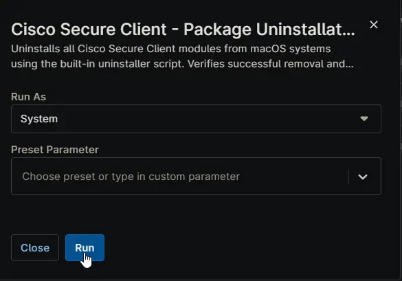

## Overview

Uninstalls all Cisco Secure Client modules from macOS systems using the built-in uninstaller script. Verifies successful removal and reports any remaining components.

## Sample Run

## Dependencies

- [Solution: Cisco Secure Client](/docs/b6926fc9-732f-4a5e-a42d-eae36c61c033)

## Automation Setup/Import

[Automation Configuration](https://github.com/ProVal-Tech/ninjarmm/blob/main/scripts/cisco-secure-client-package-uninstallation-macintosh.sh)

## Output

- Activity Details  
