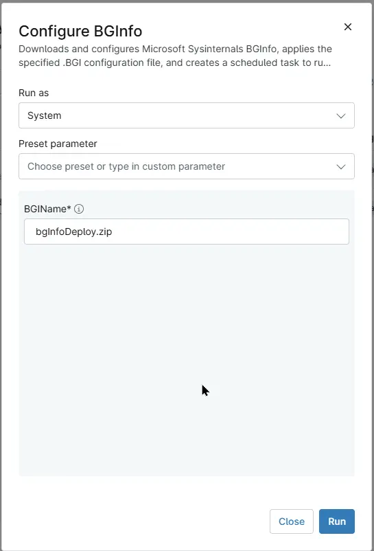

## Overview
Downloads and configures Microsoft Sysinternals BGInfo, applies the specified .BGI configuration file, and creates a scheduled task to run BGInfo automatically at user logon.

## Sample Run

## Dependencies

- [File Transfer - BGI File](/docs/3201c4cc-a76e-4df9-8195-8663a320964d)
- [Solution - Configure BgInfo](/docs/e6f8548f-1459-4f72-9d77-be33dc4d89a6)

## Parameters

| Name | Example | Accepted Values | Required | Default | Type | Description |
| ---- | ------- | --------------- | -------- | ------- | ---- | ----------- |
| BGIName | `CompanyBGI.bgi`, `CompanyBGI.zip` |  | True | - | string/text | Specify the name of the BGInfo configuration file to use. The parameter accepts either a `.bgi` configuration file or a `.zip` file containing a `.bgi` configuration with the other supported custom script that it executes like .vbs and should be applied to it. The specified file must be transferred to the `C:\ProgramData\_automation\app\BGInfo` location using Ninja's `BGI File` file transfer functionality  [File Transfer - BGI File](/docs/3201c4cc-a76e-4df9-8195-8663a320964d).|

## Automation Setup/Import

[Automation Configuration](https://github.com/ProVal-Tech/ninjarmm/blob/main/scripts/configure-bginfo.ps1)

## Output

- Activity Details  

## Changelog

### 2026-09-22

- Initial version of the document
