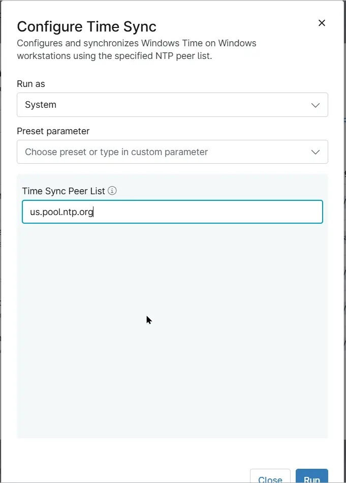

## Overview
Configures and synchronizes Windows Time on Windows workstations using the specified NTP peer list.

## Sample Run

## Dependencies

- [Custom Field - cPVAL Time Sync Peer List](/docs/5944866d-106f-46d5-83f7-75dfd19180fd)
- [Solution - Time Sync Compliance](/docs/49acbca5-5fa4-4f75-bbbc-595cec9a7e29)

## Parameters

| Name | Example | Required | Default | Type | Description |
| ---- | ------- | --------------- |  ------- | ---- | ----------- |
| Time Sync Peer List | `us.pool.ntp.org` |  `False` | - | Text/String | Specify the NTP time servers (peers) that the device should use for Windows Time synchronization. |

## Automation Setup/Import

[Automation Configuration](https://github.com/ProVal-Tech/ninjarmm/blob/main/scripts/configure-time-sync.ps1)

## Output

- Activity Details  

## Changelog

### 2026-10-02

- Initial version of the document