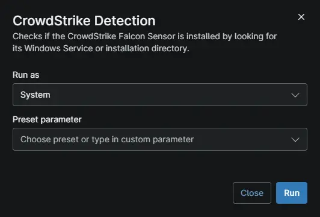

## Overview

Checks if the CrowdStrike Falcon Sensor is installed by looking for its Windows Service or installation directory.

## Sample Run

## Dependencies

- [Solution - Uninstall-Crowdstrike-Ninjaone](/docs/96ec2315-d8e2-4793-8db9-8d3f73803945)

## Automation Setup/Import

[Automation Configuration](https://github.com/ProVal-Tech/ninjarmm/blob/main/scripts/crowdstrike-detection.ps1)

## Output

- Activity Details

## Changelog

### 2026-10-09

Initial version of the script.