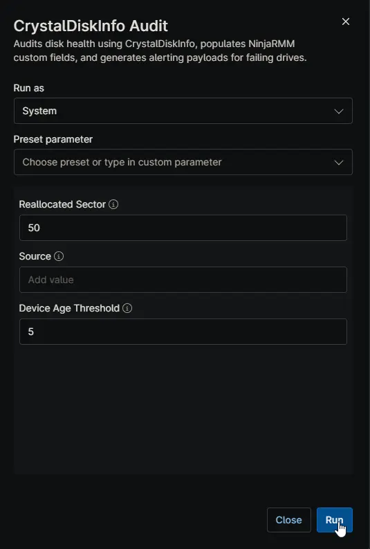

## Overview

This script serves as the primary auditing automation for the [Proactive Disk Health Monitor](/docs/acd55d90-1704-440c-a92e-795c230ecf9a) solution. It downloads and executes the [Get-CrystalDiskInfo](/docs/b08e9cd3-931f-4c70-a084-6193fe3702fb) agnostic script to collect deep S.M.A.R.T. data and physical disk health metrics.

The script performs the following key actions:

1. **Data Collection:** Gathers detailed hardware specifications, health statuses, and S.M.A.R.T. attributes for all physical disks. It automatically skips virtual machines.
2. **Custom Field Population:** Formats the collected data into HTML tables and updates the device custom fields, including basic disk info, detailed S.M.A.R.T. attributes, and the overall health status summary.
3. **Alert Evaluation:** Reads the [cPVAL Crystal Disk Alert Mode](/docs/72297da9-ba7f-443f-a21a-f56afc638a3e) custom field to determine the alerting behavior. If a drive is in a Caution or Bad state and matches the configured alert mode thresholds, the script generates a comprehensive HTML ticket payload and checks the [cPVAL Crystal Disk Alert Required](/docs/1e6d84a9-b25c-4d7f-a3b6-7f4e92c8d5a1) checkbox. If the drive recovers, it clears the alert state.

## Sample Run

> **Note:** This script is specifically engineered to operate as the automation within the [CrystalDiskInfo - Audit Eligible Devices](/docs/6c1a94e7-f52b-4a8d-9e3c-8b5d26f4a7e2) compound condition. While it can be executed manually for on-demand auditing, its primary design is for scheduled, unattended fleet-wide monitoring.

## Dependencies

- [Solution: Proactive Disk Health Monitor](/docs/acd55d90-1704-440c-a92e-795c230ecf9a)
- [Agnostic Script: Get-CrystalDiskInfo](/docs/b08e9cd3-931f-4c70-a084-6193fe3702fb)
- [Custom Field: cPVAL Crystal Disk Alert Mode](/docs/72297da9-ba7f-443f-a21a-f56afc638a3e)
- [Custom Field: cPVAL Crystal Disk Health Status](/docs/3f8a1c2e-9b47-4d5a-a6e3-1c9d84b2f7a5)
- [Custom Field: cPVAL Crystal Disk Basic Info](/docs/8d2b6f41-c73e-4a92-b5d8-6e1f3a9c4b27)
- [Custom Field: cPVAL Crystal Disk SMART Info](/docs/5a9e3d76-f184-4c2b-9a6d-2b7e85c3d1f4)
- [Custom Field: cPVAL Crystal Disk Data Collection Time](/docs/c47b9e25-a63d-4f81-8c5e-9d2a64f7b3c8)
- [Custom Field: cPVAL Crystal Disk Alert Required](/docs/1e6d84a9-b25c-4d7f-a3b6-7f4e92c8d5a1)
- [Custom Field: cPVAL Crystal Disk Alert Content](/docs/9b3f7c52-d81a-4e6c-b94f-3a8d75e2c6b9)

## Custom Fields

| Custom Field | Type | Example | Scope | Available Options | Editable | Description |
| :--- | :--- | :--- | :--- | :--- | :--- | :--- |
| [cPVAL Crystal Disk Alert Mode](/docs/72297da9-ba7f-443f-a21a-f56afc638a3e) | Dropdown | `Alerting With Recommendation` | Organization, Location, Device | `Disable`, `Audit Only`, `Alerting With Recommendation`, `Alerting Without Recommendation`, `Alert for Bad Status Only with Recommendation`, `Alert for Bad Status Only without Recommendation` | Yes | Controls the automated alerting behavior and determines if tickets are generated for Bad or Caution drive statuses. |
| [cPVAL Crystal Disk Health Status](/docs/3f8a1c2e-9b47-4d5a-a6e3-1c9d84b2f7a5) | Text | `ModelA: Good, ModelB: Caution` | Device | N/A | No | Auto-populated comma-separated summary of each physical disk health status. |
| [cPVAL Crystal Disk Basic Info](/docs/8d2b6f41-c73e-4a92-b5d8-6e1f3a9c4b27) | WYSIWYG | HTML Table | Device | N/A | No | Auto-populated HTML table showing essential specifications for each physical disk. |
| [cPVAL Crystal Disk SMART Info](/docs/5a9e3d76-f184-4c2b-9a6d-2b7e85c3d1f4) | WYSIWYG | HTML Table | Device | N/A | No | Auto-populated HTML table of detailed S.M.A.R.T. attributes. Problematic attributes are highlighted in red. |
| [cPVAL Crystal Disk Data Collection Time](/docs/c47b9e25-a63d-4f81-8c5e-9d2a64f7b3c8) | Text | `2026-08-06 14:30:00` | Device | N/A | No | Auto-populated timestamp of the last successful audit run. |
| [cPVAL Crystal Disk Alert Required](/docs/1e6d84a9-b25c-4d7f-a3b6-7f4e92c8d5a1) | Checkbox | `Checked` | Device | `Checked`, `Unchecked` | No | Auto-populated flag indicating whether a disk health alert ticket is required. |
| [cPVAL Crystal Disk Alert Content](/docs/9b3f7c52-d81a-4e6c-b94f-3a8d75e2c6b9) | WYSIWYG | HTML Payload | Device | N/A | No | Auto-populated HTML payload used as the ticket body when an alert is required. Cleared when the drive recovers. |

## Script Variables

Instead of hardcoding defaults, the script relies on NinjaRMM Script Variables as the ultimate fallback mechanism. You can configure these variables directly in the script settings within NinjaRMM to establish global baseline behaviors without modifying the code-signed script file.

| Name | Type | Example | Default | Available Options | Description |
| :--- | :--- | :--- | :--- | :--- | :--- |
| `Reallocated Sector` | Integer | `50` | `50` | N/A | Threshold for the number of reallocated sectors to mark an HDD as degraded. |
| `Source` | String/Text | `\\fileserver\share\CrystalDiskInfo.zip` | *(blank)* | N/A | Optional custom location (URL, UNC, or local path) for the CrystalDiskInfo ZIP file. |
| `Device Age Threshold` | Integer | `5` | `5` | N/A | Device age in years after which a full device replacement is recommended over a drive-only replacement. Set to 0 to ignore. |

> **Note:** Do not attempt to change default values by editing the script file directly. The PowerShell script is code-signed, and modifying the code will break the signature and prevent execution. Always use Script Variables to adjust behaviors.

## Automation Setup/Import

[Automation Configuration](https://github.com/ProVal-Tech/ninjarmm/blob/main/scripts/crystaldiskinfo-audit.ps1)

## Output

- **Activity Details:** Text output indicating the success of the audit, the detected drive health statuses, and whether an alert payload was generated.
- **Custom Fields:** Updates all associated CrystalDiskInfo custom fields on the device record.

## Changelog

### 2026-08-06

- Initial version of the document
