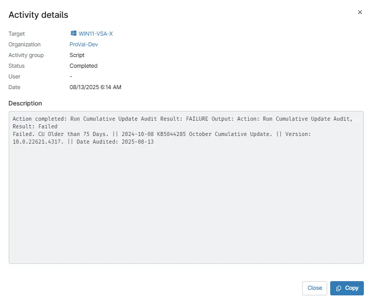

## Overview

This Script validate the full version of the OS and compares it with Microsoft's database of Windows Cumulative Updates to identify which cumulative update the device has. The data is then formatted and stored in the Custom Field.

## Sample Run

`Play Button` > `Run Automation` > `Script`  

## Dependencies

- [Custom Field - cPVAL Cumulative Update Audit Status](/docs/a7c72ccd-b604-4d7f-aefe-3fd5393d7f01)
- [Group - cPVAL Cumulative Update Older than threshold Days](/docs/577bdd4f-439e-4462-aac8-184b6b6d40a6)

## Parameters

| Name | Example | Accepted Values | Required | Default | Type | Description |
| ---- | ------- | --------------- | -------- | ------- | ---- | ----------- |
|Threshold Days| 75 | Integer | No | 75 | Integer | Enter the threshold days number to check if the CU Installed is older than the threshold Value. Default is 75. |
|Custom Field Name |cpvalCumulativeUpdateAuditStatus |String/Text | No | |String/Text | Enter the Name of Custom Field where you want the Audit Result.|

## Automation Setup/Import

[Automation Configuration](https://github.com/ProVal-Tech/ninjarmm/blob/main/scripts/cumulative-update-audit.ps1)

## Output

- Activity Details 
 
- Custom Field

