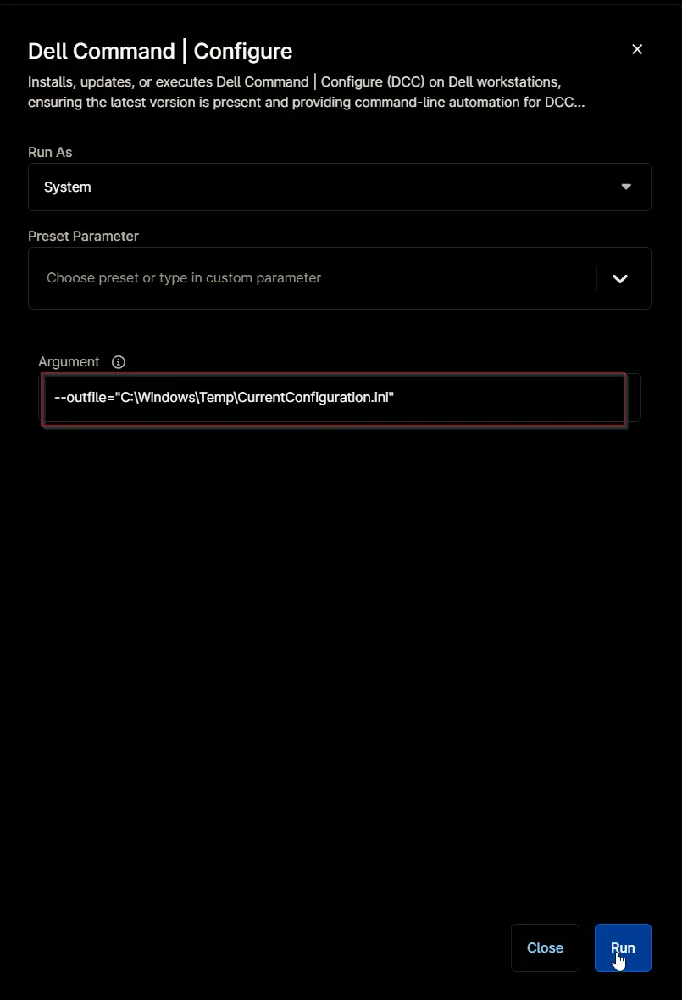

## Overview

Installs, updates, or executes Dell Command | Configure (DCC) on Dell workstations, ensuring the latest version is present and providing command-line automation for DCC operations.
 
**Supported commands/arguments reference:**  

- [Support Commands - General Options](https://www.dell.com/support/manuals/en-us/command-configure-v4.2/dcc_cli_4.2/general-options?guid=guid-70b4993d-58d3-48ef-a8db-ae7feb6e01ae&lang=en-us)  
- [Supported Commands - BIOS Options](https://www.dell.com/support/manuals/en-us/command-configure-v4.2/dcc_cli_4.2/bios-options?guid=guid-44c059be-b76d-4b2f-b8ef-655f736c40ce&lang=en-us)

**Command Line Syntax:**

[Dell Command | Configure Command Syntax](https://www.dell.com/support/manuals/en-us/command-configure-v4.2/dcc_cli_4.2/command-line-option-delimiter?guid=guid-a46d5033-22cc-4369-8951-d1b30e51008f)

## Sample Run

`Play Button` > `Run Automation` > `Script`  


Search and select `Dell Command | Update`


---

### Example 1

**Runs the script, ensuring Dell Command | Configure is installed and up to date, then list down the supported arguments.**

**Run As:** `System`  
**Preset Parameter:**  `<Leave it blank>`  
**Argument:**  `<Leave it blank>`


**Sample Output:**

```PlainText
Running the Dell Command | Configure with the '--Help' command.

Dell Command Configure Version 5.2.0  9 (Windows - Mar 19 2025, 07:33:34)
Copyright 2009 - 2025 Dell Inc. All rights reserved.

Usage: cctk --option[=argument]

For more information about a particular command,
use the option '-H' followed by the command name.
Example: cctk -H --Asset

Note: Commands with * Symbol are Read-Only BIOS Features.

    --Absolute                      --FnLockMode                    --SecureBootMode
    --AdaptiveCStates               --FullScreenLogo                --SetupPwd
    --AdminSetupLockout             -H or --help                    --SmartErrors
    --AdvBatteryChargeCfg           --HddInfo*                      --SmmSecurityMitigation
    --AdvancedMode                  --HddPwd                        --SoftGuardEn
    Advsm                           -I or --infile                  --SpeedShift
    --AllowBiosDowngrade            --IntegratedAudio               --Speedstep
    --Asset                         --InternalSpeaker               --StrongPassword
    --AutoOSRecoveryThreshold       --KbdBacklightTimeoutAc         --SupportAssistOSRecovery
    --AutoOn                        --KbdBacklightTimeoutBatt       --SvcTag*
    --AutoOnHr                      -L or --logfile                 --SysId*
    --AutoOnMn                      --LastBiosUpdate*               --SysName*
    --BIOSConnect                   --LidSwitch                     --SysPwd
    --BiosAutoRcvr                  --LogicProc                     --SysRev*
    --BiosCharacteristics*          --M2PcieSsd0                    --TelemetryAccessLvl
    --BiosConnectActivation         --MacAddrPassThru               --ThermalLogClear
    --BiosCurLang*                  --MasterPasswordLockout         --ThermalManagement
    --BiosListInstallLang*          --MediaCard                     --Touchscreen
    --BiosLogClear                  --Mem*                          --TpmActivation
    --BiosRcvrFrmHdd                --MfgDate*                      --TpmClear*
    --BiosRomSize*                  --Microphone                    --TpmPpiClearOverride
    --BiosVer*                      --MinSizeOfContigMem*           --TpmPpiDpo
    --BlockSleep                    --NumLock                       --TpmPpiPo
    --BluetoothDevice               -O or --outfile                 --TpmSecurity
    BootOrder                       --OvrWrt*                       --TurboMode
    --BrightnessAc                  --PasswordBypass                --UefiBootPathSecurity
    --BrightnessBattery             PasswordConfiguration           --UefiNwStack
    --CStatesCtrl                   --PasswordLock                  --UsbEmu
    --Camera                        --PeakShiftBatteryThreshold     --UsbEmuNoUsbBoot
    --CapsuleFirmwareUpdate         --PowerLogClear                 --UsbPortsExternal
    --CompletionCode*               --PowerOnLidOpen                --UsbPowerShare
    --CpuCore                       --PowerWarn                     --UsbWake
    --CpuCount*                     --PrimaryBattChargeCfg          --Uuid*
    --CpuSpeed*                     --PropOwnTag                    --ValSetupPwd
    --DockWarningsEnMsg             --ReportLogoType*               --ValSysPwd
    --EmbNic1                       --RestoreBIOSSettings           --Version*
    --EmbSataRaid                   -S or search                    --Virtualization
    --ExtPostTime                   --SHA256                        --VtForDirectIo
    --FOTA                          --Sata0                         --WakeOnAc
    --FanSpeed                      --SaveConfig                    --WakeOnDock
    --Fastboot                      --SdCard                        --WakeOnLan
    --FingerprintReader             --SdCardBoot                    --WarningsAndErr
    --FirstPowerOnDate*             --SdCardReadOnly                --WirelessLan
    --FnLock                        --SecureBoot                    --WlanAutoSense
Last command exit code: 0
!Information!: Command execution was successful.
```

---

### Example 2

**Runs the script, ensuring Dell Command | Configure is installed and up to date, then stores the current configuration to "C:\Windows\Temp\CurrentConfiguration.ini".**

**Run As:** `System`  
**Preset Parameter:**  `<Leave it blank>`  
**Argument:**  `--outfile="C:\Windows\Temp\CurrentConfiguration.ini"`



**Sample Content of "C:\Windows\Temp\CurrentConfiguration.ini" file:**

```PlainText
[cctk]
SysName=Latitude 3410
SysId=09EC
BiosVer=1.33.0
CCTKGenEngVer=5.2.0.9
;do not edit information above this line
Absolute=Enabled
AdaptiveCStates=Enabled
AdminSetupLockout=Disabled
AdvBatteryChargeCfg=Disabled
AdvancedMode=Enabled
Advsm=TEMPERATURE_1:NA
Advsm=TEMPERATURE_2:NA
Advsm=TEMPERATURE_3:NA
Advsm=TEMPERATURE_4:NA
Advsm=CD_1:0
AllowBiosDowngrade=Enabled
Asset=
AutoOSRecoveryThreshold=2
AutoOn=Disabled
AutoOnFri=Disabled
AutoOnHr=0
AutoOnMn=0
AutoOnMon=Disabled
AutoOnSat=Disabled
AutoOnSun=Disabled
AutoOnThur=Disabled
AutoOnTue=Disabled
AutoOnWed=Disabled
BIOSConnect=Enabled
BiosAutoRcvr=Enabled
BiosConnectActivation=LaunchpadActivation
BiosLogClear=Keep
BiosRcvrFrmHdd=Enabled
BlockSleep=Disabled
BluetoothDevice=Enabled
BootOrder=activebootlist,uefi
BootOrder=uefitype,+hdd,+embnicipv4,+embnicipv6,+usbhdd
;Here '+' indicates Enabled device, '-' indicates Disabled device.You can use DeviceNumber also to set the boot order. Example: BootOrder=+2,-1,+3
BrightnessAc=7
BrightnessBattery=5
CStatesCtrl=Enabled
Camera=Enabled
CapsuleFirmwareUpdate=Enabled
CpuCore=CoresAll
CustomChargeStart=50
CustomChargeStop=90
DockWarningsEnMsg=Enabled
EmbNic1=EnabledPxe
EmbSataRaid=Raid
ExtPostTime=0s
FOTA=Enabled
FanSpeed=Auto
Fastboot=Thorough
FingerprintReader=Enabled
;FirstPowerOnDate=
FnLock=Enabled
FnLockMode=EnableSecondary
FullScreenLogo=Disabled
IntegratedAudio=Enabled
InternalSpeaker=Enabled
LidSwitch=Enabled
LogicProc=Enabled
M2PcieSsd0=Disabled
MacAddrPassThru=SystemUnique
MasterPasswordLockout=Disabled
MediaCard=Enabled
;MfgDate=
Microphone=Enabled
NumLock=Enabled
PasswordBypass=Disabled
PasswordConfiguration=PwdDigitRqd:Disabled
PasswordConfiguration=PwdLowerCaseRqd:Disabled
PasswordConfiguration=PwdMinLen:4
PasswordConfiguration=PwdSpecialCharRqd:Disabled
PasswordConfiguration=PwdUpperCaseRqd:Disabled
PasswordLock=Enabled
PeakShiftBatteryThreshold=15
PowerLogClear=Keep
PowerOnLidOpen=Enabled
PowerWarn=Disabled
PrimaryBattChargeCfg=Adaptive
PropOwnTag=
;ReportLogoType=0
SHA256=Enabled
Sata0=Enabled
SdCard=Enabled
SdCardBoot=Disabled
SdCardReadOnly=Disabled
SecureBoot=Enabled
SecureBootMode=DeployedMode
SmartErrors=Disabled
SmmSecurityMitigation=Disabled
SoftGuardEn=SoftControlled
SpeedShift=Enabled
Speedstep=Enabled
StrongPassword=Disabled
SupportAssistOSRecovery=Enabled
SvcTag=9VWQ103
TelemetryAccessLvl=Full
ThermalLogClear=Keep
ThermalManagement=Optimized
Touchscreen=Enabled
TpmActivation=Enabled
;TpmClear=Disabled
TpmPpiClearOverride=Disabled
TpmPpiDpo=Disabled
TpmPpiPo=Disabled
TpmSecurity=Enabled
TurboMode=Enabled
UefiBootPathSecurity=AlwaysExceptInternalHdd
UefiNwStack=Enabled
UsbEmu=Enabled
UsbPortsExternal=Enabled
UsbPowerShare=Enabled
UsbWake=Disabled
;Uuid=cf2bf146-26ca-472f-98c9-26998abced54
Virtualization=Enabled
VtForDirectIo=Enabled
WakeOnAc=Disabled
WakeOnDock=Enabled
WakeOnLan=Disabled
WarningsAndErr=PromptWrnErr
WirelessLan=Enabled
WlanAutoSense=Disabled
```

---

**Run Automation:** `Yes`  


---

## Parameters

| Name | Example | Accepted Values | Required | Default | Type | Description |
| ---- | ------- | --------------- | -------- | ------- | ---- | ----------- |
| Argument | <ul><li>`--Help`</li><li>`--outfile="C:\Windows\Temp\CurrentConfiguration.ini"`</li><li>`--infile="C:\Windows\Temp\CurrentConfiguration.ini"`</li><li>`--Version`</li><li>`--HddInfo`</li><li>`--AlwaysAllowDellDocks=Enabled`</li><li>`--Camera=Enabled`</li></ul> | | False | `--Help` | String/Text | Command to execute with `Dell Command \| Configure`. If left blank, the default value `--Help` will be used. |

## Automation Setup/Import

### Step 1

Navigate to `Administration` > `Library` > `Automation`  


### Step 2

Locate the `Add` button on the right-hand side of the screen, click on it and click the `New Script` button.  


The scripting window will open.  


### Step 3

Configure the `Create Script` section as follows:

- **Name:** `Dell Command | Configure`  
- **Description:**  `Installs, updates, or executes Dell Command | Configure (DCC) on Dell workstations, ensuring the latest version is present and providing command-line automation for DCC operations.`  
- **Categories:** `ProVal`  
- **Language:**  `PowerShell`  
- **Operating System:** `Windows`  
- **Architecture:** `All`  
- **Run As:** `System`


## Step 4

Paste the following powershell script in the scripting section:  

```PowerShell
#requires -RunAsAdministrator
#requires -Version 5.1

<#
.SYNOPSIS
    Installs, updates, or executes Dell Command | Configure (DCC) on Dell workstations, ensuring the latest version is present and providing command-line automation for DCC operations.

.DESCRIPTION
    This script automates the full lifecycle management of Dell Command | Configure (DCC) on supported Dell workstations running Windows 10 or Windows 11. It is designed for use in automation platforms such as NinjaOne, but can also be run independently. The script performs the following actions:

    1. **Argument Handling**:
        - Accepts a command-line argument via the `$env:argument` environment variable, which is parsed and passed to the DCC CLI (`cctk.exe`).
        - Validates that an argument is provided and parses it to handle quoted and space-separated values.
        - If no argument is provided, defaults to '--help'.

    2. **Network Security**:
        - Sets TLS 1.2 as the security protocol for all web requests to ensure secure downloads and API calls.

    3. **Version Detection**:
        - Queries the latest available version of Dell Command | Configure from a GitHub repository using the GitHub API.
        - Detects the currently installed DCC version by searching both 32-bit and 64-bit registry uninstall locations.

    4. **Installation and Upgrade Logic**:
        - If DCC is not installed, downloads and installs the latest version using a custom script (`Invoke-WingetProcessor.ps1`) and the winget package manager.
        - If an older version is installed, uninstalls it using its MSI ProductId and then installs the latest version.
        - If the latest version is already installed, skips installation.

    5. **Directory and Permissions Management**:
        - Ensures required working directories exist and have appropriate permissions for script execution and logging.
        - Sets full control permissions for the 'Everyone' group on the working directory to avoid permission issues during automation.

    6. **Script Download and Execution**:
        - Downloads the installation script from a remote repository if not already present.
        - Executes the installation script with parameters for DCC installation via winget.
        - Logs installation and error details for troubleshooting.

    7. **Command Execution**:
        - Locates the DCC CLI executable (`cctk.exe`) and runs it with the provided arguments.
        - Handles output, error reporting, and exit code interpretation.

    8. **Exit Code Handling**:
        - Interprets DCC CLI exit codes and provides detailed, user-friendly messages for each possible code, including links to Dell documentation for further reference.
        - Throws errors for non-successful exit codes and writes informational messages for successful or non-critical codes.

    9. **Uninstallation Support**:
        - Provides functions to retrieve the ProductId of installed software and to silently uninstall DCC if needed.

    10. **System Compatibility Checks**:
        - Verifies that the script is running on a Dell system and on a supported Windows version before proceeding.
        - Halts execution and throws errors if run on unsupported hardware or OS.

    11. **Logging and Output**:
        - Uses Write-Information for detailed progress and status reporting throughout the script.
        - Outputs log content and error details as needed for diagnostics.

.NOTES
    - Requires administrative privileges.
    - Designed for Dell workstations only.
    - Supports Windows 10 and Windows 11.
    - Requires PowerShell 5.1 or later.
    - Relies on internet connectivity for version checks and script downloads.
    - Intended for use with NinjaOne or similar RMM tools, but can be run standalone.

.EXAMPLE
    $env:argument = '--Help'

    Runs the script, ensuring Dell Command | Configure is installed and up to date, then list down the supported arguments.

.OUTPUTS
    `Example
        Running the Dell Command | Configure with the '--Help' command.

        Dell Command Configure Version 5.2.0  9 (Windows - Mar 19 2025, 07:33:34)
        Copyright 2009 - 2025 Dell Inc. All rights reserved.

        Usage: cctk --option[=argument]

        For more information about a particular command,
        use the option '-H' followed by the command name.
        Example: cctk -H --Asset

        Note: Commands with * Symbol are Read-Only BIOS Features.

            --Absolute                      --FnLockMode                    --SecureBootMode
            --AdaptiveCStates               --FullScreenLogo                --SetupPwd
            --AdminSetupLockout             -H or --help                    --SmartErrors
            --AdvBatteryChargeCfg           --HddInfo*                      --SmmSecurityMitigation
            --AdvancedMode                  --HddPwd                        --SoftGuardEn
            Advsm                           -I or --infile                  --SpeedShift
            --AllowBiosDowngrade            --IntegratedAudio               --Speedstep
            --Asset                         --InternalSpeaker               --StrongPassword
            --AutoOSRecoveryThreshold       --KbdBacklightTimeoutAc         --SupportAssistOSRecovery
            --AutoOn                        --KbdBacklightTimeoutBatt       --SvcTag*
            --AutoOnHr                      -L or --logfile                 --SysId*
            --AutoOnMn                      --LastBiosUpdate*               --SysName*
            --BIOSConnect                   --LidSwitch                     --SysPwd
            --BiosAutoRcvr                  --LogicProc                     --SysRev*
            --BiosCharacteristics*          --M2PcieSsd0                    --TelemetryAccessLvl
            --BiosConnectActivation         --MacAddrPassThru               --ThermalLogClear
            --BiosCurLang*                  --MasterPasswordLockout         --ThermalManagement
            --BiosListInstallLang*          --MediaCard                     --Touchscreen
            --BiosLogClear                  --Mem*                          --TpmActivation
            --BiosRcvrFrmHdd                --MfgDate*                      --TpmClear*
            --BiosRomSize*                  --Microphone                    --TpmPpiClearOverride
            --BiosVer*                      --MinSizeOfContigMem*           --TpmPpiDpo
            --BlockSleep                    --NumLock                       --TpmPpiPo
            --BluetoothDevice               -O or --outfile                 --TpmSecurity
            BootOrder                       --OvrWrt*                       --TurboMode
            --BrightnessAc                  --PasswordBypass                --UefiBootPathSecurity
            --BrightnessBattery             PasswordConfiguration           --UefiNwStack
            --CStatesCtrl                   --PasswordLock                  --UsbEmu
            --Camera                        --PeakShiftBatteryThreshold     --UsbEmuNoUsbBoot
            --CapsuleFirmwareUpdate         --PowerLogClear                 --UsbPortsExternal
            --CompletionCode*               --PowerOnLidOpen                --UsbPowerShare
            --CpuCore                       --PowerWarn                     --UsbWake
            --CpuCount*                     --PrimaryBattChargeCfg          --Uuid*
            --CpuSpeed*                     --PropOwnTag                    --ValSetupPwd
            --DockWarningsEnMsg             --ReportLogoType*               --ValSysPwd
            --EmbNic1                       --RestoreBIOSSettings           --Version*
            --EmbSataRaid                   -S or search                    --Virtualization
            --ExtPostTime                   --SHA256                        --VtForDirectIo
            --FOTA                          --Sata0                         --WakeOnAc
            --FanSpeed                      --SaveConfig                    --WakeOnDock
            --Fastboot                      --SdCard                        --WakeOnLan
            --FingerprintReader             --SdCardBoot                    --WarningsAndErr
            --FirstPowerOnDate*             --SdCardReadOnly                --WirelessLan
            --FnLock                        --SecureBoot                    --WlanAutoSense
        Last command exit code: 0
        !Information!: Command execution was successful.
    `
.EXAMPLE
    $env:argument = '--outfile="C:\Windows\Temp\CurrentConfiguration.ini"'

    Runs the script, ensuring Dell Command | Configure is installed and up to date, then stores the current configuration to "C:\Windows\Temp\CurrentConfiguration.ini".
    Running the `Get-Content -Path "C:\Windows\Temp\CurrentConfiguration.ini"` prints the file content to console.

.OUTPUTS
    `Example
        [cctk]
        SysName=Latitude 3410
        SysId=09EC
        BiosVer=1.33.0
        CCTKGenEngVer=5.2.0.9
        ;do not edit information above this line
        Absolute=Enabled
        AdaptiveCStates=Enabled
        AdminSetupLockout=Disabled
        AdvBatteryChargeCfg=Disabled
        AdvancedMode=Enabled
        Advsm=TEMPERATURE_1:NA
        Advsm=TEMPERATURE_2:NA
        Advsm=TEMPERATURE_3:NA
        Advsm=TEMPERATURE_4:NA
        Advsm=CD_1:0
        AllowBiosDowngrade=Enabled
        Asset=
        AutoOSRecoveryThreshold=2
        AutoOn=Disabled
        AutoOnFri=Disabled
        AutoOnHr=0
        AutoOnMn=0
        AutoOnMon=Disabled
        AutoOnSat=Disabled
        AutoOnSun=Disabled
        AutoOnThur=Disabled
        AutoOnTue=Disabled
        AutoOnWed=Disabled
        BIOSConnect=Enabled
        BiosAutoRcvr=Enabled
        BiosConnectActivation=LaunchpadActivation
        BiosLogClear=Keep
        BiosRcvrFrmHdd=Enabled
        BlockSleep=Disabled
        BluetoothDevice=Enabled
        BootOrder=activebootlist,uefi
        BootOrder=uefitype,+hdd,+embnicipv4,+embnicipv6,+usbhdd
        ;Here '+' indicates Enabled device, '-' indicates Disabled device.You can use DeviceNumber also to set the boot order. Example: BootOrder=+2,-1,+3
        BrightnessAc=7
        BrightnessBattery=5
        CStatesCtrl=Enabled
        Camera=Enabled
        CapsuleFirmwareUpdate=Enabled
        CpuCore=CoresAll
        CustomChargeStart=50
        CustomChargeStop=90
        DockWarningsEnMsg=Enabled
        EmbNic1=EnabledPxe
        EmbSataRaid=Raid
        ExtPostTime=0s
        FOTA=Enabled
        FanSpeed=Auto
        Fastboot=Thorough
        FingerprintReader=Enabled
        ;FirstPowerOnDate=
        FnLock=Enabled
        FnLockMode=EnableSecondary
        FullScreenLogo=Disabled
        IntegratedAudio=Enabled
        InternalSpeaker=Enabled
        LidSwitch=Enabled
        LogicProc=Enabled
        M2PcieSsd0=Disabled
        MacAddrPassThru=SystemUnique
        MasterPasswordLockout=Disabled
        MediaCard=Enabled
        ;MfgDate=
        Microphone=Enabled
        NumLock=Enabled
        PasswordBypass=Disabled
        PasswordConfiguration=PwdDigitRqd:Disabled
        PasswordConfiguration=PwdLowerCaseRqd:Disabled
        PasswordConfiguration=PwdMinLen:4
        PasswordConfiguration=PwdSpecialCharRqd:Disabled
        PasswordConfiguration=PwdUpperCaseRqd:Disabled
        PasswordLock=Enabled
        PeakShiftBatteryThreshold=15
        PowerLogClear=Keep
        PowerOnLidOpen=Enabled
        PowerWarn=Disabled
        PrimaryBattChargeCfg=Adaptive
        PropOwnTag=
        ;ReportLogoType=0
        SHA256=Enabled
        Sata0=Enabled
        SdCard=Enabled
        SdCardBoot=Disabled
        SdCardReadOnly=Disabled
        SecureBoot=Enabled
        SecureBootMode=DeployedMode
        SmartErrors=Disabled
        SmmSecurityMitigation=Disabled
        SoftGuardEn=SoftControlled
        SpeedShift=Enabled
        Speedstep=Enabled
        StrongPassword=Disabled
        SupportAssistOSRecovery=Enabled
        SvcTag=9VWQ103
        TelemetryAccessLvl=Full
        ThermalLogClear=Keep
        ThermalManagement=Optimized
        Touchscreen=Enabled
        TpmActivation=Enabled
        ;TpmClear=Disabled
        TpmPpiClearOverride=Disabled
        TpmPpiDpo=Disabled
        TpmPpiPo=Disabled
        TpmSecurity=Enabled
        TurboMode=Enabled
        UefiBootPathSecurity=AlwaysExceptInternalHdd
        UefiNwStack=Enabled
        UsbEmu=Enabled
        UsbPortsExternal=Enabled
        UsbPowerShare=Enabled
        UsbWake=Disabled
        ;Uuid=cf2bf146-26ca-472f-98c9-26998abced54
        Virtualization=Enabled
        VtForDirectIo=Enabled
        WakeOnAc=Disabled
        WakeOnDock=Enabled
        WakeOnLan=Disabled
        WarningsAndErr=PromptWrnErr
        WirelessLan=Enabled
        WlanAutoSense=Disabled
    `

.LINK
    Dell Command | Configure CLI Reference:
    - https://www.dell.com/support/manuals/en-us/command-configure-v4.2/dcc_cli_4.2/general-options?guid=guid-70b4993d-58d3-48ef-a8db-ae7feb6e01ae&lang=en-us
    - https://www.dell.com/support/manuals/en-us/command-configure-v4.2/dcc_cli_4.2/bios-options?guid=guid-44c059be-b76d-4b2f-b8ef-655f736c40ce&lang=en-us

    Dell Command | Configure Command Line Syntax:
    https://www.dell.com/support/manuals/en-us/command-configure-v4.2/dcc_cli_4.2/command-line-option-delimiter?guid=guid-a46d5033-22cc-4369-8951-d1b30e51008f

    Dell Command | Configure Exit Codes:
    https://www.dell.com/support/kbdoc/en-us/000147084/dell-command-configure-error-codes
#>

Begin {
    ### Global Variables ###
    $ProgressPreference = 'SilentlyContinue'
    $ConfirmPreference = 'None'
    [Net.ServicePointManager]::SecurityProtocol = [Enum]::ToObject([Net.SecurityProtocolType], 3072)

    ### Arguments ###
    $argument = '{0}' -f $env:argument
    if ($null -eq $argument) {
        $argument = '--help'
    } else {
        $argument = $argument -replace '\s{1,}', ' '
        $pattern = '(?:[^\s"]|"[^"]*")+'
        $argument = ([regex]::matches($argument, $pattern)).Value
    }

    ### Installed Version ###
    $regPath = @(
        'HKLM:\SOFTWARE\Microsoft\Windows\CurrentVersion\Uninstall',
        'HKLM:\SOFTWARE\Wow6432Node\Microsoft\Windows\CurrentVersion\Uninstall'
    )
    $dccInfo = Get-ChildItem -Path $regPath | Get-ItemProperty | Where-Object { $_.DisplayName -match [regex]::Escape('Dell Command | Configure') } | Sort-Object -Property DisplayVersion -Descending | Select-Object -First 1
    $softwareName = $dccInfo.DisplayName
    $version = $dccInfo.DisplayVersion
    $dccWingetPackageId = 'Dell.CommandConfigure'
    if ($dccInfo) {
        Write-Information ('Installed Edition: ''{0}''' -f $dccInfo.DisplayName) -InformationAction Continue
        Write-Information ('Installed version: ''{0}''' -f $dccInfo.DisplayVersion) -InformationAction Continue
    }

    ### Latest Available Version ###
    $apiUri = 'https://api.github.com/repositories'
    $repoId = '197275551'
    $what = 'contents'
    $where = 'manifests'
    $finalDirectory = 'd/Dell/CommandConfigure'

    $versionUri = '{0}/{1}/{2}/{3}/{4}' -f $apiUri, $repoId, $what, $where, $finalDirectory

    try {
        $maxVersion = (
            (Invoke-RestMethod -Method Get -Uri $versionUri -ErrorAction Stop) | `
                    Select-Object @{n = 'Version'; e = { [version]$_.name } } | `
                    Sort-Object Version -Descending | `
                    Select-Object -First 1 -ExpandProperty Version
        ).ToString()
        if ($maxVersion) {
            Write-Information "Latest Available Version: $maxVersion" -InformationAction Continue
        }
    } catch {
        Write-Information ('Unable to reach ''{0}'' to fetch the latest available version. Reason: {1}' -f $versionUri, $Error[0].Exception.Message) -InformationAction Continue
    }

    ### Install Function ###
    function Install-DellCommandConfigure {
        <#
        .SYNOPSIS
        Installs or updates Dell Command | Configure using a remote PowerShell script and Winget.

        .DESCRIPTION
        Downloads the latest Invoke-WingetProcessor.ps1 script, ensures the working directory exists and has proper permissions, and executes the script to install or update Dell Command | Configure. Handles logging and error reporting for the installation process.
        #>
        [CmdletBinding()]
        Param(
            [Parameter(Mandatory)]
            [String]$DCCPackageId
        )
        ## Variables ##
        $projectName = 'Invoke-WingetProcessor'
        $workingDirectory = "C:\ProgramData\_Automation\Script\$projectName"
        $logPath = "$workingDirectory\$projectName-log.txt"
        $errorLogPath = "$workingDirectory\$projectName-error.txt"
        $BaseURL = 'https://file.provaltech.com/repo'
        $PS1URL = "$BaseURL/script/$ProjectName.ps1"
        $PS1Path = "$WorkingDirectory\$ProjectName.ps1"

        ## Directory ##
        if ( !(Test-Path -Path $WorkingDirectory) ) {
            try {
                New-Item -Path $WorkingDirectory -ItemType Directory -Force -ErrorAction Stop | Out-Null
            } catch {
                throw "!ERROR!: Failed to Create $WorkingDirectory. Reason: $($Error[0].Exception.Message)"
            }
        }

        if (-not ( ( ( Get-Acl -Path $WorkingDirectory ).Access | Where-Object { $_.IdentityReference -Match 'EveryOne' } ).FileSystemRights -Match 'FullControl' ) ) {
            $Acl = Get-Acl -Path $WorkingDirectory
            $AccessRule = New-Object System.Security.AccessControl.FileSystemAccessRule('Everyone', 'FullControl', 'ContainerInherit, ObjectInherit', 'none', 'Allow')
            $Acl.AddAccessRule($AccessRule)
            Set-Acl -Path $WorkingDirectory -AclObject $Acl -ErrorAction SilentlyContinue
        }

        ## Parameters ##
        $Parameters = @{
            Install = $True
            PackageId = $DCCPackageId
            Source = 'winget'
            AllowUpdate = $True
        }

        ## Script Download ##
        mkdir -Path $WorkingDirectory -ErrorAction SilentlyContinue | Out-Null
        $response = Invoke-WebRequest -Uri $PS1URL -UseBasicParsing
        if (($response.StatusCode -ne 200) -and (!(Test-Path -Path $PS1Path))) {
            throw "No pre-downloaded script exists and the script '$PS1URL' failed to download. Exiting."
        } elseif ($response.StatusCode -eq 200) {
            Remove-Item -Path $PS1Path -ErrorAction SilentlyContinue
            [System.IO.File]::WriteAllLines($PS1Path, $response.Content)
        }
        if (!(Test-Path -Path $PS1Path)) {
            throw 'An error occurred and the script was unable to be downloaded. Exiting.'
        }

        ## Execute Script ##
        Set-ExecutionPolicy -Scope Process -ExecutionPolicy RemoteSigned -ErrorAction SilentlyContinue
        & $PS1Path @Parameters

        if ( !(Test-Path -Path $logPath ) ) {
            throw 'Script Failed to install Dell Command | Configure. A security application seems to have interrupted the installation.'
        } else {
            $content = Get-Content -Path $logPath
            $logContent = $content[ $($($content.IndexOf($($content -match "$($ProjectName)$")[-1])) + 1)..$($Content.length - 1) ]
            Write-Information ('Log Content: {0}' -f ($logContent | Out-String)) -InformationAction Continue
        }

        if ( (Test-Path -Path $errorLogPath) ) {
            throw "Error log Content: $(Get-Content -Path $errorLogPath -ErrorAction SilentlyContinue)"
        }
    }

    ## Exit Code Validation Function ##
    function Convert-ExitCode {
        <#
        .SYNOPSIS
        Interprets and handles exit codes from Dell Command | Configure CLI.

        .DESCRIPTION
        Takes an integer exit code from cctk.exe and outputs a human-readable message. Throws an exception for error codes, and writes informational messages for successful or non-critical codes.
        .PARAMETER ExitCode
        The exit code returned by Dell Command | Configure CLI.
        #>
        ## Parameter ##
        [CmdletBinding()]
        Param(
            [Parameter(Mandatory = $true)][int]$ExitCode
        )
        Write-Information "`nLast command exit code: $ExitCode" -InformationAction Continue
        ## Exit Codes ##
        $Message = Switch ($ExitCode) {
            0 { '!Information!: Command execution was successful.' }
            1 { '!Warning!: Attempt to read write-only parameter ''%s''.' }
            2 { '!ERROR!: Clear SEL cannot be accompanied with any other option.' }
            3 { '!ERROR!: racreset cannot be accompanied with any other option.' }
            4 { '!ERROR!: Cannot execute command ''%s''. Command, or request parameter(s), not supported in present state.' }
            5 { '!ERROR!: Invalid sub net mask.' }
            6 { '!Warning!: Load defaults cannot be accompanied with any other option.' }
            7 { '!ERROR!: Parameter out of range. One or more parameters in the data field of the Request are out of range.' }
            8 { '!Warning!: Attempt to write read-only parameter ''%s''.' }
            9 { '!Warning!: Option ''%s'' requires an argument.' }
            10 { '!Information!: The Asset Tag for this system is not available.' }
            11 { '!Warning!: The Asset Tag cannot be more than %s characters long.' }
            12 { '!ERROR!: The required BIOS interfaces cannot be found on this system.' }
            13 { '!Information!: The BIOS version information is not available.' }
            14 { '!Warning!: There was a problem getting the state byte.' }
            15 { '!Information!: The state byte is not available on this system.' }
            16 { '!Warning!: There was a problem setting the state byte.' }
            17 { '!Warning!: The state byte must be a value between 0 and 255 decimal.' }
            18 { '!Information!: The CPU information is not available.' }
            19 { '!Warning!: The dependent option ''%s'' required for this subcommand is missing in the command line.' }
            20 { '!Warning!: Duplicate sub command ''%s'' has been entered.' }
            21 { '!ERROR!: The script file does not contain a valid DTK environment script signature. (%s)' }
            22 { '!Warning!: The format of the environment variable is incorrect.' }
            23 { '!Warning!: The --envar/-s option can only be used for a single option.' }
            24 { '!Warning!: The --envar/-s option can only be used for report operations.' }
            25 { '!ERROR!: There was an error opening the file %s.' }
            26 { '!Warning!: File ''%s'' does not have write permission.' }
            27 { '!Warning!: The file contains invalid option ''%s''.' }
            28 { '!Warning!: There can only be one section in the input file.' }
            29 { '!Warning!: Bad ini file, the required section [%s] cannot be found.' }
            30 { '!Warning!: Report operations and set operations must be separate.' }
            31 { '!Warning!: Help is not available for the option ''%s''.' }
            32 { '!Warning!: The -x (--hex) option can only be used with -b or -r.' }
            33 { '!Information!: Input file ''%s'' not found.' }
            34 { '!Warning!: Input file ''%s'' cannot be read.' }
            35 { '!Warning!: Invalid argument for the provided option ''%s''.' }
            36 { '!Warning!: The machine ID was not found in the file ''%s''.' }
            37 { '!Information!: The system memory information is not available.' }
            38 { '!ERROR!: The output file ''%s'' could not be opened. Please make sure the path exists and the media is not write protected.' }
            39 { '!ERROR!: Could not write to output file, disk may be full.' }
            40 { '!Warning!: The old password must be provided to set a new password using --ValSysPwd.' }
            41 { '!Warning!: The old password must be provided to set a new password using --ValSetupPwd.' }
            42 { '!Warning!: The option ''%s'' is not available or cannot be configured through this tool.' }
            43 { '!Warning!: There was an error setting the option ''%s''.' }
            44 { '!Warning!: The -n (--namefile) option can only be used with --pci.' }
            45 { '!Warning!: The set operation, ''%s'', requires sub commands.' }
            46 { '!Information!: The service tag for this system is not available.' }
            47 { '!Information!: The system ID value is not available.' }
            48 { '!Information!: The system information string is not available.' }
            49 { '!ERROR!: A system error has occurred.' }
            50 { '!ERROR!: Usage error.' }
            51 { '!Information!: The uuid information is not present on this system.' }
            52 { '!Information!: The manufacturing/first-power-on date information is not present on this system.' }
            53 { '!Warning!: Version cannot be accompanied with any other option.' }
            54 { '!ERROR!: Cannot start /etc/omreg.cfg file. Please ensure /etc/omreg.cfg file is present and is valid for your environment.' }
            55 { '!ERROR!: HAPI Driver Load Error.' }
            56 { '!Information!: Password is not required for retrieving the TPM options.' }
            57 { '!ERROR!: There was an error setting the TPM option.' }
            58 { '!ERROR!: The setup password provided is incorrect. Please try again.' }
            59 { '!ERROR!: Unsupported device. Re-try with supported device.' }
            60 { '!Warning!: Password not changed, new password does not meet criteria.' }
            61 { '!ERROR!: Error in Validation.' }
            62 { '!ERROR!: Error in Setting the Value.' }
            63 { '!Warning!: The password length should not exceed the maximum value %s.' }
            64 { '!ERROR!: This is not a Dell machine. DCC supports only Dell machines.' }
            65 { '!Warning!: Setup Password is required to change the setting. Use --ValSetupPwd to provide password.' }
            66 { '!Warning!: System Password is required to change the setting. Use --ValSysPwd to provide password.' }
            67 { '!Warning!: The system password provided is incorrect. Please try again.' }
            68 { '!Warning!: The Sequence list must be a comma-separated list of valid unique device names (ex: hdd,cdrom).' }
            69 { '!Information!: The system revision information is not available for this system.' }
            70 { '!Information!: The completion code information is not available for this system.' }
            71 { '!ERROR!: Please use 64-bit version of this application.' }
            72 { '!Warning!: %s cannot be modified when TPM is OFF.' }
            73 { '!Warning!: adddevice option not supported by this machine''s BIOS.' }
            74 { '!Warning!: usb device already present in this machine.' }
            75 { '!ERROR!: %s - Error : Unable to store BIOS information.' }
            76 { '!Warning!: Duplicate entry found in the input list : %s , Operation Aborted.' }
            77 { '!Warning!: Typo found in the input list : %s , Operation Aborted.' }
            78 { '!Warning!: Asset tag can have only printable ASCII characters.' }
            79 { '!Warning!: Multiple inputs will not be accepted.' }
            80 { '!Warning!: Invalid Hex format.' }
            81 { '!Warning!: Hex value range should be 0x0 to 0xffff.' }
            82 { '!Warning!: %s - Only positive numeric values are acceptable.' }
            83 { '!Warning!: %s - Length cannot exceed two characters.' }
            84 { '!Warning!: Range for autoon hour value should be 0 to 23(24 hour format).' }
            85 { '!Warning!: Range for autoon minute value should be 0 to 59.' }
            86 { '!Warning!: This option Not supported on UEFI Bios.' }
            87 { '!Warning!: Unable to Set Bootorder.' }
            88 { '!Warning!: Invalid Arguments. Unable to Set Bootorder.' }
            89 { '!Warning!: The provided command %s should not combine with other suboptions.' }
            90 { '!Information!: The property ownership tag for this system is not available.' }
            91 { '!Warning!: The property ownership tag cannot be more than 80 characters for non portable machines.' }
            92 { '!Warning!: The property ownership tag is limited to 48 characters for portable systems.' }
            93 { '!Warning!: Property ownership tag can have only printable ASCII characters.' }
            94 { '!ERROR!: Error in Setting the Value. Note : In some machines, If Hdd password or System password is set, you can''t set Setup password.' }
            95 { '!ERROR!: ''admin/root'' privileges required to execute this application.' }
            96 { '!Warning!: The option related BIOS information is not available in this machine.' }
            97 { '!Warning!: Improper Output from Bios. Please try again.' }
            98 { '!Warning!: ;Error in Bootorder.' }
            99 { '!Information!: Not Applicable.' }
            100 { '!Warning!: ;Uefi bootlisttype is not supported in this Machine.' }
            101 { '!Warning!: Unable to get information specific to machine.' }
            102 { '!Warning!: The input file is invalid.' }
            103 { '!Information!: No Status Present.' }
            104 { '!Warning!: File Do not have configurable Options.' }
            105 { '!Warning!: Please provide the days to enable.' }
            106 { '!Warning!: Password is not Installed. Please try again without providing --Val%s' }
            107 { '!Warning!: Please provide the old password to set the new password using --ValOwnerPwd.' }
            108 { '!Warning!: The owner password is incorrect. Please try again.' }
            109 { '!ERROR!: Error in setting the value. Note : Setup or system password might be set on the system. Clear the password(s) and try again.' }
            110 { '!Warning!: Owner password is not supported in file operations.' }
            111 { '!Warning!: Password operation is not supported on the system.' }
            112 { '!Warning!: The owner of the system has enabled the Owner Access feature. To set the Bios configuration, create setup or system password.' }
            113 { '!Warning!: Either the system hardware or the BIOS version does not support the option. To resolve the BIOS version issue, upgrade the BIOS to the latest version.' }
            114 { '!Warning!: Unable to get password information.' }
            115 { '!Warning!: Please provide the start and stop values. Example: Custom:start-end.' }
            116 { '!Warning!: The start and stop values should be in the range ''%s''.' }
            117 { '!Warning!: The stop value should be greater than the start value by 5 percentage.' }
            118 { '!Warning!: The option ''%s'' is not supported in this machine.' }
            119 { '!Warning!: Unable to set ''%s''. Note: To set this Option Legacy Option rom(LegacyOrom) should be enable and SecureBoot should be disable.' }
            120 { '!Warning!: Unable to set ''%s''. Note: To set this Option bootmode(activebootlist) should be uefi and legacy option rom (LegacyOrom) should be disable.' }
            121 { '!Warning!: Unable to set ''%s''. Note: To enable this Option SecureBoot should be disable. To disable this Option SecureBoot should be disable and bootmode(ActiveBootList) should be uefi.' }
            122 { '!Warning!: The allowed value for the option in the system are in between %s.' }
            123 { '!Warning!: The option ''%s'' is not enabled.' }
            124 { '!Warning!: Invalid argument! The possible values are: 0, 1-15, and 255.' }
            125 { '!Warning!: Invalid argument. The arguments must be set in such a way that [Start time] less than or equal [End time] less than or equal [Charge Start time].' }
            126 { '!Warning!: Unable to set the Non critical Threshold values.' }
            127 { '!Warning!: Cannot set the passed value as it is not within the range. The value should be less than or equal to ''Upper Threshold Critical'' and greater than or equal to ''Minimum value''' }
            128 { '!ERROR!: Error in Setting the Value. Note: To set TPM - 1. Admin Password must be set , 2. TPM must not be owned and 3. TPM must be deactivated.' }
            129 { '!Warning!: Invalid format! Enter the value in the ''R,G,B'' format.' }
            130 { '!Warning!: Invalid value! Expected values are ''White'', ''Red'', ''Green'', ''Blue'', ''CustomColor1'', ''CustomColor2'' and ''None''' }
            131 { '!Warning!: Invalid value! Expected values are ''White'', ''Red'', ''Green'', ''Blue'', ''CustomColor1'' and ''CustomColor2''' }
            132 { '!Warning!: Invalid format! Enter only one value.' }
            133 { '!Warning!: Invalid format! No other value is allowed with ''none''' }
            134 { '!Warning!: Invalid format! Duplicate entry found in the input list:''%s''' }
            135 { '!Warning!: Invalid operation! Set operation for ''%s'' attribute is not allowed using file mode' }
            136 { '!Warning!: Invalid format! String for ''%s'' attribute should contain maximum 4 characters. Supported characters are 0-9, A-F and a-f.' }
            137 { '!Warning!: Invalid format! String for ''%s'' attribute should contain maximum 8 characters. Supported characters are 0-9, A-F and a-f.' }
            138 { '!Warning!: Invalid set operation! ''%s'' attribute is read-only attribute.' }
            139 { '!Warning!: The option ''%s'' is not disabled.' }
            140 { '!ERROR!: This system does not have a WMI-ACPI compliant BIOS. Update the BIOS with a compatible version, if available.' }
            141 { '!Warning!: Couldn''t get WMI-ACPI Buffer Size!!' }
            142 { '!Warning!: Unable to get BIOS tables or Unknown type encountered!!.' }
            143 { '!Warning!: The dependent file is not loaded from the appropriate path, repair or reinstall to fix the issue.' }
            144 { '!Warning!: %s cannot be modified when the current value is set to PermanentlyDisabled.' }
            145 { '!Warning!: Legacy option is not supported in this machine.' }
            146 { '!Warning!: Importing ini file is failing for some features. For more information, check log.' }
            147 { '!Warning!: This value is not supported on the system. For more information, enter help cctk -h in CLI.' }
            148 { '!Warning!: The old password must be provided to set a new password using --ValHddPwd.' }
            149 { '!Warning!: Profile Invalid Memory.' }
            150 { '!Warning!: Profile Not Present.' }
            151 { '!Warning!: Profile Read Error.' }
            152 { '!Warning!: Profile Buffer Signature Error.' }
            153 { '!Warning!: Profile Not Supported.' }
            154 { '!Warning!: Profile HMAC Error.' }
            155 { '!Warning!: Profile Write Error.' }
            156 { '!Warning!: Profile Delete Error.' }
            157 { '!Warning!: Some or all fields missing.' }
            158 { '!Warning!: Profile file does not exist.' }
            159 { '!Information!: --Category sub option without arguments is used as a filter.' }
            160 { '!Information!: --Feature sub option without arguments is used as a filter.' }
            161 { '!Warning!: Use double Hyphen with full name of suboption or Single Hyphen with Shortcut of Subpotion. Example --readonly or -R(-r), --category or -C(-c), --feature or -F(-f).' }
            162 { '!Warning!: PassPhrase is required to decrypt.' }
            163 { '!ERROR!: Correct PassPhrase is required to decrypt.' }
            Default { '!ERROR!: Unknown exit code.' }
        }

        if ( $Message -match '!ERROR' ) {
            throw $Message
        } else {
            Write-Information $Message -InformationAction Continue
        }
    }

    ## Execute Command Function ##
    function Invoke-Argument {
        <#
        .SYNOPSIS
        Executes Dell Command | Configure CLI with provided arguments.

        .DESCRIPTION
        Locates the cctk.exe executable, ensures the working directory exists and is accessible, and runs cctk.exe with the specified arguments. Handles output, error reporting, and exit code interpretation.
        .PARAMETER argument
        An array of arguments to pass to cctk.exe.
        #>
        ## Parameter ##
        [CmdletBinding()]
        Param(
            [Parameter(Mandatory = $false)][String[]]$Argument
        )

        ## Variables ##
        $projectName = 'DCU-Configure'
        $workingDirectory = "C:\ProgramData\_Automation\Script\$projectName"

        ## Directory ##
        if ( !(Test-Path $WorkingDirectory) ) {
            try {
                New-Item -Path $WorkingDirectory -ItemType Directory -Force -ErrorAction Stop | Out-Null
            } catch {
                throw "!ERROR!: Failed to Create $WorkingDirectory. Reason: $($Error[0].Exception.Message)"
            }
        }

        if (-not ( ( ( Get-Acl -Path $WorkingDirectory ).Access | Where-Object { $_.IdentityReference -Match 'EveryOne' } ).FileSystemRights -Match 'FullControl' ) ) {
            $Acl = Get-Acl -Path $WorkingDirectory
            $AccessRule = New-Object System.Security.AccessControl.FileSystemAccessRule('Everyone', 'FullControl', 'ContainerInherit, ObjectInherit', 'none', 'Allow')
            $Acl.AddAccessRule($AccessRule)
            Set-Acl -Path $WorkingDirectory -AclObject $Acl -ErrorAction SilentlyContinue
        }

        ## Exe Path ##
        if ( Test-Path -Path 'C:\Program Files (x86)\Dell\Command Configure\X86_64\cctk.exe' ) {
            $exePath = 'C:\Program Files (x86)\Dell\Command Configure\X86_64\cctk.exe'
        } elseif ( Test-Path -Path 'C:\Program Files\Dell\Command Configure\X86_64\cctk.exe' ) {
            $exePath = 'C:\Program Files\Dell\Command Configure\X86_64\cctk.exe'
        } elseif ( Test-Path -Path 'C:\Program Files\Dell\Command Configure\X86\cctk.exe' ) {
            $exePath = 'C:\Program Files\Dell\Command Configure\X86\cctk.exe'
        } elseif ( Test-Path -Path 'C:\Program Files (x86)\Dell\Command Configure\X86\cctk.exe' ) {
            $exePath = 'C:\Program Files (x86)\Dell\Command Configure\X86\cctk.exe'
        } else {
            throw 'Executable for the Dell Command | Configure is missing.'
        }

        ## Execute Process ##
        try {
            if ($argument) {
                Write-Information "Running the Dell Command | Configure with the '$($argument -join ' ')' command." -InformationAction Continue
                & $exePath $argument
                Convert-ExitCode -ExitCode $LASTEXITCODE
            } else {
                Write-Information "Running the Dell Command | Configure with the '--help' command." -InformationAction Continue
                & $exePath --help
                Convert-ExitCode -ExitCode $LASTEXITCODE
            }
        } catch {
            throw "Failed to execute Dell Command | Configure. Reason: $($Error[0].Exception.Message)"
        }
    }

    ### Function Get ProductId ###
    function Get-ProductId {
        <#
        .SYNOPSIS
        Retrieves the MSI ProductId for a specified installed software.

        .DESCRIPTION
        Searches Windows registry uninstall keys for the given software name and returns its MSI ProductId (PSChildName), which is required for uninstallation.
        .PARAMETER SoftwareName
        The display name of the software to search for.
        #>
        [CmdletBinding()]
        param (
            [Parameter(Mandatory)][String]$SoftwareName
        )
        $uninstallPaths = @(
            'HKLM:\SOFTWARE\Microsoft\Windows\CurrentVersion\Uninstall',
            'HKLM:\SOFTWARE\Wow6432Node\Microsoft\Windows\CurrentVersion\Uninstall'
        )
        $uninstallInfo = Get-ChildItem $uninstallPaths -ErrorAction SilentlyContinue | Get-ItemProperty | Where-Object { $_.DisplayName -match [Regex]::Escape($SoftwareName) }
        if ($uninstallInfo) {
            return $uninstallInfo.PSChildName
        } else {
            return $null
        }
    }

    ### Function Uninstall Software ###
    Function Uninstall-Software {
        <#
        .SYNOPSIS
        Uninstalls software using its MSI ProductId.

        .DESCRIPTION
        Runs msiexec.exe with the provided ProductId to silently uninstall the specified software. Waits for the process to complete and returns the process information.
        .PARAMETER ProductId
        The MSI ProductId of the software to uninstall.
        #>
        [CmdletBinding()]
        param (
            [Parameter(Mandatory)][String]$ProductId
        )
        $argumentList = @(
            '/x',
            $ProductId,
            '/quiet',
            '/norestart'
        )
        $UninstallProcess = Start-Process 'msiexec.exe' -ArgumentList $argumentList -Wait -PassThru
        Start-Sleep -Seconds 5
        return $UninstallProcess
    }
} Process {
    if ( (Get-CimInstance -ClassName Win32_ComputerSystem).manufacturer -notmatch 'Dell' ) {
        throw 'Unsupported Device. The script is designed to work for Dell Workstations.'
    }
    if ( (Get-CimInstance -ClassName Win32_OperatingSystem).Name -notmatch 'Windows 1[01]' ) {
        throw 'Unsupported Operating System. The script is designed to work for Windows 10 and Windows 11.'
    }
    if ( !$Version ) {
        Write-Information 'Dell Command | Configure is not installed. Installing...' -InformationAction Continue
        Install-DellCommandConfigure -DCCPackageId $dccWingetPackageId
    } elseif (!$maxVersion -and [version]$version -lt '5.0') {
        Write-Information 'Unable to retrieve the latest available version. The installed version is older than 5; proceeding to update the application to the most recent available version.' -InformationAction Continue
        Install-DellCommandConfigure -DCCPackageId $dccWingetPackageId
    } elseif ( [Version]$version -lt [version]$maxVersion ) {
        Write-Information "Dell Command | Configure is outdated. Upgrading to $maxVersion..." -InformationAction Continue
        Write-Information 'Uninstalling the existing version' -InformationAction Continue
        foreach ($software in $softwareName) {
            $productId = Get-ProductId -SoftwareName $software
            if ($productId) {
                $uninstallProcessInfo = Uninstall-Software -ProductId $productId
                if (!(Get-ProductId -SoftwareName $software)) {
                    Write-Information ('{0} uninstalled successfully.' -f $software) -InformationAction Continue
                } else {
                    Write-Information ('{0} uninstall failed. Uninstallation Process Exit Code: ''{1}''' -f $software, $uninstallProcessInfo.ExitCode) -InformationAction Continue
                }
            } else {
                Write-Information ('{0} is not installed.' -f $software) -InformationAction Continue
            }
        }
        if ( $LASTEXITCODE -ne 0 ) {
            Write-Information 'Failed to remove the existing version of the application. Still attempting to install the latest version.' -InformationAction Continue
        }
        Install-DellCommandConfigure -DCCPackageId $dccWingetPackageId
    } elseif ([Version]$version -ge [version]$maxVersion) {
        Write-Information 'Dell Command | Configure is UpToDate.' -InformationAction Continue
    } else {
        Write-Information 'Could not verify if the installed version is the latest. Proceeding to execute the command.' -InformationAction Continue
    }
    Invoke-Argument -Argument $argument
} End {}
```


## Script Variables

### Argument

Click the `Add` button next to `Script Variables`.  


Select the `String/Text` option.  


The `Add String/Text Variable` window will open.  


In the box, fill in the following details and select `Add` to create the script variable.  

**Name:** `Argument`  
**Description:** `Command to execute with Dell Command | Configure. If left blank, the default value "--Help" will be used.`  
**Mandatory:** `<Leave it Unchecked>`  
**Set Default Value:** `<Leave it blank>`


## Saving the Automation

Click the Save button in the top-right corner of the screen to save your automation.  


You will be prompted to enter your MFA code. Provide the code and press the Continue button to finalize the process.  


## Completed Automation


## Output

- Activity Details  
